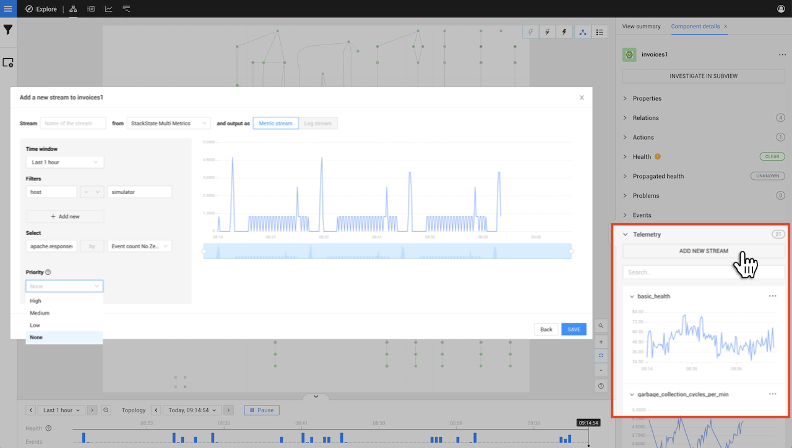

# Add a telemetry stream

## Overview

Elements in StackState can have telemetry streams assigned - metrics streams and log streams. This provides extra insight into your topology. StackState requires elements to have telemetry streams for some features, for example, to [add a health check to an element](../checks-and-monitors/add-a-health-check.md). Many StackPacks will automatically link telemetry to elements in the topology. If a telemetry stream was not automatically assigned to an element, or you want to add a custom telemetry stream, you can do this manually from the StackState UI.

## Add a telemetry stream to an element

You can add telemetry streams to any component or direct relation in the StackState Topology Perspective.

1. Select the component or direct relation that you want to add a telemetry stream to.
   * Detailed information about the element will be displayed in the right panel details tab - **Component details** or **Direct relation details** depending on the element type that you have selected.
2. Click **ADD NEW STREAM** under **Telemetry** in the right panel details tab.
3. Provide the following details:
   * **Name** - A name for the telemetry stream. This will be visible in the StackState UI. For metric streams, you can also [specify a unit type](#units-of-measurement) here. 
   * **Data source** - The data source for the telemetry stream. You can select from the standard data sources or add your own in **Settings** &gt; **Telemetry Sources**.
4. Click **NEXT**
5. At the top of the **Add a new stream** popup, select whether to output the telemetry stream as a Metric stream or a Log stream:
   * **Metric stream** \(default\) - use for metrics. StackState visualizes metric streams as a time series line chart. Check the available [aggregation methods](#aggregation-methods).
   * **Log stream** - use for streams that contain logs and events. StackState visualizes log streams as a bar chart.
6. Provide the following details:
   * **Time window** - The selection of time to be shown in the StackState UI. The time window is used for display purposes only and doesn't affect handling in any way.
   * **Filters** - Select the data relevant to the element. For example, if the data source contains data about all services on a host, select the specific host and service to attach data for.
   * **Select** - for metric streams only, select the metric that you want to retrieve and the function to apply to it.
   * **Priority** - Optional, you can [set a priority for the telemetry stream](set-telemetry-stream-priority.md). This will influence the order in which the stream is displayed in the StackState UI and the way the stream is handled by other services, such as the [Autonomous Anomaly Detector](../../stackpacks/add-ons/aad.md).
7. The stream preview on the right will update to show the incoming log or metric values based on the details provided.
8. Click **SAVE** to add the stream to the element.
   * You will receive a notification that the stream has been successfully completed.
9. A graph of the selected telemetry stream data will be visible under **Telemetry** in the right panel details tab. You can inspect data in the stream using the [telemetry inspector](browse-telemetry.md).

### Aggregation methods

The following aggregation methods are available:

* `MEAN` - mean
* `PERCENTILE_25` - 25th percentile
* `PERCENTILE_50` - 50th percentile
* `PERCENTILE_75` - 75th percentile
* `PERCENTILE_90` - 90th percentile
* `PERCENTILE_95` - 95th percentile
* `PERCENTILE_98` - 98th percentile
* `PERCENTILE_99` - 99th percentile
* `MAX` - maximum value
* `MIN` - minimum value
* `SUM` - sum of the values
* `EVENT_COUNT` - the number of occurrences during the bucket interval
* `SUM_NO_ZEROS` - sum of the values \(missing values from a data source won't be filled with zeros\)
* `EVENT_COUNT_NO_ZEROS` - the number of occurrences during the bucket interval \(missing values from a data source won't be filled with zeros\)

### Units of measurement

The unit used to measure a metric stream's data can be specified at the end of the metric stream name between parentheses. For example, a metric stream named `Kubernetes Memory Used (decmbytes)` would display a metric chart where the incoming data was formatted as MegBytes (MB).

The sections below list all available units and the associated metric stream names that apply them. Based on the specified unit, standard conversions (up or down) will be applied.

#### Miscellaneous 

* String - `<METRIC_NAME> (string)`
* Short - `<METRIC_NAME> (short)`
* Percent (0-100) - `<METRIC_NAME> (percent)`
* Percent (0.0-1.0) - `<METRIC_NAME> (percentunit)`
* Humidity (%H) - `<METRIC_NAME> (humidity)`
* Decibel - `<METRIC_NAME> (dB)`
* Hexadecimal (0x) - `<METRIC_NAME> (hex0x)`
* Hexadecimal - `<METRIC_NAME> (hex)`
* Scientific notation - `<METRIC_NAME> (sci)`
* Locale format - `<METRIC_NAME> (locale)`
* Pixels - `<METRIC_NAME> (pixel)`

#### Acceleration

* Meters/sec² - `<METRIC_NAME> (accMS2)`
* Feet/sec² - `<METRIC_NAME> (accFS2)`
* G unit - `<METRIC_NAME> (accG)`

#### Angle

* Degrees (°) - `<METRIC_NAME> (degree)`
* Radians - `<METRIC_NAME> (radian)`
* Gradian - `<METRIC_NAME> (grad)`
* Arc Minutes - `<METRIC_NAME> (arcmin)`
* Arc Seconds - `<METRIC_NAME> (arcsec)`

#### Area

* Square Meters (m²) - `<METRIC_NAME> (areaM2)`
* Square Feet (ft²) - `<METRIC_NAME> (areaF2)`
* Square Miles (mi²) - `<METRIC_NAME> (areaMI2)`

#### Computation

* FLOP/s - `<METRIC_NAME> (flops)`
* MFLOP/s - `<METRIC_NAME> (mflops)`
* GFLOP/s - `<METRIC_NAME> (gflops)`
* TFLOP/s - `<METRIC_NAME> (tflops)`
* PFLOP/s - `<METRIC_NAME> (pflops)`
* EFLOP/s - `<METRIC_NAME> (eflops)`
* ZFLOP/s - `<METRIC_NAME> (zflops)`
* YFLOP/s - `<METRIC_NAME> (yflops)`

#### Concentration

* parts-per-million (ppm) - `<METRIC_NAME> (ppm)`
* parts-per-billion (ppb) - `<METRIC_NAME> (conppb)`
* nanogram per cubic meter (ng/m³) - `<METRIC_NAME> (conngm3)`
* nanogram per normal cubic meter (ng/Nm³) - `<METRIC_NAME> (conngNm3)`
* microgram per cubic meter (μg/m³) - `<METRIC_NAME> (conμgm3)`
* microgram per normal cubic meter (μg/Nm³) - `<METRIC_NAME> (conμgNm3)`
* milligram per cubic meter (mg/m³) - `<METRIC_NAME> (conmgm3)`
* milligram per normal cubic meter (mg/Nm³) - `<METRIC_NAME> (conmgNm3)`
* gram per cubic meter (g/m³) - `<METRIC_NAME> (congm3)`
* gram per normal cubic meter (g/Nm³) - `<METRIC_NAME> (congNm3)`
* milligrams per decilitre (mg/dL) - `<METRIC_NAME> (conmgdL)`
* millimoles per litre (mmol/L) - `<METRIC_NAME> (conmmolL)`

#### Currency

* Dollars ($) - `<METRIC_NAME> (currencyUSD)`
* Pounds (£) - `<METRIC_NAME> (currencyGBP)`
* Euro (€) - `<METRIC_NAME> (currencyEUR)`
* Yen (¥) - `<METRIC_NAME> (currencyJPY)`
* Rubles (₽) - `<METRIC_NAME> (currencyRUB)`
* Hryvnias (₴) - `<METRIC_NAME> (currencyUAH)`
* Real (R$) - `<METRIC_NAME> (currencyBRL)`
* Danish Krone (kr) - `<METRIC_NAME> (currencyDKK)`
* Icelandic Króna (kr) - `<METRIC_NAME> (currencyISK)`
* Norwegian Krone (kr) - `<METRIC_NAME> (currencyNOK)`
* Swedish Krona (kr) - `<METRIC_NAME> (currencySEK)`
* Czech koruna (czk) - `<METRIC_NAME> (currencyCZK)`
* Swiss franc (CHF) - `<METRIC_NAME> (currencyCHF)`
* Polish Złoty (PLN) - `<METRIC_NAME> (currencyPLN)`
* Bitcoin (฿) - `<METRIC_NAME> (currencyBTC)`
* Milli Bitcoin (฿) - `<METRIC_NAME> (currencymBTC)`
* Micro Bitcoin (฿) - `<METRIC_NAME> (currencyμBTC)`
* South African Rand (R) - `<METRIC_NAME> (currencyZAR)`
* Indian Rupee (₹) - `<METRIC_NAME> (currencyINR)`
* South Korean Won (₩) - `<METRIC_NAME> (currencyKRW)`
* Indonesian Rupiah (Rp) - `<METRIC_NAME> (currencyIDR)`
* Philippine Peso (PHP) - `<METRIC_NAME> (currencyPHP)`
* Vietnamese Dong (VND) - `<METRIC_NAME> (currencyVND)`

#### Data

* bytes(IEC) - `<METRIC_NAME> (bytes)`
* bytes(SI) - `<METRIC_NAME> (decbytes)`
* bits(IEC) - `<METRIC_NAME> (bits)`
* bits(SI) - `<METRIC_NAME> (decbits)`
* kibibytes - `<METRIC_NAME> (kbytes)`
* kilobytes - `<METRIC_NAME> (deckbytes)`
* mebibytes - `<METRIC_NAME> (mbytes)`
* megabytes - `<METRIC_NAME> (decmbytes)`
* gibibytes - `<METRIC_NAME> (gbytes)`
* gigabytes - `<METRIC_NAME> (decgbytes)`
* tebibytes - `<METRIC_NAME> (tbytes)`
* terabytes - `<METRIC_NAME> (dectbytes)`
* pebibytes - `<METRIC_NAME> (pbytes)`
* petabytes - `<METRIC_NAME> (decpbytes)`

#### Data rate

* packets/sec - `<METRIC_NAME> (pps)`
* bytes/sec(IEC) - `<METRIC_NAME> (binBps)`
* bytes/sec(SI) - `<METRIC_NAME> (Bps)`
* bits/sec(IEC) - `<METRIC_NAME> (binbps)`
* bits/sec(SI) - `<METRIC_NAME> (bps)`
* kibibytes/sec - `<METRIC_NAME> (KiBs)`
* kibibits/sec - `<METRIC_NAME> (Kibits)`
* kilobytes/sec - `<METRIC_NAME> (KBs)`
* kilobits/sec - `<METRIC_NAME> (Kbits)`
* mibibytes/sec - `<METRIC_NAME> (MiBs)`
* mibibits/sec - `<METRIC_NAME> (Mibits)`
* megabytes/sec - `<METRIC_NAME> (MBs)`
* megabits/sec - `<METRIC_NAME> (Mbits)`
* gibibytes/sec - `<METRIC_NAME> (GiBs)`
* gibibits/sec - `<METRIC_NAME> (Gibit)`
* gigabytes/sec - `<METRIC_NAME> (GBs)`
* gigabits/sec - `<METRIC_NAME> (Gbits)`
* tebibytes/sec - `<METRIC_NAME> (TiBs)`
* tebibits/sec - `<METRIC_NAME> (Tibits)`
* terabytes/sec - `<METRIC_NAME> (TBs)`
* terabits/sec - `<METRIC_NAME> (Tbits)`
* pibibytes/sec - `<METRIC_NAME> (PiBs)`
* pibibits/sec - `<METRIC_NAME> (Pibits)`
* petabytes/sec - `<METRIC_NAME> (PBs)`
* petabits/sec - `<METRIC_NAME> (Pbits)`

#### Date & time

* Datetime ISO - `<METRIC_NAME> (dateTimeAsIso)`
* Datetime ISO (No date if today) - `<METRIC_NAME> (dateTimeAsIsoNoDateIfToday)`
* Datetime US - `<METRIC_NAME> (dateTimeAsUS)`
* Datetime US (No date if today) - `<METRIC_NAME> (dateTimeAsUSNoDateIfToday)`
* Datetime local - `<METRIC_NAME> (dateTimeAsLocal)`
* Datetime local (No date if today) - `<METRIC_NAME> (dateTimeAsLocalNoDateIfToday)`
* Datetime default - `<METRIC_NAME> (dateTimeAsSystem)`
* From Now - `<METRIC_NAME> (dateTimeFromNow)`

#### Energy

* Watt (W) - `<METRIC_NAME> (watt)`
* Kilowatt (kW) - `<METRIC_NAME> (kwatt)`
* Megawatt (MW) - `<METRIC_NAME> (megwatt)`
* Gigawatt (GW) - `<METRIC_NAME> (gwatt)`
* Milliwatt (mW) - `<METRIC_NAME> (mwatt)`
* Watt per square meter (W/m²) - `<METRIC_NAME> (Wm2)`
* Volt-ampere (VA) - `<METRIC_NAME> (voltamp)`
* Kilovolt-ampere (kVA) - `<METRIC_NAME> (kvoltamp)`
* Volt-ampere reactive (var) - `<METRIC_NAME> (voltampreact)`
* Kilovolt-ampere reactive (kVAr) - `<METRIC_NAME> (kvoltampreact)`
* Watt-hour (Wh) - `<METRIC_NAME> (watth)`
* Watt-hour per Kilogram (Wh/kg) - `<METRIC_NAME> (watthperkg)`
* Kilowatt-hour (kWh) - `<METRIC_NAME> (kwatth)`
* Kilowatt-min (kWm) - `<METRIC_NAME> (kwattm)`
* Ampere-hour (Ah) - `<METRIC_NAME> (amph)`
* Kiloampere-hour (kAh) - `<METRIC_NAME> (kamph)`
* Milliampere-hour (mAh) - `<METRIC_NAME> (mamph)`
* Joule (J) - `<METRIC_NAME> (joule)`
* Electron volt (eV) - `<METRIC_NAME> (ev)`
* Ampere (A) - `<METRIC_NAME> (amp)`
* Kiloampere (kA) - `<METRIC_NAME> (kamp)`
* Milliampere (mA) - `<METRIC_NAME> (mamp)`
* Volt (V) - `<METRIC_NAME> (volt)`
* Kilovolt (kV) - `<METRIC_NAME> (kvolt)`
* Millivolt (mV) - `<METRIC_NAME> (mvolt)`
* Decibel-milliwatt (dBm) - `<METRIC_NAME> (dBm)`
* Ohm (Ω) - `<METRIC_NAME> (ohm)`
* Kiloohm (kΩ) - `<METRIC_NAME> (kohm)`
* Megaohm (MΩ) - `<METRIC_NAME> (Mohm)`
* Farad (F) - `<METRIC_NAME> (farad)`
* Microfarad (µF) - `<METRIC_NAME> (µfarad)`
* Nanofarad (nF) - `<METRIC_NAME> (nfarad)`
* Picofarad (pF) - `<METRIC_NAME> (pfarad)`
* Femtofarad (fF) - `<METRIC_NAME> (ffarad)`
* Henry (H) - `<METRIC_NAME> (henry)`
* Millihenry (mH) - `<METRIC_NAME> (mhenry)`
* Microhenry (µH) - `<METRIC_NAME> (µhenry)`
* Lumens (Lm) - `<METRIC_NAME> (lumens)`

#### Flow

* Gallons/min (gpm) - `<METRIC_NAME> (flowgpm)`
* Cubic meters/sec (cms) - `<METRIC_NAME> (flowcms)`
* Cubic feet/sec (cfs) - `<METRIC_NAME> (flowcfs)`
* Cubic feet/min (cfm) - `<METRIC_NAME> (flowcfm)`
* Litre/hour - `<METRIC_NAME> (litreh)`
* Litre/min (L/min) - `<METRIC_NAME> (flowlpm)`
* milliLitre/min (mL/min) - `<METRIC_NAME> (flowmlpm)`
* Lux (lx) - `<METRIC_NAME> (lux)`

#### Force

* Newton-meters (Nm) - `<METRIC_NAME> (forceNm)`
* Kilonewton-meters (kNm) - `<METRIC_NAME> (forcekNm)`
* Newtons (N) - `<METRIC_NAME> (forceN)`
* Kilonewtons (kN) - `<METRIC_NAME> (forcekN)`

#### Hash rate

* hashes/sec - `<METRIC_NAME> (Hs)`
* kilohashes/sec - `<METRIC_NAME> (KHs)`
* megahashes/sec - `<METRIC_NAME> (MHs)`
* gigahashes/sec - `<METRIC_NAME> (GHs)`
* terahashes/sec - `<METRIC_NAME> (THs)`
* petahashes/sec - `<METRIC_NAME> (PHs)`
* exahashes/sec - `<METRIC_NAME> (EHs)`

#### Mass

* milligram (mg) - `<METRIC_NAME> (massmg)`
* gram (g) - `<METRIC_NAME> (massg)`
* pound (lb) - `<METRIC_NAME> (masslb)`
* kilogram (kg) - `<METRIC_NAME> (masskg)`
* metric ton (t) - `<METRIC_NAME> (masst)`

#### Length

* millimeter (mm) - `<METRIC_NAME> (lengthmm)`
* inch (in) - `<METRIC_NAME> (lengthin)`
* feet (ft) - `<METRIC_NAME> (lengthft)`
* meter (m) - `<METRIC_NAME> (lengthm)`
* kilometer (km) - `<METRIC_NAME> (lengthkm)`
* mile (mi) - `<METRIC_NAME> (lengthmi)`

#### Pressure

* Millibars - `<METRIC_NAME> (pressurembar)`
* Bars - `<METRIC_NAME> (pressurebar)`
* Kilobars - `<METRIC_NAME> (pressurekbar)`
* Pascals - `<METRIC_NAME> (pressurepa)`
* Hectopascals - `<METRIC_NAME> (pressurehpa)`
* Kilopascals - `<METRIC_NAME> (pressurekpa)`
* Inches of mercury - `<METRIC_NAME> (pressurehg)`
* PSI - `<METRIC_NAME> (pressurepsi)`

#### Radiation

* Becquerel (Bq) - `<METRIC_NAME> (radbq))`
* curie (Ci) - `<METRIC_NAME> (radci)`
* Gray (Gy) - `<METRIC_NAME> (radgy)`
* rad - `<METRIC_NAME> (radrad)`
* Sievert (Sv) - `<METRIC_NAME> (radsv)`
* milliSievert (mSv) - `<METRIC_NAME> (radmsv)`
* microSievert (µSv) - `<METRIC_NAME> (radusv)`
* rem - `<METRIC_NAME> (radrem)`
* Exposure (C/kg) - `<METRIC_NAME> (radexpckg)`
* roentgen (R) - `<METRIC_NAME> (radr)`
* Sievert/hour (Sv/h) - `<METRIC_NAME> (radsvh)`
* milliSievert/hour (mSv/h) - `<METRIC_NAME> (radmsvh)`
* microSievert/hour (µSv/h) - `<METRIC_NAME> (radusvh)`

#### Rotational Speed

* Revolutions per minute (rpm) - `<METRIC_NAME> (rotrpm))`
* Hertz (Hz) - `<METRIC_NAME> (rothz)`
* Radians per second (rad/s) - `<METRIC_NAME> (rotrads)`
* Degrees per second (°/s) - `<METRIC_NAME> (rotdegs)`

#### Temperature

* Celsius (°C) - `<METRIC_NAME> (celsius)`
* Fahrenheit (°F) - `<METRIC_NAME> (fahrenheit)`
* Kelvin (K) - `<METRIC_NAME> (kelvin)`

#### Time

* Hertz (1/s) - `<METRIC_NAME> (hertz)`
* nanoseconds (ns) - `<METRIC_NAME> (ns)`
* microseconds (µs) - `<METRIC_NAME> (µs)`
* milliseconds (ms) - `<METRIC_NAME> (ms)`
* seconds (s) - `<METRIC_NAME> (s)`
* minutes (m) - `<METRIC_NAME> (m)`
* hours (h) - `<METRIC_NAME> (h)`
* days (d) - `<METRIC_NAME> (d)`
* duration (ms) - `<METRIC_NAME> (dtdurationms)`
* duration (s) - `<METRIC_NAME> (dtdurations)`
* duration (hh:mm:ss) - `<METRIC_NAME> (dthms)`
* duration (d hh:mm:ss) - `<METRIC_NAME> (dtdhms)`
* Timeticks (s/100) - `<METRIC_NAME> (timeticks)`
* clock (ms) - `<METRIC_NAME> (clockms)`
* clock (s) - `<METRIC_NAME> (clocks)`

#### Throughput

* counts/sec (cps) - `<METRIC_NAME> (cps)`
* ops/sec (ops) - `<METRIC_NAME> (ops)`
* requests/sec (rps) - `<METRIC_NAME> (reqps)`
* reads/sec (rps) - `<METRIC_NAME> (rps)`
* writes/sec (wps) - `<METRIC_NAME> (wps)`
* I/O ops/sec (iops) - `<METRIC_NAME> (iops)`
* counts/min (cpm) - `<METRIC_NAME> (cpm)`
* ops/min (opm) - `<METRIC_NAME> (opm)`
* reads/min (rpm) - `<METRIC_NAME> (rpm)`
* writes/min (wpm) - `<METRIC_NAME> (wpm)`

#### Velocity

* meters/second (m/s) - `<METRIC_NAME> (velocityms)`
* kilometers/hour (km/h) - `<METRIC_NAME> (velocitykmh)`
* miles/hour (mph) - `<METRIC_NAME> (velocitymph)`
* knot (kn) - `<METRIC_NAME> (velocityknot)`

#### Volume

* millilitre (mL) - `<METRIC_NAME> (mlitre)`
* litre (L) - `<METRIC_NAME> (litre)`
* cubic meter - `<METRIC_NAME> (m3)`
* Normal cubic meter - `<METRIC_NAME> (Nm3)`
* cubic decimeter - `<METRIC_NAME> (dm3)`
* gallons - `<METRIC_NAME> (gallons)`

## See also

* [Autonomous Anomaly Detector](../../stackpacks/add-ons/aad.md)
* [Monitor the health of an element](../checks-and-monitors/add-a-health-check.md)
* [Browse data in a telemetry stream](browse-telemetry.md)
* [Set a priority for the telemetry stream](/use/metrics/set-telemetry-stream-priority.md)

