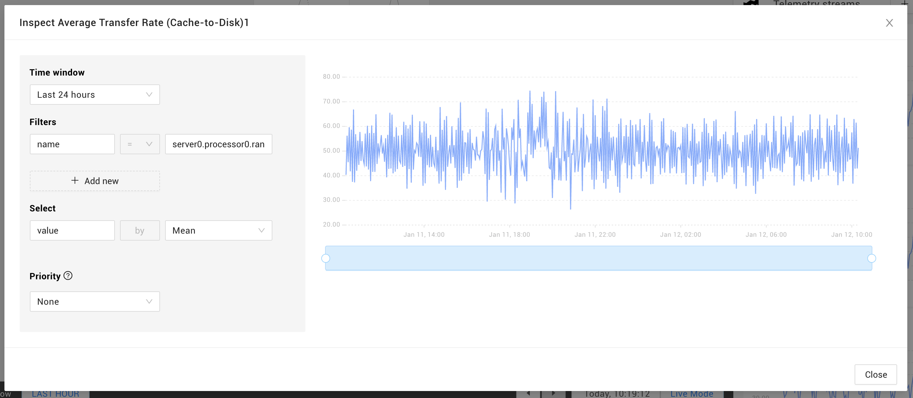

# Browse telemetry

## Overview

The StackState UI displays a visualization of filtered data for each configured telemetry stream.

Telemetry streams are added to elements automatically when they're imported to StackState or you can manually [add a single telemetry stream](add-telemetry-to-element.md) to a single component.

## Telemetry inspector

Click on any of the telemetry stream charts, or select **Inspect stream** from its context menu, to open the telemetry inspector.

Within the telemetry inspector you can adjust the selected metric as well as the filters, time window and aggregation applied to the data source. 


Changes made here will not be saved to the telemetry stream attached to the element.


### Anomaly feedback

When anomaly detection is enabled for a metric stream, users can give feedback on reported anomalies in the form of a thumbs-up (meaning "well spotted!") or thumbs-down (meaning "false positive"). For more elaborate feedback, it's also possible to add comments. Feedback added to anomalies will be used by the StackState team to further develop and improve the AAD. **It's not used to train the local instance of the AAD.**


In a self-hosted installation, feedback must be [exported and sent to StackState](/configure/anomaly-detection/export-anomaly-feedback.md) for the StackState team to be able to access it.


 
**Take care not to include sensitive data in comments.** 

Comments added to an anomaly will be included in any anomaly feedback data that's sent to StackState.


## See also

* [Add a single telemetry stream to a component](add-telemetry-to-element.md)
* [Monitor a telemetry stream with a health check](../checks-and-monitors/add-a-health-check.md)
* [Use templates to add telemetry streams to your own integrations](../../configure/telemetry/telemetry_synchronized_topology.md "StackState Self-Hosted only")
