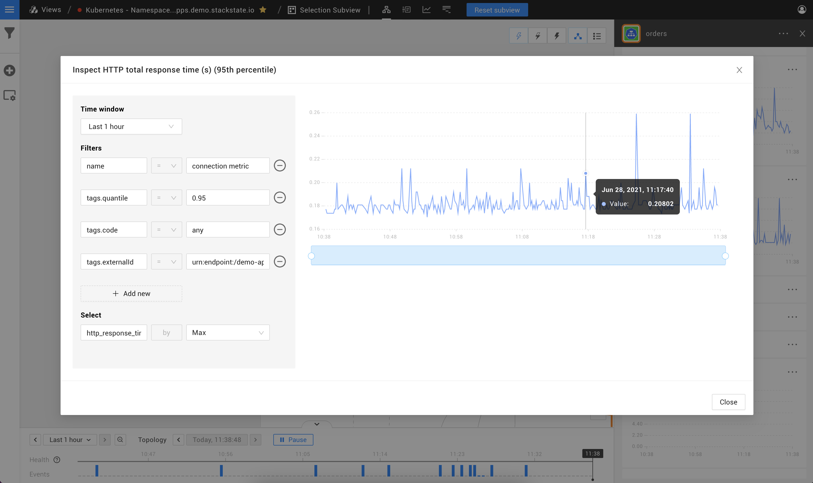
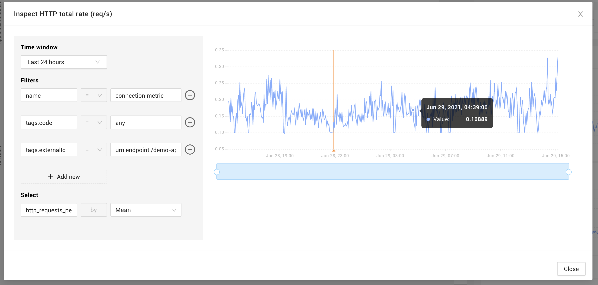
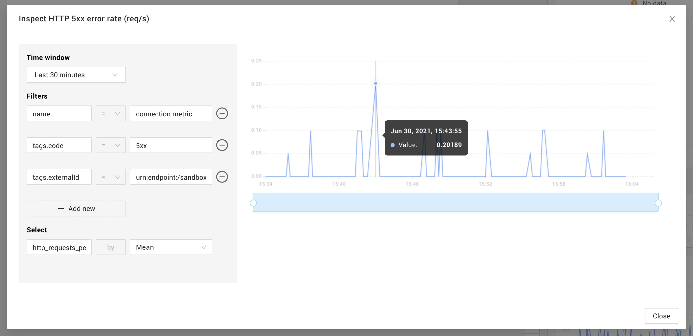
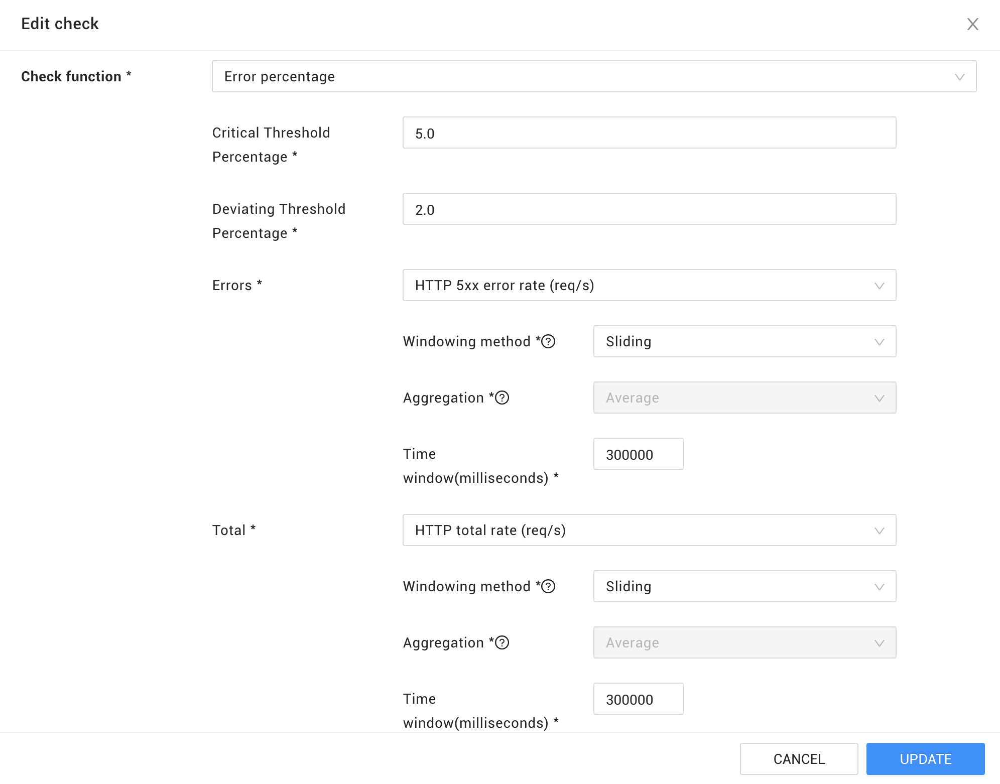
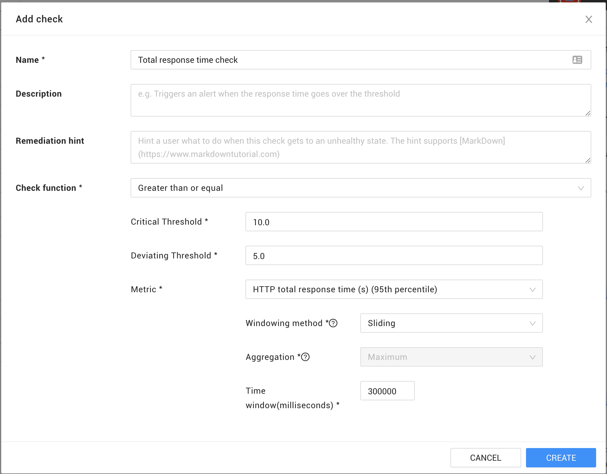

# Golden signals

## Overview

To assist in monitoring distributed systems with a defined SLO (Service Level Objective), StackState can be configured to alert you if an SLI (Service Level Indicator) falls below a defined threshold. StackState Agent V2 deployed on a Linux host will retrieve telemetry that can be used to monitor the [four golden signals \(sre.google\)](https://sre.google/sre-book/monitoring-distributed-systems/#xref_monitoring_golden-signals). These metrics can then be used to build a [check](#checks) in StackState that responds to fluctuations in service level.

The checks described on this page don't ensure that you are meeting your SLO directly, but they can help prevent an SLO violation by catching and alerting on changes in your SLIs as soon as possible.

## Requirements

To work with golden signals and the checks described on this page, you need to have:

* The [StackState Agent V2 StackPack](/stackpacks/integrations/agent.md) installed in StackState.
* [StackState Agent V2](/setup/agent/linux.md) version 2.12 or higher running on a Linux host with a network tracer.

## Four golden signals

### Latency

To monitor the time it takes to service a request, StackState supports metric streams for HTTP response time for processes and services.

To add a latency stream, [add a telemetry stream](/use/metrics/add-telemetry-to-element.md) and select the following metric: `http_response_time_seconds`. You can filter the stream on any HTTP response code or any of the predefined groups:

- any
- success (100-399)
- 1xx
- 2xx
- 3xx
- 4xx
- 5xx

By default, processes and services that serve HTTP requests have the following response time streams:

- HTTP total response time (s) (95th percentile)
- HTTP 5xx error response time (s) (95th percentile)
- HTTP 4xx error response time (s) (95th percentile)
- HTTP Success response time (s) (95th percentile)

### Traffic

Similar to measuring the latency, StackState Agent V2 supports the `http_requests_per_second` telemetry stream. The same response codes and predefined groups are also supported for the traffic stream.

By default, processes and services that serve HTTP requests have the following request rate streams:

- HTTP total rate (req/s)
- HTTP 5xx error rate (req/s)
- HTTP 4xx error rate (req/s)
- HTTP Success rate (req/s)

### Errors

StackState allows you to monitor on any specific HTTP error code or one of the 4xx or 5xx error groups, as explained above. If your SLO specifies a limit for the rate of errors in your system, you can [add a check](#checks).

### Saturation

There are many ways StackState can help monitor the saturation of a system, for example:

- HTTP Requests per second
- CPU usage
- Memory usage

## Checks

From StackState Agent V2.13, [Anomaly health checks](/use/checks-and-monitors/anomaly-health-checks.md) monitoring golden signals will automatically be added for streams with HTTP traffic. 

To help meet a specific SLA (Service Level Agreement), you can [add health checks](/use/concepts/health-state.md#stackstate-health-checks) in StackState. Examples of using a check function to monitor error percentage and response time are given below.

### Example: Error percentage

The `Error percentage` check function can be used to monitor two streams - one reporting errors and one reporting a total. A `DEVIATING` or `CRITICAL` health state will be returned if the percentage of errors/total crosses the specified `DeviatingThresholdPercentage` or `CriticalThresholdPercentage`.

If your SLO defines that a service can have a maximum of 5% of requests failing, you can create a check using the `Error percentage` function and set the `CriticalThresholdPercentage` to `5.0`:

### Example: Response time

The `Greater than or equal` check function can alert you when one of your telemetry streams is above a certain threshold. A DEVIATING or CRITICAL health state will be returned if the specified `DeviatingThreshold` or `CriticalThreshold` is crossed.

Use this function to make sure you meet your SLO for maximum response time, for example:

## Configuration and limitations

The metrics described in this page are gathered by the StackState Agent and can be disabled. Refer to the [StackState Agent documentation](/setup/agent/about-stackstate-agent.md) for more information. 

Note that StackState Agent can only report on request rate and response time of HTTP/1 protocol. HTTP/2, HTTP/3 and HTTPS protocols aren't currently supported.
