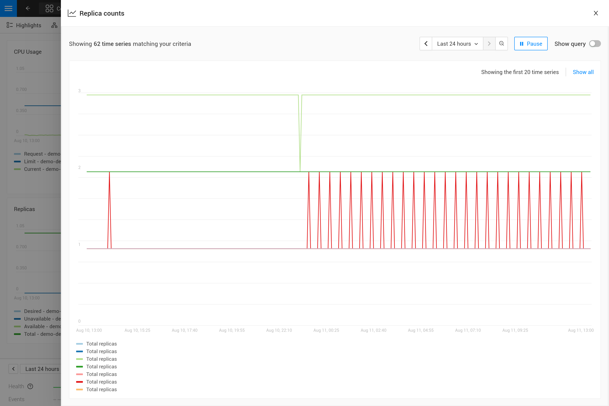
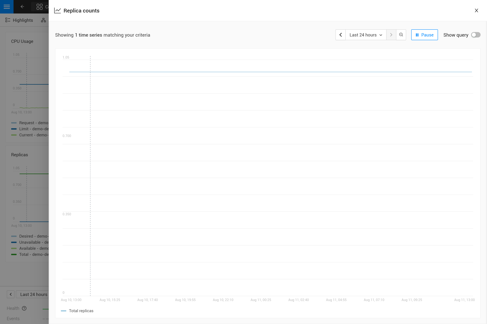
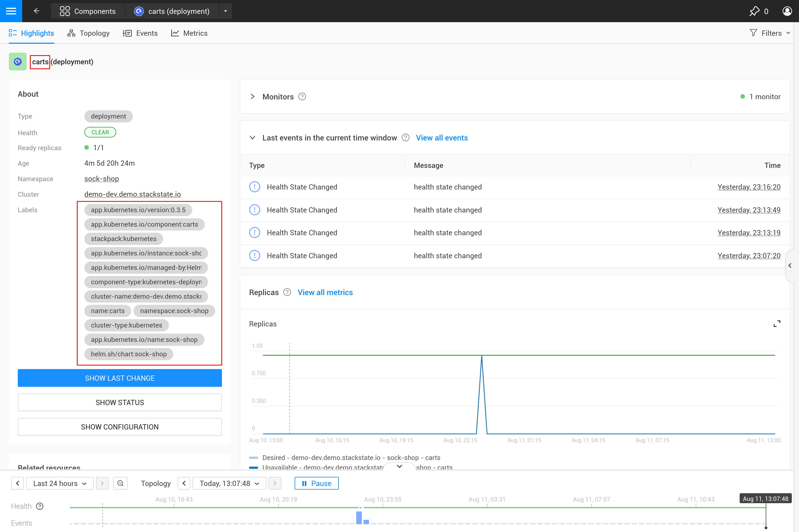
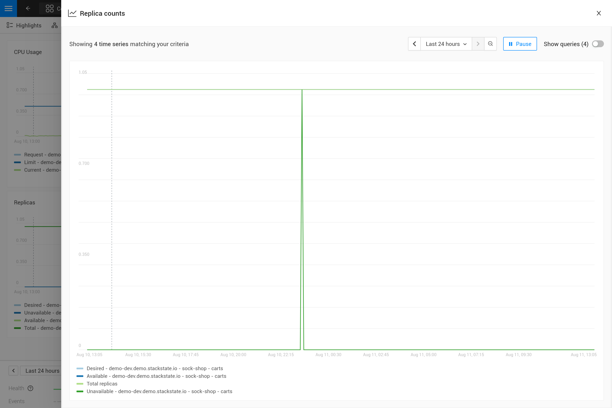

# Add metrics to components

## Overview 

StackState provides already many metrics by default on most types of components that represent Kubernetes resources. Extra metrics can be added to any set of components whenever needed. When adding metrics to components there are 2 options:

1. The metrics are already collected by StackState but aren't visualized on a component by default
1. The metrics aren't yet collected by StackState at all and therefore aren't even available. yet

For option 1 the steps below will instruct you how to create a metric binding which will configure StackState to add a specific metric to a specific set of components.

In case of option 2 first make sure that the metrics are available in StackState, by sending them to StackState using the [Prometheus remote write protocol](./k8s-prometheus-remote-write.md). Only after that continue by adding the metrics to the desired components.

## Steps

Steps to create a metric binding:

1. [Write the outline of the metric binding](#write-the-outline-of-the-metric-binding)
2. [Write the topology query (STQL) to select the components](#determine-the-topology-query)
3. [Write the PromQL query for the desired metric](#determine-the-promql-query)
4. [Bind the correct time series to each component](#bind-the-correct-time-serie-to-each-component)
5. [Create or update the metric binding in StackState](#create-or-update-the-metric-binding-in-stackstate)

As an example the steps will add a metric binding for the `Replica counts`  of Kubernetes deployments. This is just an example, this metric binding already exists in StackState by default.

## Write the outline of the metric binding

Use this template to create your own metric binding, all the parts will be filled in completely after going through this guide.

```
_type: MetricBinding
chartType: line
enabled: true
tags: {}
unit: 
name: 
description: 
priority: 
identifier: urn:custom:metric-binding:...
queries:
  - expression:
    alias:
scope:
```

The fields in this template are:

* `_type`: StackState needs to know this is a metric binding so, value always needs to be `MetricBinding`
* `chartType`: StackState will support different chart types (`line`, `bar`, etc.), currently only `line` is supported
* `enabled`: Set to `false` to keep the metric binding but not show it to users
* `tags`: Will be used to organize metrics in the user interface, can be left empty using `{}`
* `unit`: The unit of the values in the time series returned by the query or queries, used to render the Y-axis of the chart. See the [supported units](/develop/reference/k8sTs-chart-units.md) reference for all units.
* `name`: The name for the metric binding
* `description`: Optional description, displayed on-hover of the name
* `priority`: One of `HIGH`, `MEDIUM`, or `LOW`. Main sort order for metrics on a component (in the order they're mentioned here), secondary sort order is the `name`.
* `identifier`: A URN (universal resource identifier), used as the unique identifier of the metric binding. It must start with `urn:custom:metric-binding:`, the remainder is free-format as long as it's unique amongst all metric bindings.
* `queries`: A list of queries to show in the chart for the metric binding (see also the following sections)
* `scope`: The topology scope of the metric binding, a topology query that selects the components on which this metric binding will be shown.

Fill in all the parts already known first (with the deployment replica counts as the example)

```
_type: MetricBinding
chartType: line
enabled: true
tags: {}
unit: short
name: Replica counts
priority: MEDIUM
identifier: urn:custom:metric-binding:my-deployment-replica-counts
queries:
  - expression:
    alias:
scope:
```

The queries and scope section will be filled in the next steps. Note that the unit used is `short`, which will simply render a numeric value. In case you're not sure yet about the unit of the metric, you can leave it open and decide on the correct unit when writing the PromQL query.

## Write the topology query

Use the Explore view of the [Topology perspective](/use/views/k8s-topology-perspective.md), http://your-stackstate-instance/#/views/explore, and select the components that need to show the new metric. Both the basic and advanced views can be used to make the selection. The most common fields to select topology on for metric bindings are `type` for the component type and `label` for selecting all the labels. For example for the deployments:

```
type = "deployment" and label = "stackpack:kubernetes"
```

The type filter selects all deployments, while the label filter selects only components created by the Kubernetes stackpack (label name is `stackpack` and label value is `kubernetes`). The latter can also be omitted to get the same result.

Switch to the advanced mode to copy the resulting topology query and put it in the `scope` field of the metric binding.


Metric bindings only support the query filters, query functions like `withNeighborsOf` aren't supported and can't be used.


## Write the PromQL query

Go to the [metric explorer](/use/metrics/k8sTs-explore-metrics.md) of your StackState instance, http://your-stackstate-instance/#/metrics, and use it to query for the metric of interest. The explorer has auto-completion for metrics, labels, label values but also PromQL functions, and operators to help you out. Start with a short time range of, for example, an hour to get the best results.

For the total number of replicas use the `kubernetes_state_deployment_replicas` metric. To make the charts shown for this metric representative for the time series data extend the query to do an aggregation using the `${__interval}` parameter:

```
max_over_time(kubernetes_state_deployment_replicas[${__interval}])
```

In this specific case use `max_over_time` to make sure the chart always shows the highest number of replicas at any given time. For longer time ranges this means that a short dip in replicas won't be shown, to emphasize the lowest number of replicas use `min_over_time` instead. 

Copy the query into the `expression` property of the first entry in the `queries` field of the metric binding. Use `Total replicas` as an alias. This is the name that will show in the chart legend.


In StackState the size of the metric chart automatically determines the granularity of the metric shown in the chart. PromQL queries can adjusted to make optimal use of this behavior to get a representative chart for the metric. [Writing PromQL for charts](./k8s-writing-PromQL-for-charts.md) explains this in detail.


## Bind the correct time series to each component

The metric binding with all fields filled in looks like this now:

```
_type: MetricBinding
chartType: line
enabled: true
tags: {}
unit: short
name: Replica counts
priority: MEDIUM
identifier: urn:custom:metric-binding:my-deployment-replica-counts
queries:
  - expression: max_over_time(kubernetes_state_deployment_replicas[${__interval}])
    alias: Total replicas
scope: type = "deployment" and label = "stackpack:kubernetes"
```

Creating it in StackState and viewing the "Replica count" chart on a deployment component gives an unexpected result. The chart shows the replica counts for all deployments. Logically one would expect only 1 time series: the replica count for this specific deployment.



To fix this make the PromQL query specific for a component using information from the component. Filter on enough metric labels to select only the specific time series for the component. This is the "binding" of the correct time series to the component. For anyone experienced in making Grafana dashboards this is similar to a dashboard with parameters that are used in queries on the dashboard. Let's change the query in the metric binding to this:

```
max_over_time(kubernetes_state_deployment_replicas{kube_cluster_name="${tags.cluster-name}", kube_namespace="${tags.namespace}", kube_deployment="${name}"}[${__interval}])
```



The PromQL query now filters on 3 labels, `kube_cluster_name`, `kube_namespace` and `kube_deployment`. Instead of specifying an actual value for these labels a variable reference to fields of the component is used. In this case the labels `cluster-name` and `namespace` are used, referenced using `${tags.cluster-name}` and `${tags.namespace}`. Further the component name is referenced with `${name}`.

Supported variable references are:
* Any component label, using `${tags.<label-name>}`
* The component name, using `${name}`




The cluster name, namespace and a combination of the component type and name are ususally enough for selecting the metrics for a specific component from Kubernetes. These labels, or similar labels, are usually available on most metrics and components.


## Create or update the metric binding in StackState

Use the StackState CLI to create the metric binding in StackState. First save the metric binding into a YAML file (`metric-bindings.yaml`), but put it in a list of `nodes` like this:

```
nodes:
- _type: MetricBinding
  chartType: line
  enabled: true
  tags: {}
  unit: short
  name: Replica counts
  priority: MEDIUM
  identifier: urn:custom:metric-binding:my-deployment-replica-counts
  queries:
    - expression: max_over_time(kubernetes_state_deployment_replicas{kube_cluster_name="${tags.cluster-name}", kube_namespace="${tags.namespace}", kube_deployment="${name}"}[${__interval}])
      alias: Total replicas
  scope: type = "deployment" and label = "stackpack:kubernetes"
```

This format supports defining many metric bindings in the same file such that they can be created or updated with a single StackState CLI command.

Use the [StackState CLI](/setup/cli/k8sTs-cli-sts.md) to create the metric binding:

```bash
sts settings apply -f metric-bindings.yaml
```

Verify the results in StackState by opening the metrics perspective for a deployment. If you're not happy with the result simply change the metric binding in the YAML file and run the command again to update it.


The identifier is used as the unique key of a metric binding. Changing the identifier will create a new metric binding instead of updating the existing one.


The `sts settings` command has more options, for example it can list all metric bindings:

```bash
sts settings list --type MetricBinding
```

Finally to delete a metric binding use

```bash
sts settings delete --ids <id>
```

The `<id>` in this command isn't the identifier but the number in the `Id` column of the `sts settings list` output.

## Other options

### More than 1 time series in a chart


There is only 1 unit for a metric binding (it gets plotted on the y-axis of the chart). As a result you should only combine queries that produce time series with the same unit in 1 metric binding. Sometimes it might be possible to convert the unit. For example, CPU usage might be reported in milli-cores or cores, milli-cores can be converted to cores by multiplying by 1000 like this  `(<original-query>) * 1000`.


There are 2 ways to get more than 1 time series in a single metric binding and therefore in a single chart:

1. Write a PromQL query that returns multiple time series for a single component
2. Add more PromQL queries to the metric binding

For the first option an example is given in the [next section](./k8s-add-metrics.md#using-metric-labels-in-aliases). The second option can be useful for comparing related metrics. Some typical use-cases:

* Comparing total replicas vs desired and available
* Resource usage: limits, requests and usage in a single chart

To add more queries to a metric binding simply repeat [steps](./k8s-add-metrics.md#steps) 3. and 4. and add the query as an extra entry in the list of queries. For the deployment replica counts there are several related metrics that can be included in the same chart:

```
nodes:
- _type: MetricBinding
  chartType: line
  enabled: true
  tags: {}
  unit: short
  name: Replica counts
  priority: MEDIUM
  identifier: urn:custom:metric-binding:my-deployment-replica-counts
  queries:
    - expression: max_over_time(kubernetes_state_deployment_replicas{kube_cluster_name="${tags.cluster-name}", kube_namespace="${tags.namespace}", kube_deployment="${name}"}[${__interval}])
      alias: Total replicas
    - expression: max_over_time(kubernetes_state_deployment_replicas_available{kube_cluster_name="${tags.cluster-name}", kube_namespace="${tags.namespace}",  kube_deployment="${name}"}[${__interval}])
      alias: Available - ${kube_cluster_name} - ${kube_namespace} - ${kube_deployment}
    - expression: max_over_time(kubernetes_state_deployment_replicas_unavailable{kube_cluster_name="${tags.cluster-name}", kube_namespace="${tags.namespace}",  kube_deployment="${name}"}[${__interval}])
      alias: Unavailable - ${kube_cluster_name} - ${kube_namespace} - ${kube_deployment}
    - expression: min_over_time(kubernetes_state_deployment_replicas_desired{kube_cluster_name="${tags.cluster-name}", kube_namespace="${tags.namespace}",  kube_deployment="${name}"}[${__interval}])
      alias: Desired - ${kube_cluster_name} - ${kube_namespace} - ${kube_deployment}
  scope: type = "deployment" and label = "stackpack:kubernetes"
```



### Using metric labels in aliases

When a single query returns multiple time series per component, this will show as multiple lines in the chart. But in the legend they will all use the same alias. To be able to see the difference between the different time series the alias can include references to the metric labels using the `${label}` syntax. For example here is a metric binding for the "Container restarts" metric on a pod, note that a pod can have multiple containers:

```
type: MetricBinding
chartType: line
enabled: true
id: -1
identifier: urn:custom:metric-binding:my-pod-restart-count
name: Container restarts
priority: MEDIUM
queries:
- alias: Restarts - ${container_name}
  expression: max by (kube_cluster_name, kube_namespace, pod_name, container_name) (kubernetes_containers_restarts{kube_cluster_name="${tags.cluster-name}", kube_namespace="${tags.namespace}", pod_name="${name}"})
scope: (label = "stackpack:kubernetes" and type = "pod")
unit: short
```

Note that the `alias` references the `container_name` label of the metric. Make sure the label is present on the query result, when the label is missing the `${container_name}` will be rendered as literal text to help troubleshooting.
