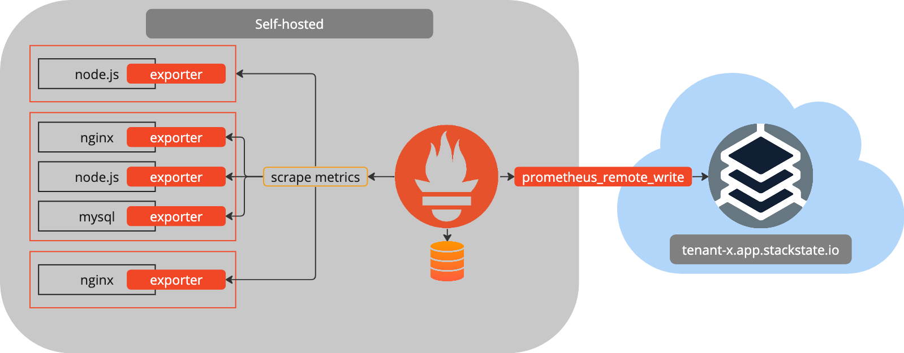
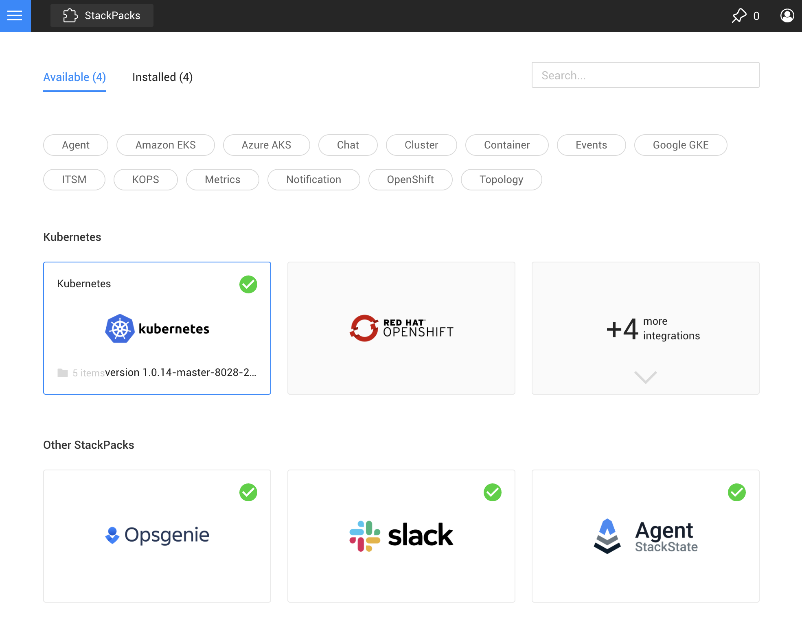
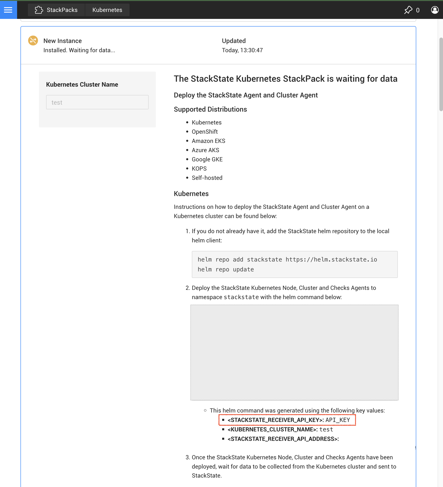

# Prometheus remote_write

When you have your own on-premise or self-hosted Prometheus running where metrics for your environment are aggregated, you can mirror these metrics in StackState. This will allow you to use StackState's powerful topology and correlation features to troubleshoot your Kubernetes environment without having to switch between tools.

To make this possible, StackState exposes the Prometheus `remote_write` protocol as an endpoint. Using this endpoint you can configure your Prometheus instance to send metrics to StackState. The metrics are then automatically ingested, and it will be possible to bind the metrics to the components observed by StackState. The following diagram shows how this works:



## Prerequisites

To mirror your Prometheus metrics in StackState, you need to lookup the API Key that's used to send in metrics into StackState. The API Key can be found in the description of the installed Kubernetes StackPack in StackState. The following steps show how to find the API Key:

1. Open the StackState UI and navigate to the StackPacks page

    

2. Find the Kubernetes StackPack and click on it.
3. In the description of the StackPack, you will find the API Key that's used to send in metrics into StackState.

    

## Configuring your Prometheus instance

To configure your Prometheus instance to send metrics to StackState, you need to add a new remote write endpoint to your Prometheus configuration. This can be done by updating the `remote_write` section in your `prometheus.yml` file. There are 2 variants that you can use for the authentication to the endpoint, either through a header or through basic authentication.

### Header authentication

You can authenticate using the API Key by adding the `sts-api-key` header to the prometheus remote_write requests. The following example shows how to configure this:

```yaml
remote_write:
- url: https://<tenant>.app.stackstate.io/receiver/prometheus/api/v1/write
  headers:
    sts-api-key: <API Key>
```

### Basic authentication

You can authenticate using basic authentication by adding the `basic_auth` section to the prometheus remote_write requests. Because the requests to this API are made from a headless service, the username field is set to the static value `apikey`. The following example shows how to configure this:

```yaml
remote_write:
- url: https://<tenant>.app.stackstate.io/receiver/prometheus/api/v1/write
  basic_auth:
    username: apikey
    password: <API Key>
```

## Finishing up

After the configuration changes have been applied to the Prometheus configuration file, Prometheus needs to be restarted. After the restart, Prometheus will start sending metrics to StackState. The metrics will be automatically correlated with the rest of your environment and will be visible in the StackState UI.
