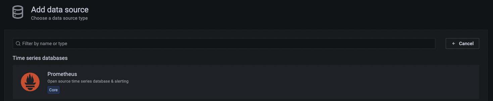
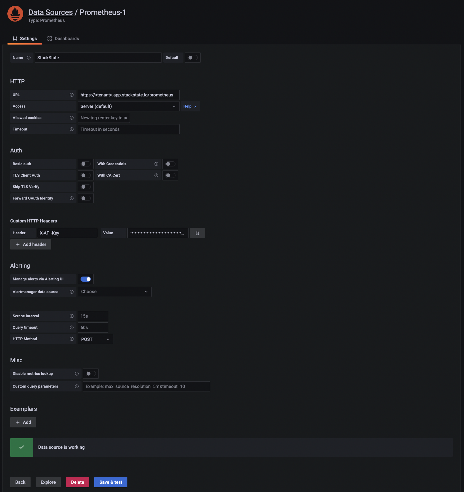

# SUSE Observability as a Grafana Datasource

SUSE Observability can be used as a datasource for Grafana. This will allow to use Grafana as a visualization tool for your SUSE Observability data. This is useful if you already have some dashboards which you want to keep using. Because SUSE Observability exposes a Prometheus-compatible API, you can use the [Prometheus datasource](https://grafana.com/docs/grafana/latest/datasources/prometheus) in Grafana to connect to SUSE Observability. This also makes SUSE Observability usable with other Prometheus-compatible solutions.

## Prerequisites

Before you can add SUSE Observability as a datasource in Grafana, you need to setup a ServiceToken to authenticate with SUSE Observability. SUSE Observability recommends to create a dedicated role with permissions for this purpose.

You can do this via the SUSE Observability CLI:

```sh
> sts rbac create-subject --subject grafana
✅ Created subject 'grafana'
> sts rbac grant --subject grafana --permission read-metrics
✅ Granted permission 'read-metrics' on 'system' to subject 'grafana'
PERMISSION   | RESOURCE
read-metrics | system
```

This will create a new role in SUSE Observability called `grafana` and grant it the `read-metrics` permission. You can then create a ServiceToken for this role:

```sh
> sts service-token create --name grafana --roles grafana
✅ Service token created: svctok-XXXXXXXXXXXXXXXXXXXXXXXXXXXXXXXX
```

Learn more about [managing ServiceTokens](/use/security/k8s-service-tokens.md).

The returned ServiceToken can be used to authenticate with SUSE Observability. You can now add SUSE Observability as a datasource in Grafana.

## Create a new SUSE Observability datasource in Grafana

With the created ServiceToken, you can now add SUSE Observability as a datasource in Grafana. To do this, go to the Grafana UI and navigate to the datasource configuration page. Click on the `Add data source` button and select `Prometheus` from the list of datasources.



On the datasource configuration page, enter the following configuration details:

* **Name**: SUSE Observability
* **URL**: `https://<tenant-name>.app.stackstate.io/prometheus`
* **Custom HTTP Headers**
  * **Header**: `X-API-Key`
  * **Value**: `<service-token>`



Click on the `Save & Test` button to save the datasource. If the configuration is correct, you should see a green `Data source is working` message.
