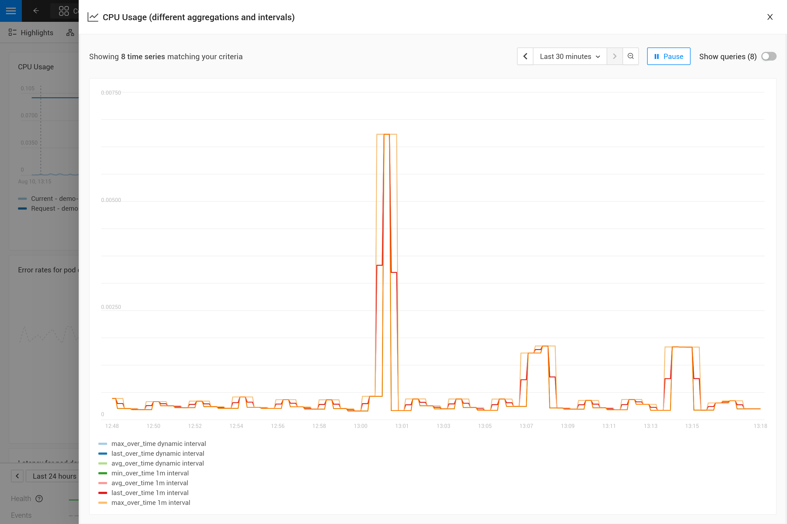
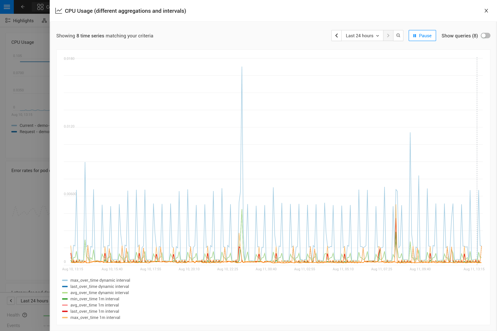
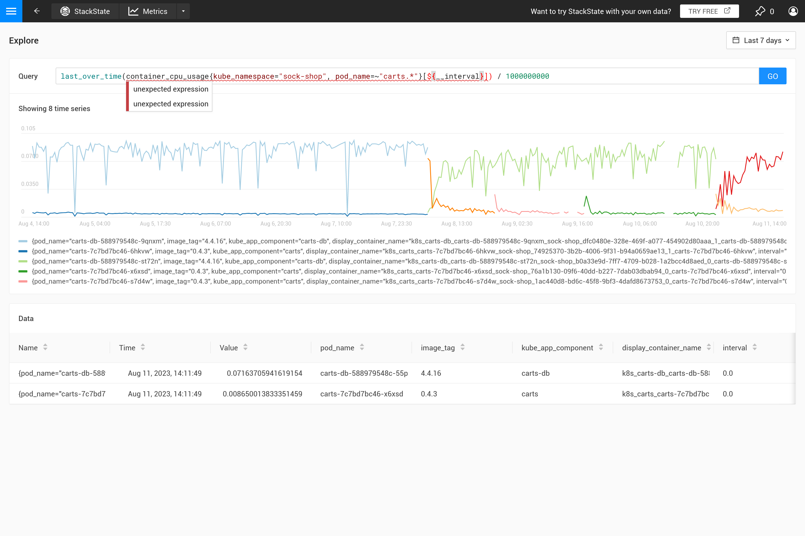
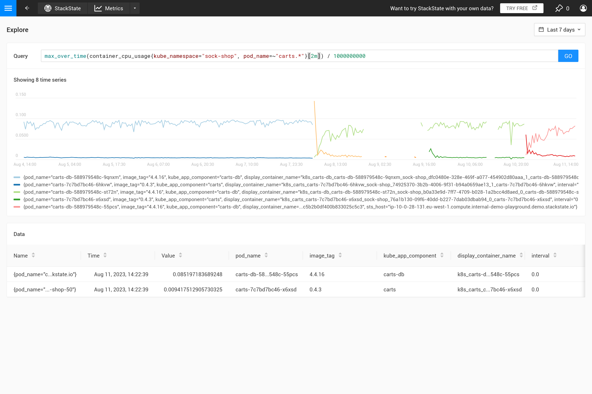
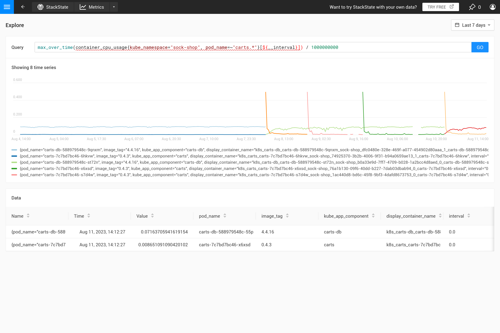
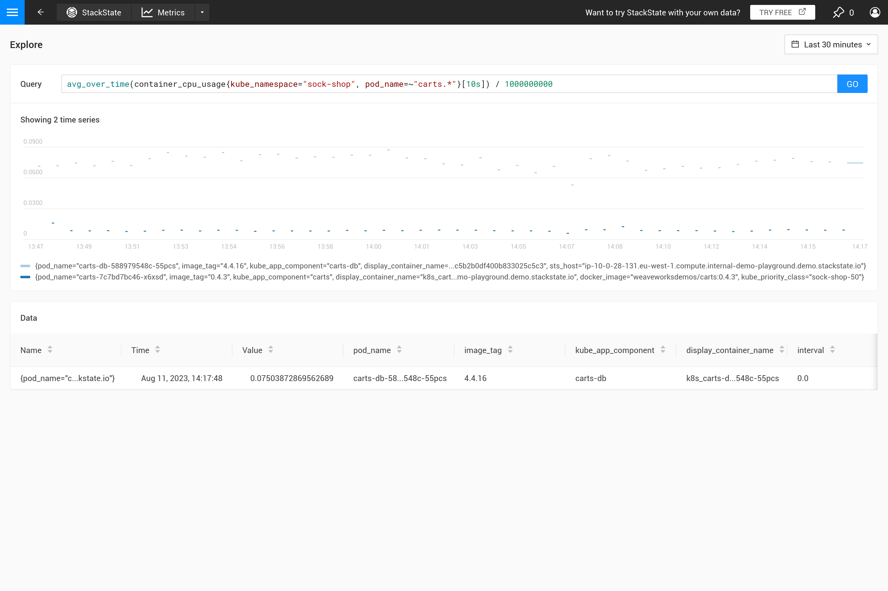
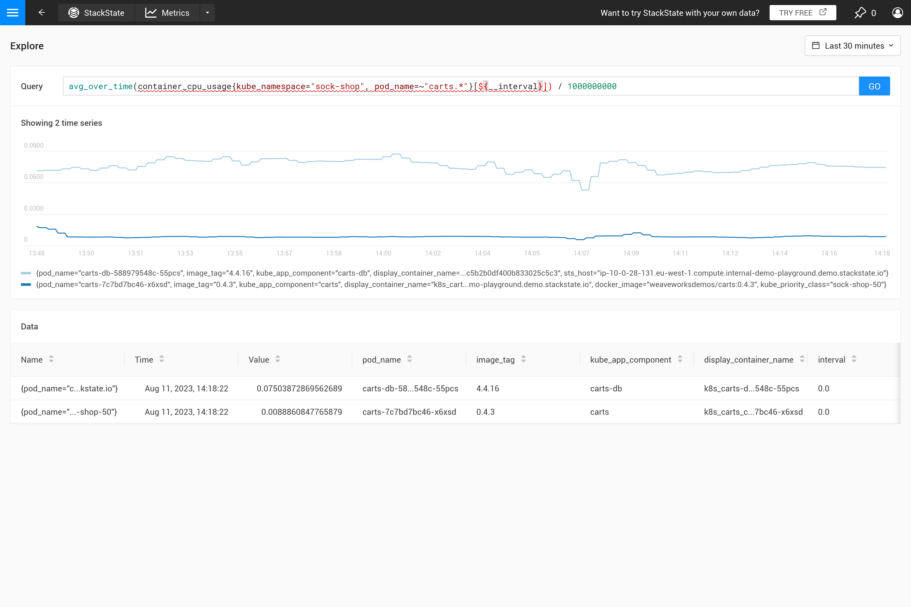

# Writing PromQL queries for representative charts

## Guidelines

When StackState shows data in a chart it almost always needs to reduce or increase the resolution of scraped data to make it fit nicely in to the available space for the chart. In the [Why?](./k8s-writing-promql-for-charts.md#why) section the reasoning behind these guidelines is discussed, but for most cases there is no need to understand and remember all the details and you can just follow the guidelines.

Guidelines for charts that represent the metric data in the best way possible:

* Don't query for the raw metric but always aggregate over time (using `*_over_time` or `rate` functions).
* Use the `${__interval}` parameter as the range for aggregations over time, it will automatically adjust with the resolution of the chart
* Use the `${__rate_interval}` parameter as the range for `rate` aggergations, it will also automatically adjust with the resolution of the chart but takes into account specific behaviors of `rate`.

Applying an aggregation often means a trade-off is made on what behavior of a metric gets emphasized. For large time windows for example, `max_over_time` will show all peaks but may not show all troughs. While `min_over_time` does the exact opposite and `avg_over_time` will smooth out both peaks and troughs. To show this behavior here is an example metric binding using the CPU usage of pods, to see it in action copy it to a YAML file and use the [CLI to apply it](./k8s-add-metrics.md#create-or-update-the-metric-binding-in-stackstate) in your StackState (you can remove it later).

```
nodes:
- _type: MetricBinding
  chartType: line
  enabled: true
  tags: {}
  unit: short
  name: CPU Usage (different aggregations and intervals)
  priority: HIGH
  identifier: urn:custom:metric-binding:pod-cpu-usage-a
  queries:
    - expression: sum(max_over_time(container_cpu_usage{kube_cluster_name="${tags.cluster-name}", kube_namespace="${tags.namespace}", pod_name="${name}"}[${__interval}])) by (kube_cluster_name, kube_namespace, pod_name) /1000000000
      alias: max_over_time dynamic interval
    - expression: sum(min_over_time(container_cpu_usage{kube_cluster_name="${tags.cluster-name}", kube_namespace="${tags.namespace}", pod_name="${name}"}[${__interval}])) by (kube_cluster_name, kube_namespace, pod_name) /1000000000
      alias: min_over_time dynamic interval
    - expression: sum(avg_over_time(container_cpu_usage{kube_cluster_name="${tags.cluster-name}", kube_namespace="${tags.namespace}", pod_name="${name}"}[${__interval}])) by (kube_cluster_name, kube_namespace, pod_name) /1000000000
      alias: avg_over_time dynamic interval
    - expression: sum(avg_over_time(container_cpu_usage{kube_cluster_name="${tags.cluster-name}", kube_namespace="${tags.namespace}", pod_name="${name}"}[${__interval}])) by (kube_cluster_name, kube_namespace, pod_name) /1000000000
      alias: last_over_time dynamic interval
    - expression: sum(max_over_time(container_cpu_usage{kube_cluster_name="${tags.cluster-name}", kube_namespace="${tags.namespace}", pod_name="${name}"}[1m])) by (kube_cluster_name, kube_namespace, pod_name) /1000000000
      alias: max_over_time 1m interval
    - expression: sum(min_over_time(container_cpu_usage{kube_cluster_name="${tags.cluster-name}", kube_namespace="${tags.namespace}", pod_name="${name}"}[1m])) by (kube_cluster_name, kube_namespace, pod_name) /1000000000
      alias: min_over_time 1m interval
    - expression: sum(avg_over_time(container_cpu_usage{kube_cluster_name="${tags.cluster-name}", kube_namespace="${tags.namespace}", pod_name="${name}"}[1m])) by (kube_cluster_name, kube_namespace, pod_name) /1000000000
      alias: avg_over_time 1m interval
    - expression: sum(avg_over_time(container_cpu_usage{kube_cluster_name="${tags.cluster-name}", kube_namespace="${tags.namespace}", pod_name="${name}"}[1m])) by (kube_cluster_name, kube_namespace, pod_name) /1000000000
      alias: last_over_time 1m interval
  scope: (label = "stackpack:kubernetes" and type = "pod")
```

After applying it open the metrics perspective for a pod in StackState (preferably a pod with some spikes and troughs in CPU usage), enlarge the chart using the icon in the top-right corner and play with the time window to see what the effects are (30 minutes vs 24 hours for example). 
Note that when you don't make the decission on what aggregation to use StackState will automatically use the `last_over_time` aggregation, see also [Why?](./k8s-writing-promql-for-charts.md#why) for an explanation.





## Why?

First of all, why should you use an aggregation? It does not make sense to retrieve more datapoints from the metric store than fit in the chart. Therefore StackState automatically determines the step needed between 2 data points to get a good result. For short time windows (for example 1 hour, i.e. the chart shows 1 hour of data only) this results in a small step (around 10 seconds). Metrics are often only collected every 30 seconds so the same value will be repeated for 3 subsequent timestamps in the chart. Zooming out to a 1 week time window, will require a much bigger step (around 1 hour, depending on the exact size of the chart on screen).

When the steps become larger than the resolution of the collected data points a decission needs to be made on how to represent all data for the entire 1 hour time range as a single value. When an aggregation over time is already specified in the query it will be used to do that, however if no aggregation is specified, or when the aggregation interval is smaller than the step, the `last_over_time` aggregation is used with the `step` size as the interval. The result is that only the last data point for each hour is used to represent the entire hour of data. 

To summarize, when executing a PromQL query for a time range of 1 week with a step of 1 hour a query like this:

```
container_cpu_usage /1000000000
```

is automatically converted to:

```
last_over_time(container_cpu_usage[1h]) /1000000000
```

Try it for yourself on the [StackState playground](https://play.stackstate.com/#/metrics?promql=last_over_time%28container_cpu_usage%7Bkube_namespace%3D%22sock-shop%22%2C%20pod_name%3D~%22carts.%2A%22%7D%5B%24%7B__interval%7D%5D%29%20%2F%201000000000&timeRange=LAST_7_DAYS).





Often this behavior is not intended and it is better to decide for yourself what kind of aggregation is needed. Using different aggregation functions it is possible to emphasize certain behavior (at the cost of hiding other behavior). Is it more important to see peaks, troughs, a smooth chart ectc.? Then use the `${__interval}` parameter for the range as it is automatically replaced with the `step` size used for the query. The result is that all the data points in the step are used.




The `${__interval}` parameter protects us from another issue. When the `step` size and therefore the `${__interval}` value, would shrink to a smaller size than the resolution of the stored metric data this would result in gaps in the chart. 

Therefore `${__interval}` will never shrink smaller than the 2* the default scrape interval (default scrape interval is 30 seconds) of the StackState agent.

Finally the `rate()` function requires at least 2 data points to be in the interval to calculate a rate at all. With less than 2 data points the rate will not have a value. Therefore  `${__rate_interval}` is guaranteed to always be at least 4 * the scrape interval, except when data is missing this will guarantee no unexpected gaps or other strange behavior in rate charts.

There are some excellent blog posts on the internet that explain this in more detail:

* [Step and query range](https://www.robustperception.io/step-and-query_range/)
* [What range should I use with rate()?](https://www.robustperception.io/what-range-should-i-use-with-rate/)
* [Introduction of __rate_interval in Grafana](https://grafana.com/blog/2020/09/28/new-in-grafana-7.2-__rate_interval-for-prometheus-rate-queries-that-just-work/)

## See also

Some more resources on understanding PromQL queries:

* [Anatomy of a PromQL Query](https://promlabs.com/blog/2020/06/18/the-anatomy-of-a-promql-query/)
* [Selecting Data in PromQL](https://promlabs.com/blog/2020/07/02/selecting-data-in-promql/)
* [How to join multiple metrics](https://iximiuz.com/en/posts/prometheus-vector-matching/)
* [Aggregation over time](https://iximiuz.com/en/posts/prometheus-functions-agg-over-time/)
