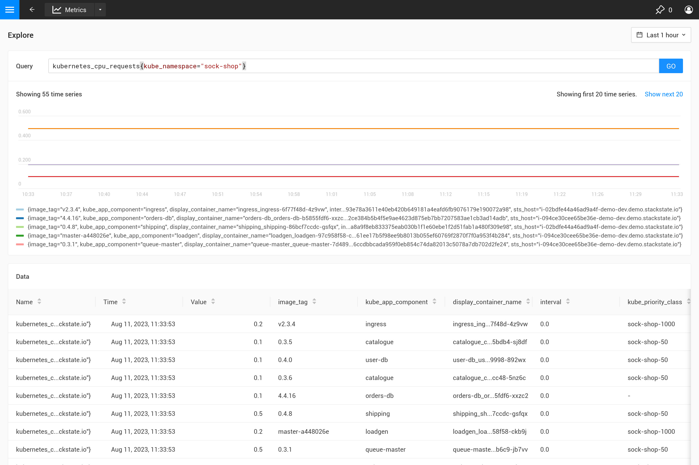

# Explore metrics

You can find the metrics explorer at the bottom of the SUSE Observability main menu. Use it to execute any PromQL query and visualize the resulting time series. The query result is shown in a chart for the selected time range and in a table that shows the last value together with the labels for the time series.

## PromQL queries

The query input field has auto-suggestions for metric names, label names and values, and supported PromQL functions. See the Prometheus documentation for a complete [PromQL guide and reference](https://prometheus.io/docs/prometheus/latest/querying/basics/). SUSE Observability also adds 2 default parameters that can be used in any query: `${__interval}` and `${__rate_interval}`. They can be used to scale the aggregation interval automatically with the chart resolution ([more details](/use/metrics/k8s-writing-promql-for-charts.md)).

## See also

* [Writing PromQL queries for representative charts](/use/metrics/k8s-writing-promql-for-charts.md)
* [PromQL documentation](https://prometheus.io/docs/prometheus/latest/querying/basics/)
* [PromQL operators](https://prometheus.io/docs/prometheus/latest/querying/operators/)
* [PromQL functions](https://prometheus.io/docs/prometheus/latest/querying/functions/)
* [Anatomy of a PromQL Query](https://promlabs.com/blog/2020/06/18/the-anatomy-of-a-promql-query/)
* [Selecting Data in PromQL](https://promlabs.com/blog/2020/07/02/selecting-data-in-promql/)
* [How to join multiple metrics](https://iximiuz.com/en/posts/prometheus-vector-matching/)
* [Aggregation over time](https://iximiuz.com/en/posts/prometheus-functions-agg-over-time/)