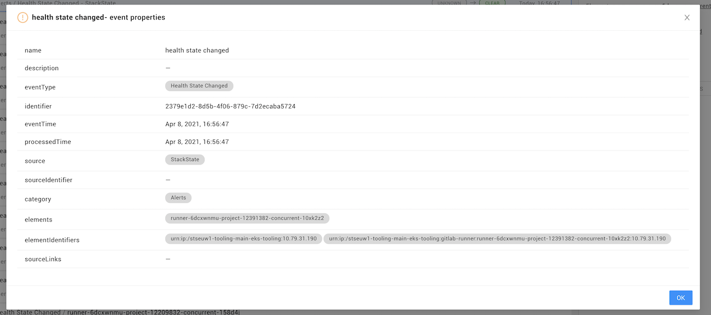

# Events Perspective


**This page describes StackState version 4.3.**

The StackState 4.3 version range is End of Life (EOL) and no longer supported. We encourage customers still running the 4.3 version range to upgrade to a more recent release.

Go to the [documentation for the latest StackState release](https://docs.stackstate.com/).


The Events Perspective shows events and changes for the elements in the current [view](../views.md) or filtered topology.

## Events

StackState defines an event as a timestamped record of an activity or change that an observer of the platform should be aware of. Events help you make sense of changes that impact your IT landscape and are a great asset when troubleshooting problems.

### Event source

StackState works with three different kinds of events, note that not all of these are available in the Events Perspective:

* **Internally generated events** - Events generated by StackState. The following event types will be listed in the Events Perspective: Anomaly, Component/relation created, Component/relation deleted, Component/relation updated, Health state changed, Version changed.
* **Events from external sources** - Some StackState integrations can retrieve events from external systems. All events retrieved from external systems will be listed in the Events Perspective. You can also use the StackState CLI or an HTTP POST to [send events to StackState](../../configure/telemetry/send_telemetry.md#events).
* **Events from telemetry streams** - Event data can be received in a log [telemetry stream](../../configure/telemetry/checks_and_streams.md#telemetry-streams). Events from these streams will not be listed in the Events Perspective, however, they can be monitored by a check. Checks can trigger a health state change event, which would then be listed in the Events Perspective as an internally generated event.

### Event category

All events in StackState have a category assigned based on the event type and source system. The available categories are **Activities**, **Alerts**, **Anomalies**, **Changes** and **Others**. Events received from external systems will have a category attached to them when they arrive in StackState. If no valid category is included in an event, it will be grouped under the category **Others**.

### Event properties

Click on an event to display an overview of the event details in the **Event properties** pane on the right of the screen. Events from external systems will also include links through to relevant information in the source system here:

* **Elements** - The components and/or relations involved in the event.
* **Event type** - A description of the event type.
* **Event time** - The time at which the event occurred. For events from an external system, this will be the timestamp from the external system. Click on the timestamp to [time travel](events_perspective.md#time-travel) to the topology at the moment that the event occurred.
* **Processed time** - For external events, this is the time that the event was received by StackState. For internally generated events that affect the graph database, this is the time data was stored in the graph database. Click on the timestamp to [time travel](events_perspective.md#time-travel) to the topology at the moment that the event was processed by StackState.
* **Links** - Direct links to an external source of an event. For example, a ServiceNow change request or JIRA ticket.
* **Description** - Additional information about the event. For example, the context of the event or its importance.
* **SHOW EVENT PROPERTIES** - Click to access all data included in the event.

## Filter displayed events

### Filter by source component

The [topology filters](../view_filters.md#filter-topology) in the the **View Filters** pane on the left side of the StackState UI define the elements \(components and relations\) for which events will be displayed. Only events relating to elements that match the applied topology filters or the view itself will be visible. You can adjust the components for which events are displayed by updating the topology filters.

### Filter by event properties

The [event filters](../view_filters.md#filter-events) in the **View Filters** pane on the left side of the StackState UI allow you to refine the events displayed based on event category or type, source system and tags.

### Filter by timestamp

The Events Perspective shows events matching the **Time Window** selected in the timeline control at the bottom of the StackState UI. Adjust the time window to show only events that were generated at that time time.

## Time travel

The Events Perspective lists events that were generated:

* by the topology elements that existed at the point in time specified by the playhead.
* within the selected time window.

This allows you to time travel to both events generated by topology elements available at a specific point in history and events generated within a specific time window. Moving the playhead in the timeline or clicking a timestamp will time travel to the topology that was available at that point in history. The events list will be updated to include events for the topology elements available at the position of the playhead and within the selected time window.

For example:

* Adjust the **Time window** to increase or decrease the number of events displayed.
* Move the **playhead** on the timeline to time travel to the topology available at that point in history. Events generated within the selected time window by topology elements that existed at the moment in time indicated by the playhead will be displayed.
* Click on a timestamp from the **Event Properties** to move the playhead directly to that point on the timeline. This will update the events list to display events that were generated:
  * by topology elements that existed at that moment in time.
  * within the specified time window \(this will be adjusted to fit the selected timestamp if required\).

## See also

* [Use events to trigger event notifications and actions](../health-state-and-event-notifications/send-event-notifications.md)
* [Filtering data](../view_filters.md)
* [Working with StackState views](../views.md)
* [Send events to StackState from external sources](../../configure/telemetry/send_telemetry.md#events)

