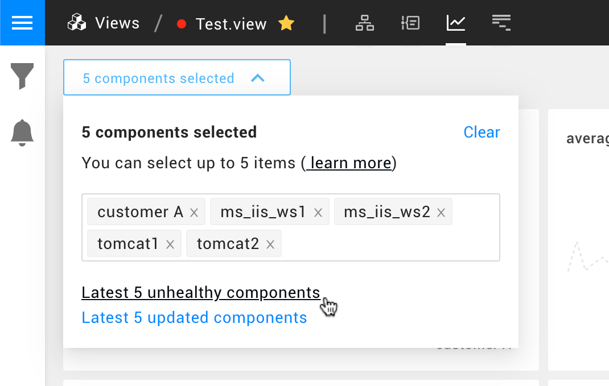
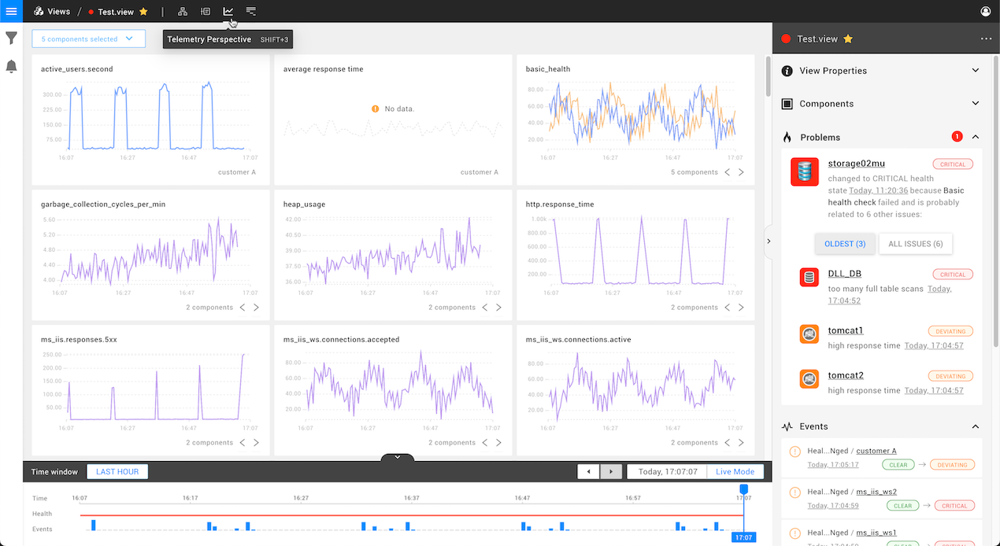

# Telemetry Perspective


**This page describes StackState version 4.3.**

The StackState 4.3 version range is End of Life (EOL) and no longer supported. We encourage customers still running the 4.3 version range to upgrade to a more recent release.

Go to the [documentation for the latest StackState release](https://docs.stackstate.com/).


The Telemetry Perspective shows telemetry streams for your [view](../views.md) and provides an automatic dashboard. StackState will automatically deliver all the relevant information for any part of your landscape, so you don't need to pre-define the streams you want to see.

## Telemetry and Components

The Telemetry Perspective shows telemetry for up to **5** components. When you open the Telemetry Perspective, StackState will show the telemetry for the components in your view. If there are more than 5 components in your view, StackState selects the top 5 components as follows:

* The 5 components that most recently changed their health state to either CRITICAL or DEVIATING.
* If there are no unhealthy components, the 5 components that most recently changed their health state.

You can manually change the component selection in the Telemetry Perspective using the **Component Selector**:

The component selection can be adjusted as follows:

* Clear the component selection using the **Clear** button
* Add components by typing their name in the component bar; remove components by clicking on the **x** next to their name
* Reset the component selection to the most recent 5 unhealthy or updated components using the links at the bottom  

## Filtering

### Topology Filters

The View Filters pane on the left side of the screen in any View allows you to filter the sub-set of topology for which telemetry streams are displayed. Read more about [Topology Filters](../view_filters.md#filter-topology)

## Charts

Charts are showing Telemetry Data of selected components in near real-time - they are fetching data every 30 seconds. If a process is stopped and no more data is received, then eventually, the process will leave the chart as the data shifts left at least every 30 seconds. If there is more data that comes in during the 30 second interval it will be pushed to a chart. A single chart can display multiple lines for the same metric when multiple components are selected - this grouping is based on the name of the stream. It is possible to cycle through each of these streams and depict them as a single line in a single chart using the arrow controls on the chart.

## Time travel

Time traveling with the Telemetry Perspective is also possible. When time traveling, the currently selected Topology is time traveled, and the telemetry of those components are depicted in the charts. It is possible that the selected component may no longer exist in the time traveled state, no data for this component will be shown.

## Ordering

The Telemetry Perspective orders the telemetry streams based on their priority. The priority can be configured on the Telemetry Inspector screen.

