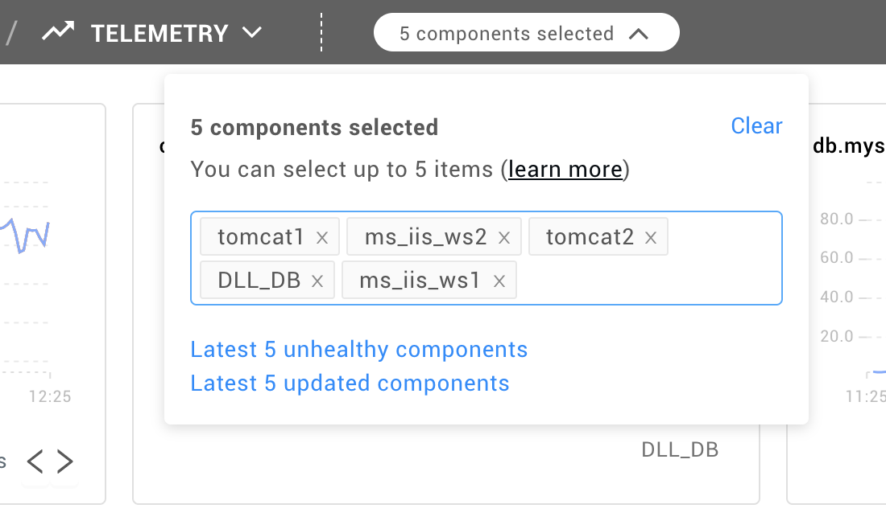

# How to narrow the telemetry perspective

Telemetry Perspective primarily provides the Telemetry overview for components selected in the Topology View. Sometimes the Topology selection can be too big to transfer it to a readable Telemetry dashboard. Component number restriction for Telemetry Perspective is set to 5 by default. There is no limit on the number of relations. In situations when you open the Telemetry Perspective from a Topology selection and there's a lot of charts for 5 pre-selected components with unhealthy or changed state, you can narrow it further down. Follow the instructions below:

## 1. Locate components selector

On the top ribbon there is a dropdown menu that informs how many components are selected for the Telemetry Perspective \(1\). Unfold it to see all components selected for the current Telemetry Perspective:

## 2. Remove unnecessary components

Each component has an "x" button next it's name. Click on the "x" button to remove the component from the dropdown list.

Note: If there are no components selected for the Telemetry Perspective, the dropdown menu contains an input field, where you can start typing component names that you want to see Telemetry for.

