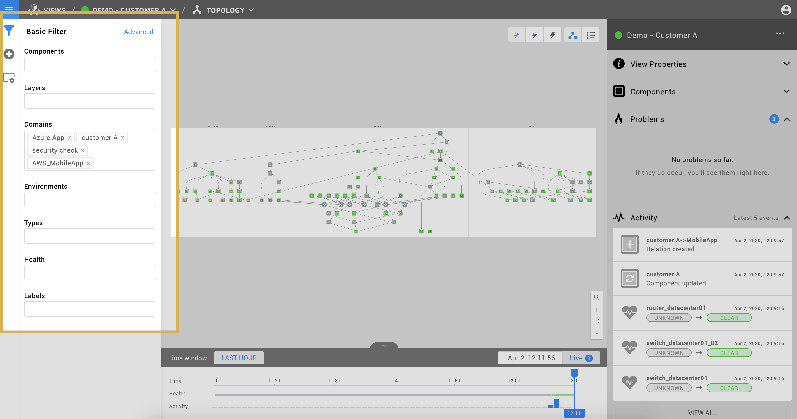
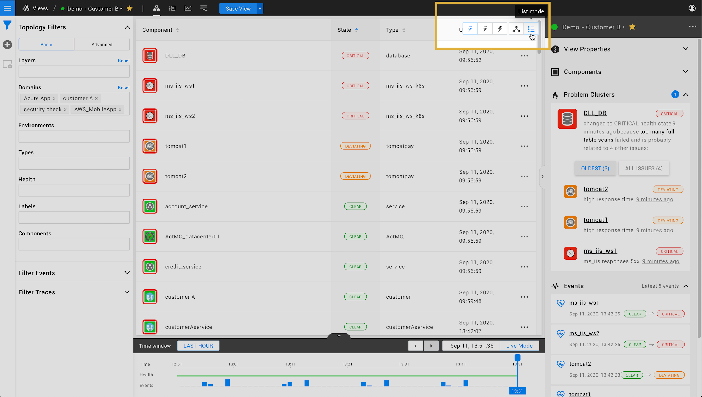
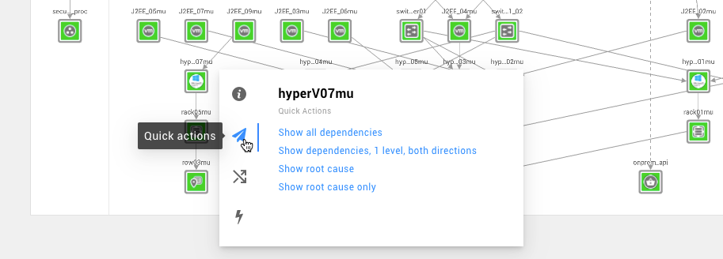

# Topology Perspective

The Topology Perspective displays the components in your IT landscape and their relationships.


## Components and relations

The Topology Perspective shows components and relations in the selected [view](../views.md). Components that have one or more [checks](../../configure/checks_and_streams.md#checks) configured will have a calculated [health state](../../configure/propagation.md).

## Component details

When a component is selected by clicking on it, the Component Details panel is shown on the right hand side. This panel displays detailed information of the component:

* metadata such as the component's name, type and labels
* [health checks](../../configure/checks_and_streams.md#checks)
* [telemetry streams](../../configure/checks_and_streams.md#data-streams)

## Filtering

By design, there is only one topology per StackState instance to make sure any part of the topology can always be connected to any other part. The topology is, of course, segmented in many different ways depending on your environment. You can narrow down on the part of the topology you are interested in filtering.

### Using basic filtering

The main way of filtering the topology is by using the basic filter panel, accessed using the _filter_ icon.

From here, you can use the basic filter panel to filter the topology on certain properties. If you select a particular property, the topology view will be updated to show only the topology that matches the selected value. Selecting multiple properties narrows down your search \(ie, it combines them using an `AND` operator\). Selecting multiple values for a single property expands your search \(ie, it combines them using an `OR` operator\).

Using the basic filter panel you can select a subset of your topology based on the following properties:

* layers
* domains
* environments
* types
* health state
* tags / labels

Layers, domains, and environments are a way to organize your topology. The health state reflects how the component is functioning. Use labels to make it easy to navigate your topology.

### Filter settings

**Show Components** adds one or more specific components to the topology selection. You can **search** for the component by name.

### Basic filtering example

Here is an example of using the basic filtering capabilities. This example shows how to filter for particular components and customers.



The same topology selection can also be shown in list format:



### Filtering limits

To optimize performance, a limit is placed on the amount of elements that can be loaded to produce a topology visualization. By default, the limit is set to 10000 elements. This limit can be configured using the `stackstate.topologyQueryService.maxStackElementsPerQuery` parameter in `etc/application_stackstate.conf`.

If a [basic filtering](/use/perspectives/topology-perspective#filtering) or [advanced query](/configure/topology_selection_advanced) exceeds the limit configured in `etc/application_stackstate.conf` you will be presented with an error on screen.

Note that the filtering limit is applied to the total amount of elements that need to be loaded and not the elements displayed after filtering. For example:
```text
withNeighborsOf(direction = "both", components = (name = "*"), levels = "15") <br>   AND layer = "applications"
```
In the query above, we are asking to LOAD all neighbors of every component in our topology to eventually only SHOW the ones that belong to the `applications` layer. This would likely fail with a filtering limit error because of the number of components loaded.

To successfully produce this topology visualization, you could either re-write the query to keep the number of components loaded below the configured filtering limit, or increase the filtering limit configured in `etc/application_stackstate.conf`.

## Interactive navigation

It is also possible to interactively navigate the topology. Right-click on a component to bring up the component navigation menu:

Selecting an action from the menu allows you to change your view, respective to the selected component.



**Quick Actions** expands the topology selection in one of the following ways:

* Show all dependencies -- shows all dependencies for selected component
* Show dependencies, 1 level, both directions -- limits displayed dependencies to one level from selcted compontent
* Show Root Cause -- if the selected component is in a non-clear state, adds the root cause tree
* Show Root Casue only -- limits displayed components to the root cause elements


**Dependencies** isolates the selected component \(shows only that component\) and expands the topology selection in one of the following ways:

* Direction -- choose between **Both**, **Up**, and **Down**
* Depth -- choose between **All**, **1 level**, and **2 levels**

If you require more flexibility in selecting topology, check out our [guide to Advanced topology querying with STQL](../../configure/topology_selection_advanced.md).

## Component finder

Locate a specific component in the view by typing the first few letters of it's name in the Topology Perspective. Alternatively, you can select the **Component finder** icon magnifying glass in the bottom right corner of the topology visualizer.

## Zoom in, zoom out and Fit to Screen

There are zoom buttons located in the bottom right corner of the topology visualizer. The **plus** button zooms in on the topology, the **minus** button zooms out. In between both buttons is the **fit to screen** button which zooms out so the complete topology becomes visible.

## Problem clusters

If one or more components have a critical state, StackState will show the related components and their states as a Problem Cluster in the [View Overview pane](../views.md#view-overview).

## Root cause display

If there are components with [telemetry streams](../../configure/checks_and_streams.md#data-streams) and [health checks](../../configure/checks_and_streams.md#checks) in your view, the Topology Perspective will calculate a health state and [propagate](../../configure/propagation.md) this state throughout the graph. This means your view can contain components that have a deviating health state caused by a component that is outside your view.

The Topology Perspective allows you to configure whether to show the root cause if it is outside of your view:

* **Don't show root cause** -- do not show the root cause
* **Show root cause only** -- only show the root cause component
* **Show full root cause tree** -- show the entire root cause tree

## List mode

The components in the view can also be shown in a list instead of a graph.
