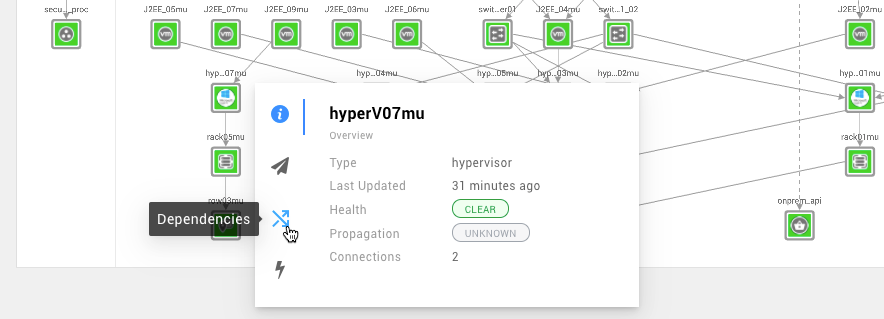
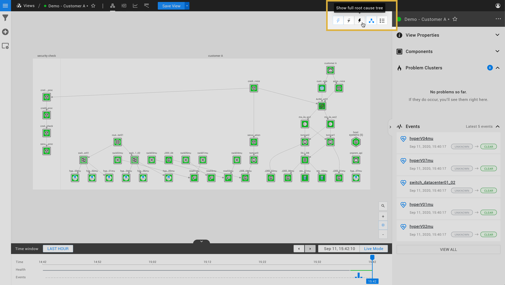

# Topology Perspective

The Topology Perspective displays the components in your IT landscape and their relationships.

## Components and relations

The Topology Perspective shows components and relations in the selected [view](../views.md). Components that have one or more [checks](../../configure/checks_and_streams.md#checks) configured will have a calculated [health state](../../configure/propagation.md).

## Component details

When a component is selected by clicking on it, the Component Details panel is shown on the right hand side. This panel displays detailed information of the component:

* metadata such as the component's name, type and labels
* [health checks](../../configure/checks_and_streams.md#checks)
* [telemetry streams](../../configure/checks_and_streams.md#data-streams)

## Filtering

The View Filters panel on the left side of the screen in any View allows you to filter the topology components displayed. Read more about [Topology Filters](filters.md#topology-filters)

## Interactive navigation

It is also possible to interactively navigate the topology. Hover over a component to bring up the component navigation menu:

Selecting an action from the menu allows you to change your view, respective to the selected component.

### Quick actions

Quick actions expand the topology selection in one of the following ways:

* Show all dependencies -- shows all dependencies for selected component
* Show dependencies, 1 level, both directions -- limits displayed dependencies to one level from selected component
* Show Root Cause -- if the selected component is in a non-clear state, adds the root cause tree
* Show Root Cause only -- limits displayed components to the root cause elements

You can extend this list with [component actions](../../configure/component_actions.md) that are pre-defined in a StackPack or configure your own actions.

### Dependencies

Isolate the selected component \(show only that component\) and expand the topology selection in one of the following ways:

* Direction -- choose between **Both**, **Up**, and **Down**
* Depth -- choose between **All**, **1 level**, and **2 levels**

If you require more flexibility in selecting topology, check out our [guide to Advanced topology querying with STQL](../../configure/topology_selection_advanced.md).

### Root Cause Analysis

Isolate the selected deviating component \(show only that component\) and expand the topology selection in one of the following ways:

* **Root cause only** -- only show the root cause component
* **Full root cause tree** -- the entire root cause tree

## Component finder

Locate a specific component in the view by typing the first few letters of it's name in the Topology Perspective. Alternatively, you can select the **Component finder** icon magnifying glass in the bottom right corner of the topology visualizer.

## Zoom in, zoom out and Fit to Screen

There are zoom buttons located in the bottom right corner of the topology visualizer. The **plus** button zooms in on the topology, the **minus** button zooms out. In between both buttons is the **fit to screen** button which zooms out so the complete topology becomes visible.

## Problem clusters

If one or more components have a critical state, StackState will show the related components and their states as a Problem Cluster in the [View Overview pane](../views.md#view-overview).

## Root cause outside current view

If there are components with [telemetry streams](../../configure/checks_and_streams.md#data-streams) and [health checks](../../configure/checks_and_streams.md#checks) in your view, the Topology Perspective will calculate a health state and [propagate](../../configure/propagation.md) this state throughout the graph. This means your view can contain components that have a deviating health state caused by a component that is outside your view.

The Topology Perspective allows you to configure whether to show a root cause _that is outside of the currently displayed view_:

* **Don't show root cause** -- do not show the root cause
* **Show root cause only** -- only show the root cause component
* **Show full root cause tree** -- show the entire root cause tree

## List mode

The components in the view can also be shown in a list instead of a graph.
