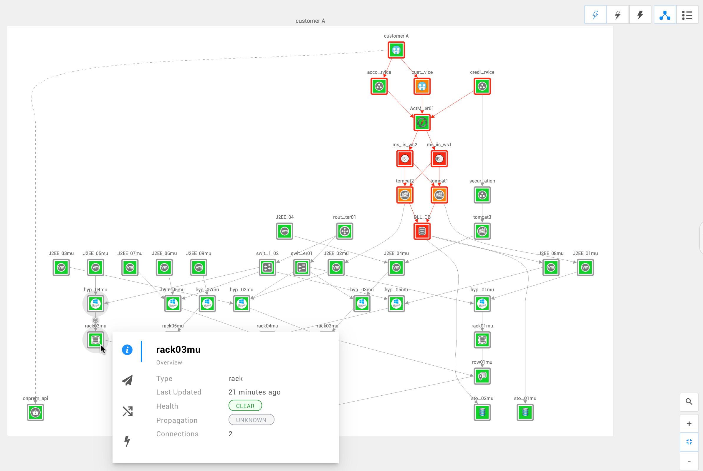
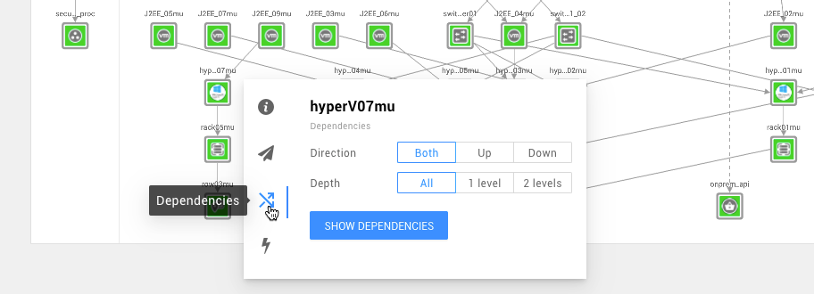
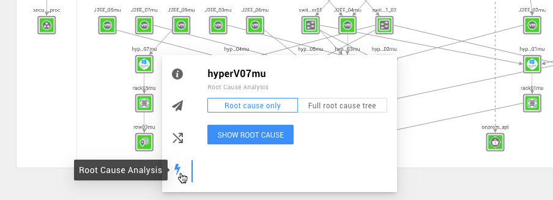
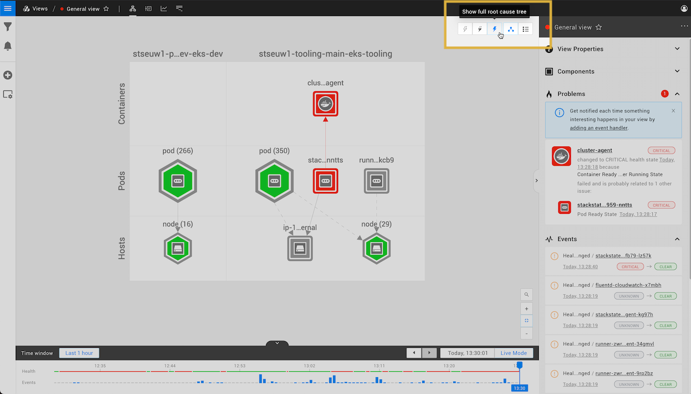

# Topology Perspective


**This page describes StackState version 4.3.**

The StackState 4.3 version range is End of Life (EOL) and no longer supported. We encourage customers still running the 4.3 version range to upgrade to a more recent release.

Go to the [documentation for the latest StackState release](https://docs.stackstate.com/).


## Overview

The Topology Perspective displays the components in your IT landscape and their relationships.

## Components and relations

The Topology Perspective shows components and relations in the selected [view](../views.md). Components that have one or more [checks](../../configure/telemetry/checks_and_streams.md#checks) configured will have a calculated [health state](../../develop/developer-guides/custom-functions/propagation-functions.md).

## Component details

When a component is selected by clicking on it, the Component Details pane is shown on the right hand side. This panel displays detailed information of the component:

* metadata such as the component's name, type and labels
* [health checks](../../configure/telemetry/checks_and_streams.md#checks)
* [telemetry streams](../../configure/telemetry/checks_and_streams.md#data-streams)

## Filter displayed components

The [topology filters](../view_filters.md#filter-topology) in the the **View Filters** pane on the left side of the StackState UI allow you to filter the topology components displayed.

Click on a label in the [component details pane](topology-perspective.md#component-details) to add this as a filter.

## Filter displayed events

The [event filters](../view_filters.md#filter-events) can be used to filter the events shown in the **Events** list in the View Details pane on the right of the StackState UI.

## Interactive navigation

The topology can also be navigated interactively. Hover over any component to bring up the component navigation menu. The available options allow you to change your view respective to the selected component.

### Actions

**Actions** can be used to expand the topology selection in one of the following ways:

* Show all dependencies -- shows all dependencies for selected component
* Show dependencies, 1 level, both directions -- limits displayed dependencies to one level from selected component
* Show Root Cause -- if the selected component is in a non-clear state, adds the root cause tree
* Show Root Cause only -- limits displayed components to the root cause elements

A list of the available actions is included in the component details pane when you select a component and also in the component navigation menu, which is displayed when you hover over a component.

The default list of actions can be extended with [component actions](../../configure/topology/component_actions.md) that are installed as part of a StackPack or you can [write your own](../../develop/developer-guides/custom-functions/component-actions.md) custom component action functions.

### Dependencies

Hover over any component to bring up the component navigation menu. Select Dependencies to isolate the selected component \(show only that component\) and expand the topology selection in one of the following ways:

* Direction -- choose between **Both**, **Up**, and **Down**
* Depth -- choose between **All**, **1 level**, and **2 levels**

If you require more flexibility in selecting topology, check out the [StackState Query Language \(STQL\)](../../develop/reference/stql_reference.md).

### Root Cause Analysis

Hover over any component to bring up the component navigation menu. Select Root Cause Analysis to isolate the selected non clear \(e.g. deviating or critical\) and expand the topology selection in one of the following ways:

* **Root cause only** -- only show the probable causing component
* **Full root cause tree** --  show the entire root cause tree

You can also [show root cause outside the current view](topology-perspective.md#root-cause-outside-current-view)

## Component finder

Locate a specific component in the view by typing the first few letters of it's name in the Topology Perspective. Alternatively, you can select the **Component finder** icon magnifying glass in the bottom right corner of the topology visualizer.

## Zoom in, zoom out and Fit to Screen

There are zoom buttons located in the bottom right corner of the topology visualizer. The **plus** button zooms in on the topology, the **minus** button zooms out. In between both buttons is the **fit to screen** button which zooms out so the complete topology becomes visible.

## Problems

If one or more components have a critical state, StackState will show the related components and their states as a **Problem** in the [View Details pane](/use/views.md#the-view-details-pane).

## Root cause outside current view

If there are components with [telemetry streams](../../configure/telemetry/checks_and_streams.md#data-streams) and [health checks](../../configure/telemetry/checks_and_streams.md#checks) in your view, the Topology Perspective will calculate a health state and [propagate](../../develop/developer-guides/custom-functions/propagation-functions.md) this state throughout the graph. The propagated health state will help you to see the risk of affecting other components.

It is possible that your view can contain components that have a deviating propagated health state caused by a component that is outside your view. The Topology Perspective allows you to configure whether to show a root cause even when it is outside of the currently displayed view:

* **Don't show root cause** -- do not show the root cause
* **Show root cause only** -- only show the root cause component
* **Show full root cause tree** -- show the entire root cause tree

## List mode

The components in the topology visualization can also be shown in a list instead of a graph:

### Export as CSV

From list mode, the component list can be exported as a CSV file. The CSV file includes `name`, `state`, `type` and `updated` details for each component in the view.

1. From the topology perspective, click the **List mode** icon on the top right of the screen to open the topology in list mode.
2. Click **Download as CSV** from the top of the page.
   * The component list will be downloaded as a CSV file named `<view_name>.csv`.

