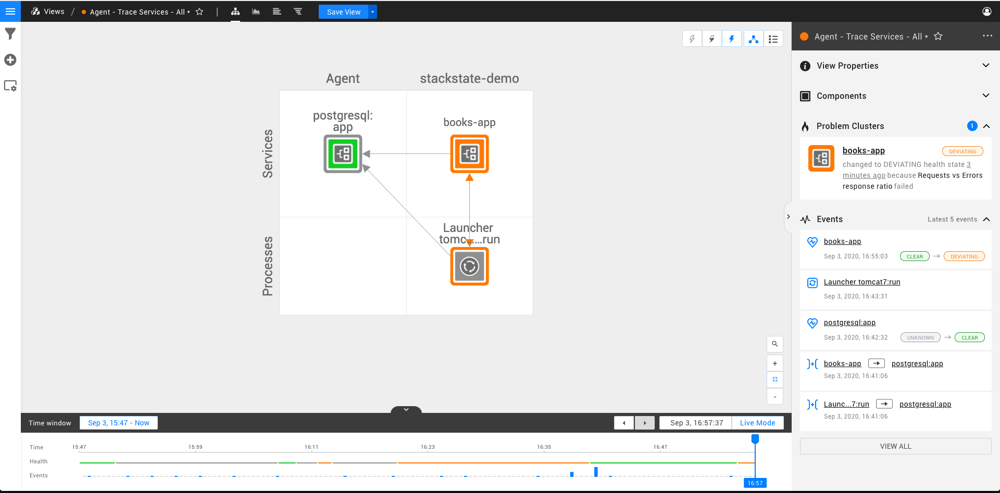
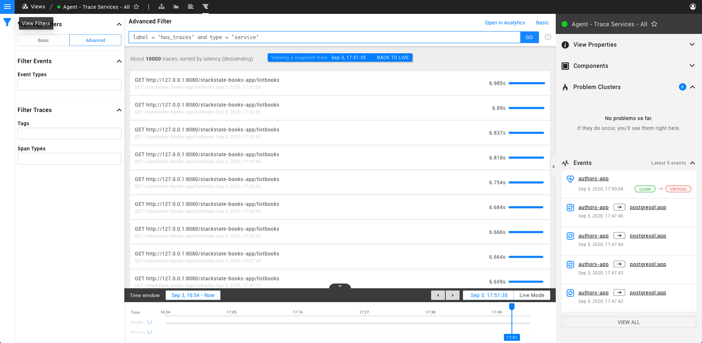

# Traces Perspective

The trace perspective shows a list of traces and their spans for the components in your view. This way, you can monitor the performance of the applications in your IT infrastructure in StackState without using 3rd party tools.

To find out more about how you can add traces to StackState please visit [the following guide](../../configure/how_to_setup_traces.md).

## Traces and Topology

When you're in a [view](../views.md), you are seeing a sub-selection of your IT infrastructure in terms of components and relations. If you then switch to the *traces perspective* how do these traces relate to the components in your view? A number of our supported integrations send traces to StackState via [our agent](../../configure/how_to_setup_traces.md). However, these traces are also used to create topology which you can see in the [topology perspective](topology-perspective.md) of your view. For example, let's imagine that among your IT infrastructure the following components exist:
1. An HTTP service
2. A Java Application
3. A SQL Database

By installing our agent and its integrations to gather traces from these technologies, you'll then get traces that traverse these components. StackState, at ingestion time, stores both the spans that make up for each component in the bullet list above, as well as the topology (components and relations) that can be extracted from these traces. Therefore, each component makes for a span, and each trace makes for the list of spans (or components) that are traversed in order to complete requests that are executed in your IT infrastructure.

The two images above illustrate these concepts by showing a library application whose main responsibility is to fetch a list of books. You can see the topology that is created out of the traces as well as an example of a single trace and its spans for a request to fetch the list of books.

## Inspecting Traces

### Trace Inspection

When in the *traces perspective*, you get a list of the slowest traces for the components in your view. In order to see the spans that make up for each trace, you can click on any trace in the list in order to expand that item.

Span types are colored differently according to the information on the right. For example, the orange spans in this trace correspond to postgres calls that are made when completing the request.

### Span Details

When inspecting a trace and seeing the list of its spans, you can click on any span to see further details. The image below illustrates this action.

## Filtering

As explained in this guide, traces and components are tightly related. Therefore, there are two ways of filtering the traces you see in the *traces perspective*: using topology filters or trace filters.

### Topology Filters

When you are in a view, you fetch traces for the components in that view. Therefore, you can use these same filters while in trace perspective to reduce/increase the number of components for which you want to fetch traces. You can learn more about how to use topology filters in the [topology perspective page](topology-perspective.md).

### Trace Filters

You are able to filter traces based on two properties of its spans: span types and span tags. The image below shows the filters menu where you see filters for topology, events and traces:

For example, if you filter the trace list for all spans of type **database**, this will return all traces that have at least one span whose type is **database**.

## Sorting and Limiting

As of version 4.1, all traces are sorted by latency (descending). This is the only sorting criteria available in this version. As for limits, the trace list is not limited by any size and you're able to scroll infinitely to see all traces that are available for you component, filter and time selections.

## Time Traveling Considerations

When using the *traces perspective*, just like in other perspectives, you can either be in live mode or in the past. If you're in live mode, StackState is constantly polling for new traces. When time travelling to the past, all views in all perspectives come with a timeline for which you can make two selections:
1. The specific moment in time for which you want the snapshot of your IT infrastructure to be fetched (i.e. topology).
2. The time range for which you want to see traces (e.g the last 24 hours).

Let's imagine a concrete scenario - You received an alert saying that your payment processing application is not able to process any payments right now and your customers aren't being served. When using StackState, you can go to the moment in time in which the components that make up for the critical path of payment processing turned into `CRITICAL` state. That moment corresponds to the point in time for which you fetch the snapshot of your IT infrastructure as specified in 1). You can then select to see the hours that preceded that moment in order to fetch the traces that will hopefully point you to the root cause of your problem.

### Inspection, scrolling and its impact on time selection.

When using the *traces perspective* in live mode, you are constantly polling for the *slowest traces* in your time range selection. However, in a large IT infrastructure with constant requests being traced, what are you slowest traces now might now be your slowest traces (and be further down the list) in a matter of seconds. However, if a user is inspecting a trace or one of its spans, it would severely impact the usability of this feature if that trace kept constantly bouncing up and down the list of traces. Furthermore, if a user is scrolling down the list looking for a specific trace or a pattern in the list of traces, it also would make it hard for them for that list to be constantly changing. For these reasons, we've decided that these two actions (inspecting traces/spans and scrolling) effectively "pause" time and allow you to browse through a stable snapshot of your data. Pausing time means that you are now in the past and just like in all other perspectives, you're able to resume to live mode by clicking on the blue ribbon on top or in the timeline itself as illustrated in the image below.

