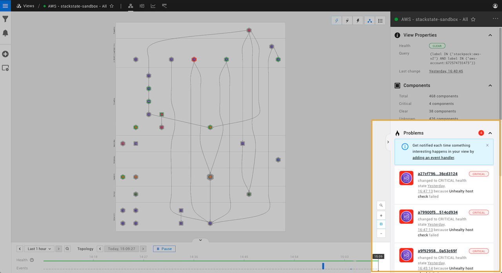

# What is a problem?

## Overview

When a component or relation reports a DEVIATING \(orange\) or CRITICAL \(red\) state, StackState will identify this as a problem in your IT environment. As StackState is aware of the connections and dependencies between components in the topology, related unhealthy state changes can be grouped together into a single problem with a single root cause. This is helpful because it will:

* **Speed up problem investigation** - all unhealthy elements affected by a single root cause can be found in a dedicated sub-view.
* **Reduce noise** - the evolution of the problem can be be tracked as a single entity, rather than a collection of individual, unhealthy elements.

## What is a StackState problem?

A problem in StackState is the collection of unhealthy components that can be attributed to a single root cause. A problem contains the following components:

* A single root cause - this is the unhealthy component at the bottom of the dependency chain.
* Any number of contributing causes - these are all of the unhealthy components that depend on the root cause.

## Problem lifecycle

A problem is [created](#problem-created) when the health state of a component in a view changes to DEVIATING (orange) or CRITICAL (red).

Updates to the health state of components in the view may result in new problems being created or existing problems being [updated](#problem-updated). If a change in health state causes the root cause of an existing problem to change, the resulting problem update may cause an existing problem to be [subsumed](#problem-subsumed). For example, if a previously healthy upstream dependency switches to an unhealthy state.

When the root cause and all contributing cause components have changed to a CLEAR (green) health state, the problem is considered as [resolved](#problem-resolved).

### Problem created

If a component's health state changes to DEVIATING or CRITICAL and the root cause component is not already part of an existing problem, a new problem will be created. All other components in the landscape with an unhealthy state that can be attributed to the same root cause will be added to the same problem as contributing causes. It is possible for a single unhealthy component to be a contributing cause in two separate problems - if there are two potential root cause components for a component's unhealthy state, StackState will see this as two separate problems. 

The following events will be generated:

* A `Problem created` event for each created problem.

### Problem updated

A problem will be updated if a component in the landscape switches its state to DEVIATING or CRITICAL and becomes a new contributing cause or root cause for an existing problem.

The following events will be generated:

* A `Problem updated` event for each update to a problem.


Updates to an existing problem may result in another existing problem being [subsumed](#problem-subsumed) or a new problem being [created](#problem-created).


### Problem subsumed

If a component switches its state to unhealthy and would become the new root cause for more than one existing problem, StackState will combine all of these problems into one problem. The original problems will all be incorporated into the oldest problem with the same root cause \(subsumed\) and the oldest problem will have its root cause updated to be the new root cause component. This would happen, for example, if an upstream dependency of two root cause components switched to an unhealthy state.

The following events will be generated:

* A `Problem updated` event for the oldest problem.
* A `Problem subsumed` event for each other (subsumed) problem.

### Problem resolved

When the root cause and all contributing cause components have changed to a CLEAR \(green\) health state, the problem is considered as resolved and will no longer be visible in the StackState UI. 

The following events will be generated:

* A `Problem resolved` event for the resolved problem.


If the components in the problem change back to an unhealthy state in the future, this will be reported as a new problem in StackState.


## See also

* [How to navigate through a problem in the StackState UI](problem_investigation.md)
* [Anomaly detection](../concepts/anomaly-detection.md)
* [Problem notifications](problem_notifications.md)

