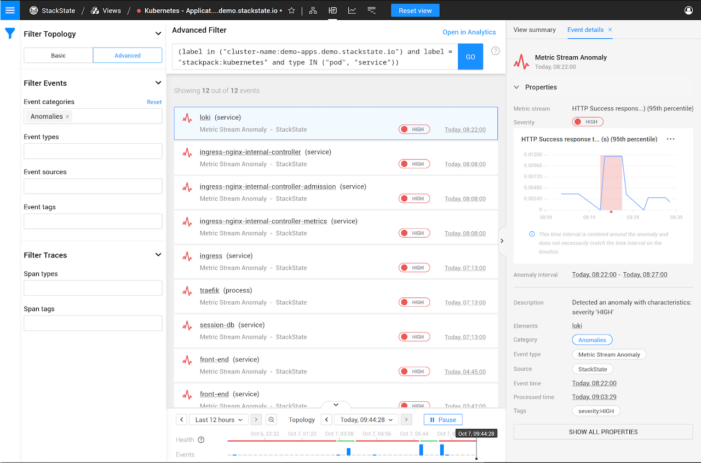
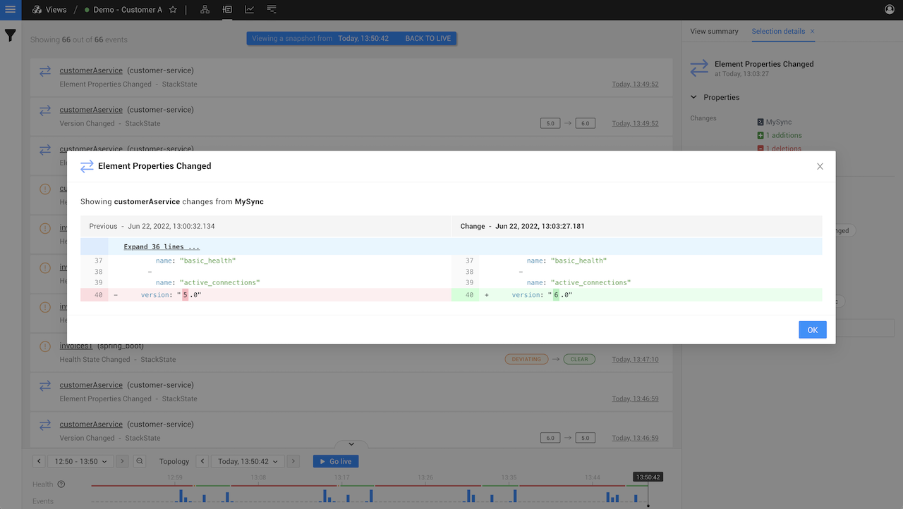

# Investigate a problem

## Overview

Unhealthy components in a view are grouped into [problems](about-problems.md) based on how they're connected in the topology. When StackState identifies a problem, this will be reported in the right panel under **Problems**.

* The **View summary** and **Subview summary** tabs list all problems that impact components in the current view or subview. 
* The **Component details** tab lists all problems that involve the selected component. 
* The **Direct relation details** tab lists all problems that involve the selected direct relation, its source component or its target component. 

You will find the most recently updated problem at the top of the list and the problem with the oldest update at the bottom. Whenever a problem is created or updated, it will move to the top of the list. Within each problem, the involved components are listed in order of the timestamp of their last health state change, from the most recent at the top to the oldest at the bottom.

➡️ [Learn more about the problem lifecycle](problem-lifecycle.md)

## Detailed information about a problem

Select a problem to open detailed information about it in the right panel details tab - **Problem details**.

The **Problem details** tab gathers together all the information you need to get started investigating a problem in your landscape:

* All [unhealthy components](about-problems.md#topology-elements-in-a-problem) in the problem \(the root cause and contributing causes\). 
* The [Probable Causes](problem_investigation.md#probable-causes) of unhealthy components - events that may have triggered the unhealthy state changes in the problem. 

Click **INVESTIGATE IN SUBVIEW** to open all components in a problem in a dedicated, temporary [problem subview](problem_investigation.md#problem-subview).

## Probable causes

For each reported problem, StackState will list all events that are likely to have contributed to unhealthy state changes in the problem. These could be events of type **Anomaly**, **Configuration changed** or **Version changed** that occurred within the [problem time window](about-problems.md#time-window-of-a-problem) and relate to components in the problem. If no relevant probable cause events are available in StackState, the list will be empty.

### Anomaly events

Anomaly events are generated whenever an anomaly is detected by the [Autonomous Anomaly Detector](../../stackpacks/add-ons/aad.md). For metric stream anomalies, details of the metric stream where the anomaly was found are provided.

1. Select a `Metric stream anomaly` event in the Events Perspective.
   * Detailed information about the event is displayed in the right panel details tab - **Event details**.
   * The affected stream is displayed highlighting the detected anomaly.
2. Click on the metric stream graph or select **inspect** from its menu \(**...**\) to open the [telemetry inspector](../metrics/browse-telemetry.md) and inspect the stream in more detail.

### Configuration changed events

Configuration changed events are generated whenever relevant properties of a component are updated at the synchronization source. For example, if AWS security rules are changed or a load balancer has increased its capacity. Exact details of the change are provided.

1. Select an `Configuration changed` event in the Events Perspective.
   * Detailed information about the event is displayed in the right panel details tab - **Event details**.
2. Click **Show all changes** in the right panel details tab.
   * A diff of the old and new properties is displayed.

### Version changed events

Version changed events are generated whenever the `version` property of a component is updated.

## Problem subview

A problem subview is a temporary StackState view. The filters applied to a problem subview return all components related to the problem root cause and any contributing causes within the [problem time window](about-problems.md#time-window-of-a-problem). This is a larger set of components than would be shown by selecting to show the [full root cause tree](../stackstate-ui/perspectives/topology-perspective.md#show-root-cause). The following components will be included:

* **Root cause** - Each problem has a single root cause. This is the unhealthy component at the bottom of the dependency chain.
* **Contributing cause** - A problem can contain any number of contributing causes. These are all of the unhealthy components in the problem, other than the root cause.
* **Healthy components** - A number of healthy components are also included in a problem:
  * Upstream healthy dependencies of the root cause or one of the contributing causes.
  * Downstream healthy components with an unhealthy [propagated state](/use/concepts/health-state.md#element-propagated-health-state) that originates from either the root cause or one of the contributing causes.

Within a problem subview, you have access to all perspectives containing data specific to the problem time window and the involved components. The applied filters can be adjusted, but it isn't possible to save the subview. You can share the problem subview with other StackState users, including any modifications you have made, as a link.

To exit the Problem Subview, click the view name in the top bar of the StackState UI.

## See also

* [What is a problem?](about-problems.md)
* [Problem lifecycle](problem-lifecycle.md)
* [Problem notifications](problem_notifications.md)
* [Anomaly detection](../concepts/anomaly-detection.md)
