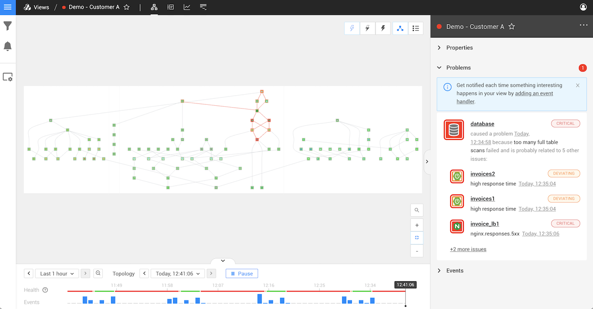
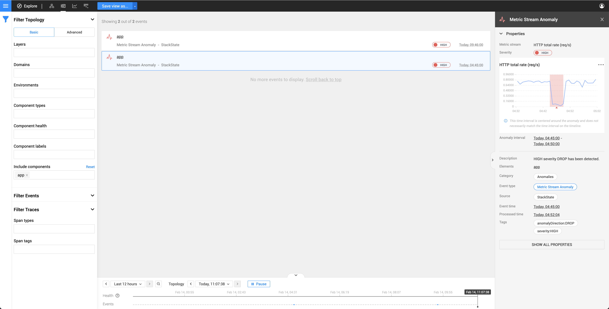
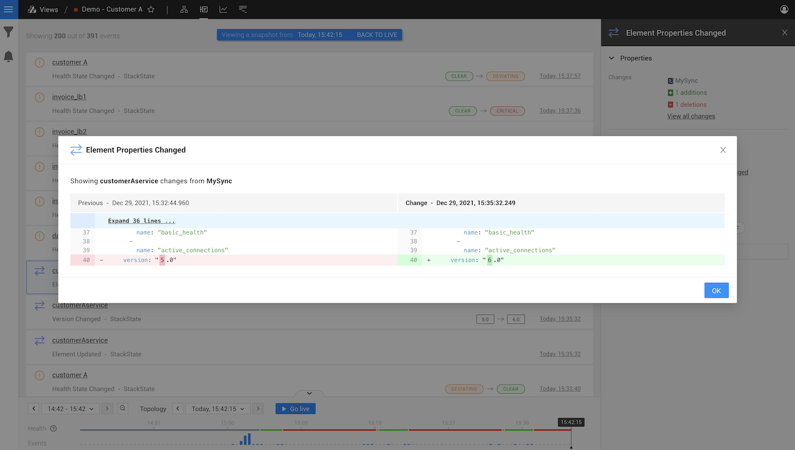
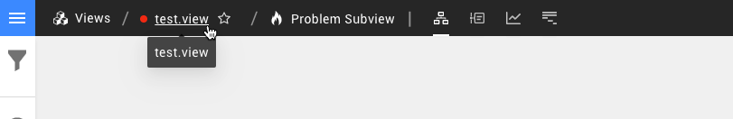

# Investigate a problem

## Overview

Unhealthy components in a view are grouped into [problems](about-problems.md) based on how they are connected in the topology. When StackState identifies a problem this will be reported in the **View Summary** in the right panel under **Problems**. Problems are listed by the timestamp of the health state change for the root cause component - you will find the oldest problem in the view at the bottom of the list. Click on a problem to open [detailed information about the problem ](problem_investigation.md#detailed-information-about-a-problem) in the right panel.

## Detailed information about a problem

Click on a problem to display detailed information about the problem in the right panel. This gathers together all the information you need to get started investigating a problem in your landscape. All unhealthy components in the problem \(the root cause and contributing causes\) are listed here. Events that may have triggered the unhealthy state changes in the problem are listed in the section [Probable Causes](problem_investigation.md#probable-causes).

Click the **INVESTIGATE IN SUBVIEW** button to open all components in a problem in a dedicated, temporary [problem subview](problem_investigation.md#problem-subview).

## Probable causes

For each reported problem, StackState will list all events that are likely to have contributed to unhealthy state changes in the problem. These could be events of type **Anomaly**, **Element properties changed** or **Version changed** that occurred within the [problem time window](about-problems.md#time-window-of-a-problem) and relate to components in the problem. If no relevant probable cause events are available in StackState, the list will be empty.

### Anomaly events

Anomaly events are generated whenever an anomaly is detected by the [Autonomous Anomaly Detector](../../stackpacks/add-ons/aad.md). For metric stream anomalies, details of the metric stream where the anomaly was found are provided.

1. Click on a Metric stream anomaly event in the Events Perspective
   * Detailed information about the event is displayed in the right panel.
   * The affected stream is displayed highlighting the detected anomaly.
2. Click on the metric stream graph or select **inspect** from its menu \(**...**\) to open the [telemetry inspector](../metrics-and-events/browse-telemetry.md) and inspect the stream in more detail.

### Element properties changed events

Element properties changed events are generated whenever relevant properties of a component are updated at the synchronization source. For example, if AWS security rules are changed or a load balancer has increased its capacity. Exact details of the change are provided.

1. Click on an Element properties changed event in the Events Perspective.
   * Detailed information about the event is displayed in the right panel.
2. Click **Show all changes** in the right panel.
   * A diff of the old and new properties is displayed.

### Version changed events

Version changed events are generated whenever the `version` property of a component is updated.

## Problem subview

A problem subview is a temporary StackState view. The filters applied to a problem subview return all components related to the problem root cause and any contributing causes within the [problem time window](problem_investigation.md#time-window-of-a-problem). This is a larger set of components than would be shown by selecting to show the [full root cause tree](../stackstate-ui/perspectives/topology-perspective.md#root-cause-outside-current-view). The following components will be included:

* **Root cause** - Each problem has a single root cause. This is the unhealthy component at the bottom of the dependency chain.
* **Contributing cause** - A problem can contain any number of contributing causes. These are all of the unhealthy components in the problem, other than the root cause.
* **Healthy components** - A number of healthy components are also included in a problem:
  * Upstream healthy dependencies of the root cause or one of the contributing causes.
  * Downstream healthy components with an unhealthy [propagated state](/use/health-state/about-health-state.md#propagated-health-state) that originates from either the root cause or one of the contributing causes.

Within a problem subview, you have access to all perspectives containing data specific to the problem time window and the involved components. The applied filters can be adjusted, but it is not possible to save the subview. You can share the problem subview with other StackState users, including any modifications you have made, as a link.

To exit the Problem Subview, click on the view name in the top bar of the StackState UI.

### Time window of a problem

A problem is considered to start one hour before the timestamp of the first reported unhealthy state it contains and end five minutes after the last change to an unhealthy state. Note that the first unhealthy state in the problem might not have been reported by the root cause component. If a component in the problem changes to an unhealthy state or a new component is added to the problem, the problem time window will be extended to include this state change.

## See also

* [What is a problem?](about-problems.md)
* [Problem notifications](problem_notifications.md)
* [Anomaly detection](../concepts/anomaly-detection.md)
