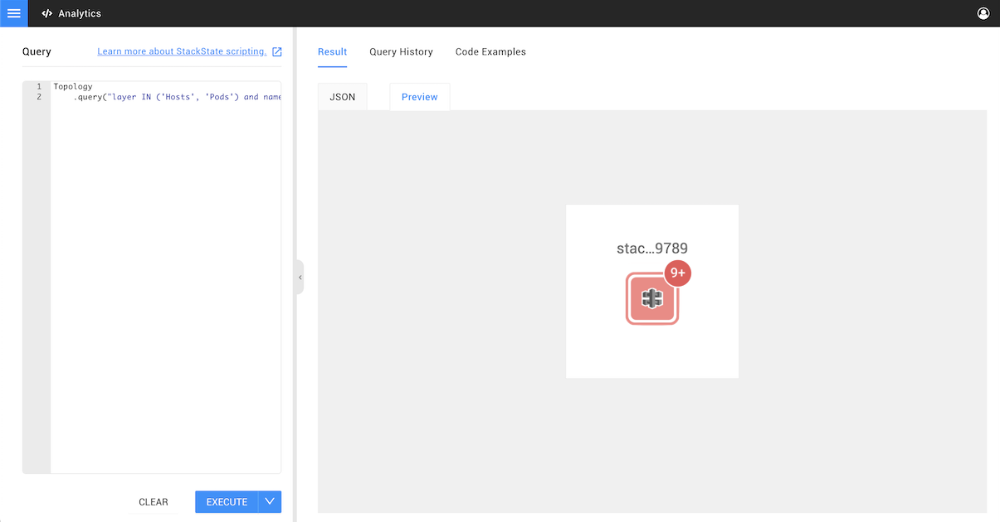

# Analytics

## Overview

The analytics environment allows you to directly query the [4T data model](../concepts/4t_data_model.md). The analytics environment uses the StackState Scripting Language \(STSL\) as the basis for querying StackState, so you can build and test your StackState scripts here.

Queries created in the analytics environment can be used to investigate issues, automate processes and build reports. Here are some examples of queries that you could execute:

* Get the names of all pods running in a namespace.
* Determine the maximum latency of a service since yesterday. 
* Find all machines indirectly connected to a set of APIs.
* Show which databases have been updated since last week.

## The analytics environment

If your StackState user has the permission `access-analytics`, you can access the analytics environment from the main menu. This will be available by default for all [power users and admins](../../setup/security/rbac/rbac_permissions.md). There are also places in the user interface where you can be directed to analytical environment if some data is available in the form of a query, a link will then say "Open in Analytics".

The analytics environment is divided into two sections:

* The query you want to execute on the left
* The results and query history on the right.

When executing a query for the first time, the result of the query is displayed in preview form if a preview is available for the type of data requested, for example a metric chart or a topology view. If no preview is available, the data will be shown in JSON form.

Every query that you have executed in StackState is shown in the query history, together with the query result at that point in time.

## Previews

Results of queries are typically displayed in raw JSON form, unless there is a preview available. Previews are currently available for:

* Topology query results, see [Topology.query](../../develop/reference/scripting/script-apis/topology.md#function-query)
* Telemetry query results, see [Telemetry.query](../../develop/reference/scripting/script-apis/telemetry.md#function-query) 
* Telemetry predictions, see [Prediction.predictMetrics](../../develop/reference/scripting/script-apis/prediction.md#function-predictmetrics)
* STML reports, see [UI.showReport](../../develop/reference/scripting/script-apis/ui.md#function-showreport)



## Queries

In the analytics environment, you use a combination of the [StackState Scripting Language \(STSL\)](../../develop/reference/scripting/) and the [StackState Query Language \(STQL\)](../../develop/reference/stql_reference.md) to build your queries and scripts.

A query is a regular STSL script. For example, when you run the query: `1+1` you will get the result `2`.

As a part of an STSL script, you can invoke the StackStake Query Language \(STQL\). A simple example of an analytical query that uses both STSL and STQL is:

```text
Topology.query('environment in ("Production")').components()
```

[Topology.query](../../develop/reference/scripting/script-apis/topology.md) is a regular script function that takes ab STQL query \(`environment in ("Production")` in the above example\) as an argument. The `.components()` at the end, is a so-called builder method. This ensures that only the components, and not the relations between these components, are retrieved from the topology.

The combination of STSL and STQL allows you to chain together multiple queries. The following example gets all metrics of all databases in the production environment for the last day:


```text
Topology
    .query('environment in ("Production") AND type = "Database"')
    .components()
    .metricStreams()
    .thenCollect { metricStream -> 
        Telemetry.query(metricStream)
            .aggregation("95th percentile"", "15m")
            .start("-1d")
    }
```


This analytical query first gets all metric streams of components from the `Production` environment that are of the type `Database`. The result of that query is then used to build up telemetry queries against these metric streams.

The full list of available functions can be found [in the Script API documentation](../../develop/reference/scripting/script-apis/). To learn about chaining, see [async script results](../../develop/reference/scripting/async-script-result.md).

### Example queries

Below are some queries to get you started with an example of their expected output. You can find more examples in the StackState UI Analytics environment itself.

* [Find the number of relations between two components](analytics.md#find-the-number-of-relations-between-two-components)
* [Compare the Staging environment to the Production environment](analytics.md#compare-the-staging-environment-to-the-production-environment)
* [Predict disk space of a server for the next week ](analytics.md#predict-disk-space-of-a-server-for-the-next-week)

#### Find the number of relations between two components



```text
Topology.query('name IN ("Alice", "Bob")')
  .relations()
  .count()
```



```text
1
```



#### Compare the Staging environment to the Production environment




```text
Topology.query('environment = "Staging"')
    .diff(Topology.query('environment = "Production"'))
    .then { diff ->
        diff
            .diffResults[0]
            .result
            .addedComponents
            .collect { comp -> comp.name }
    }
```





```text
[
  "customer E_appl02",
  "MobileApp",
  "customer B_appl01",
  "customer E_appl01",
  "customer B_appl02"
]
```




#### Predict disk space of a server for the next week




```text
Prediction.predictMetrics("linear", "7d",
    Telemetry.query("StackState metrics", 'host="lnx01" AND name="diskspace" AND mount="/dev/disk1s1"')
        .metricField("value")
        .aggregation("min", "1d")
        .start("-4w") // based on last month
        .compileQuery()
).predictionPoints(7).then { result -> resut.prediction  }
```





```text
{
    "_type":"MetricTelemetryData",
    "data":[
        [
            52.35911407877176,
            1611091854483
        ],
        [
            51.400303131762215,
            1611092754483
        ],
        [
            48.64705240252446,
            1611093654483
        ],
        [
            49.62017120667122,
            1611094554483
        ],
        [
            49.55251201458979,
            1611095454483
        ],
        [
            54.46042805305259,
            1611096354483
        ],
        [
            48.681355107261204,
            1611097254483
        ],
    ],
    "dataFormat":[
        "value",
        "timestamp"
    ],
    "isPartial":false
}
```




## See also

* [StackState scripting language \(STSL\)](../../develop/reference/scripting/)
* [StackState script APIs](../../develop/reference/scripting/script-apis/)
* [StackState Query Language \(STQL\)](../../develop/reference/stql_reference.md)

