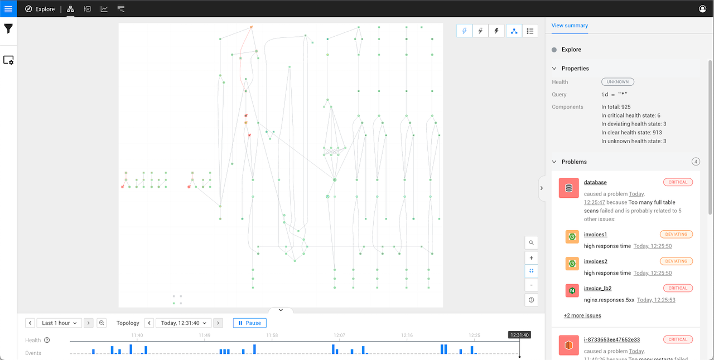
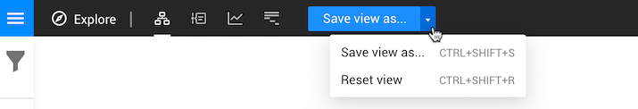

# Explore mode

## Overview

The StackState explore mode provides an unfiltered view of your topology with. This is most likely a much larger overview that you would like to see at any given time, but it's a good place to start when creating a [customized view](views/about_views.md) and to get familiar with the StackState UI.

Explore mode can display up to 10,000 components at any time. If your topology already contains more items than this, you will need to [add a filter](explore_mode.md#add-a-filter) to display data.

## Perspectives

Explore mode gives you access to data from your entire IT landscape in all of the [StackState perspectives](../concepts/perspectives.md) - these same perspectives are also available to access data for every StackState view. Each perspective shows different data from the filtered \(or unfiltered\) components. Click the perspective buttons at the top of the screen to switch between the perspectives:

* [Topology Perspective](perspectives/topology-perspective.md) - the topology visualization.
* [Metrics Perspective](perspectives/metrics-perspective.md) - 
* [Events Perspective](perspectives/events_perspective.md) - events from the selected topology and telemetry interval.
* [Traces Perspective](perspectives/traces-perspective.md) - traces and spans for components.

## Add a filter

You can zoom in on a specific area of your IT landscape using basic filters by writing an advanced filter query. Click the **View Filters** icon on the left to open the [View Filters panel](filters.md).

## Save filters as a view

When you change the displayed components using a filter, the **Save view** button will appear at the top of the screen. You can save the applied filters and access them directly from the [Views](views/about_views.md) menu.

## See also

* [Filtering data](filters.md)
* [StackState perspectives](../concepts/perspectives.md)
* [Working with StackState Views](views/about_views.md)
