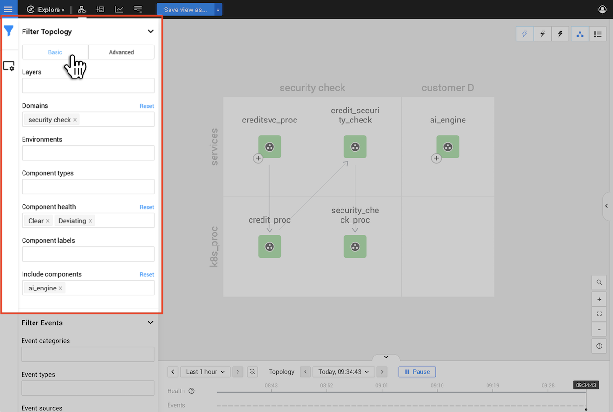
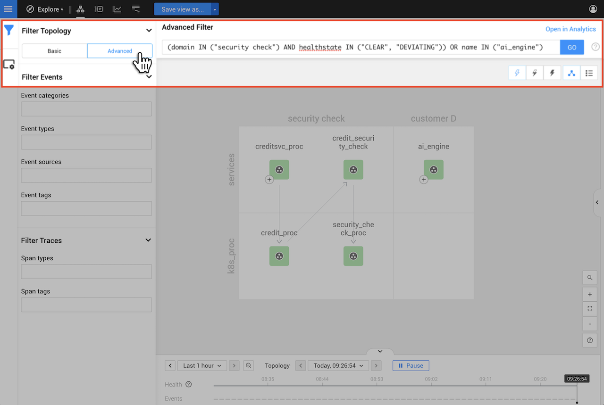

# Filters

## Overview

The **View Filters** panel on the left of the StackState UI allows you to filter the components \(topology\), events and traces displayed in each perspective. Applied filters can be [saved as a view](filters.md#save-filters-as-a-view) to open directly in the future.


## Filter Topology

Topology filters can be used to select a sub-set of topology components to be shown in any one of the available perspectives. You can browse your topology using basic filters or build an advanced topology filter that zooms in on a specific area of your topology using the StackState in-built query language \(STQL\). Read more about:

* [Basic topology filters](filters.md#basic-topology-filters)
* [Advanced topology filters](filters.md#advanced-topology-filters)
* [Topology filtering limits](filters.md#topology-filtering-limits)

### Basic topology filters

The main way to filter topology is using the available basic filters. When you set a filter, the open perspective will update to show only the visualization or data for the subset of your topology that matches the filter. Setting multiple filters will narrow down your search further. You can set more than one value for each filter to expand your search

| Filter | Description |
| :--- | :--- |
| Layers, Domains, Environments and Component types | Filter by the component details included when components are imported or created. |
| Component health | Only include components with the named [health state](../concepts/health-state.md) as reported by the associated health check. |
| Component labels | Only include components with a specific label. |
| Include components | Components named here will be included in the topology **in addition to** the components returned from other filters. |



**StackState Self-Hosted**

Extra information for the [StackState Self-Hosted product](https://docs.stackstate.com/):

    
You can define custom labels to make searching for information easier.


To filter the topology using basic filters, click the **View Filters** button on the left and select **Basic** under **Filter Topology**. 

The example below uses basic filters to return components that match the following conditions:

* In the **Domain** `security check`
* AND has a **Health** state of `Clear` OR `Deviating`
* OR is the **Component** with the name `ai_engine`



This same filter could also be written as an advanced topology filter using STQL.

### Advanced topology filters

You can use the in-built [StackState Query Language \(STQL\)](../../develop/reference/stql_reference.md) to build an advanced topology filter that zooms in on a specific area of your topology.

To filter the topology using an STQL query, click the **View Filters** button on the left and select **Advanced** under **Filter Topology**. 

The STQL query example below will return components that match the following conditions:

* In the **Domain** `security check`
* AND has a **Health** state of `Clear` OR `Deviating`
* OR is the **Component** with the name `ai_engine`

```yaml
(domain IN ("security check") AND healthstate IN ("CLEAR", "DEVIATING")) OR name IN ("ai_engine")
```



This same filter result could also be returned with basic filters, see [basic topology filters](filters.md#basic-topology-filters).

### Compatibility of basic and advanced filters

You can switch between basic and advanced filtering by selecting **Basic** or **Advanced** under **Filter Topology** in the **View Filters** panel.

It's always possible to switch from Basic to Advanced filtering. The selected basic filters will be converted directly to an STQL query. For simple queries it's also possible to switch from Advanced to Basic filtering, however, some advanced queries aren't compatible with basic filters. 

➡️ [Learn more about the compatibility of basic and advanced topology filters](/develop/reference/stql_reference.md#compatibility-basic-and-advanced-filters)

### Other filters

The advanced filters listed below are compatible with basic filtering, but can't be set or adjusted as a basic filter.

* **withNeighborsOf** - when an advanced filter includes the function [withNeighborsOf](/develop/reference/stql_reference.md#withneighborsof), the number of components whose neighbors are queried for is shown in the **Other filters** box. To be compatible with basic filtering, a `withNeighborsOf` function must be joined to other filters using an `OR` operator.
* **identifier** - when an advanced filter selects components by [identifier](/develop/reference/stql_reference.md#filters), the number of component identifiers queried is reported in the **Other filters** box. To be compatible with basic filtering, an `identifier` filter must be specified and joined to other filters using the operator `OR identifier IN (...)`.

The **Other filters** box in the View Filters panel lists all such advanced filters and the number of affected components.


The **Other filters** box only gives details of advanced filters that have been set and are compatible with basic filtering.


### Topology filtering limits

To optimize performance, a limit is placed on the amount of elements that can be loaded to produce a topology visualization. The filtering limit has a default value of 10000 elements. If a [basic filter](filters.md#basic-topology-filters) or [advanced filter query](filters.md#advanced-topology-filters) exceeds the filtering limit, a message will be shown on screen and no topology visualization will be displayed.

Note that the filtering limit is applied to the total amount of elements that need to be **loaded** and not the amount of elements that will ultimately be displayed.

In the example below, we first LOAD all neighbors of every component in our topology and then DISPLAY only the ones that belong to the `applications` layer. This would likely fail with a filtering limit error as it requires all components in the topology to be loaded.

```text
withNeighborsOf(direction = "both", components = (name = "*"), levels = "15")
   AND layer = "applications"
```

To successfully produce this topology visualization, we would need to either re-write the query to keep the number of components loaded below the configured filtering limit, or increase the filtering limit. By fitering for only components in the `applications` layer, we will DISPLAY the same components as the query above, without first needing to LOAD all components. This query is therefore less likely to result in a filtering limit error.

```yaml
layer = "applications"
```



**StackState Self-Hosted**

Extra information for the [StackState Self-Hosted product](https://docs.stackstate.com/):

    
If required, you can manually configure the topology filtering limit. 


## Filter Events

The **View Filters** panel on the left of the StackState UI can be used to filter the events shown in the [Events Perspective](perspectives/events_perspective.md). They're also included in the **Event** list in the right panel **View summary** tab and the details tabs - **Component details** and **Direct relation details**.

The following event filters are available:

| Filter | Description                                                                                                                                                                                                                                                                                                                                                                      |
| :--- |:---------------------------------------------------------------------------------------------------------------------------------------------------------------------------------------------------------------------------------------------------------------------------------------------------------------------------------------------------------------------------------|
| **Category** | Show only events from one or more [categories](perspectives/events_perspective.md#event-category).                                                                                                                                                                                                                                                                              |
| **Type** | Click the **Type** filter box to open a list of all event types that have been generated for the currently filtered components in the current time window. You can select one or more event types to refine the events displayed.                                                                                                                                               |
| **Source** | Events can be generated by StackState or retrieved from an external source system, such as Kubernetes or ServiceNow, by an integration. Click the **Source** filter box to open a list of all source systems for events that have been generated for the currently filtered components in the current time window. Select one or more source systems to see only those events.  |
| **Tags** | Relevant event properties will be added as tags when an event is retrieved from an external system. For example `status:open` or `status:production`. This can help to identify events relevant to a specific problem or environment.                                                                                                                                           |

## Filter Traces

Traces shown in the [Traces Perspective](perspectives/traces-perspective.md) can be filtered based on two properties of the spans they contain:

* Span types
* Span tags

For example, if you filter the trace list for all spans of type `database`, this will return all traces that have at least one span whose type is `database`.

## Save filters as a view

To update the existing view with the currently applied filters, click **Save view** at the top of the screen. To save the current filters as a new view, click **Save view as**. 

➡️ [Learn more about StackState views](views/about_views.md)

## Clear applied filters

To clear any filters you have added and return to the saved view filters or initial clean state, click the view name at the top of the screen. Alternatively, you can select **Reset view** from the **Save view** dropdown menu at the top of the screen, or **Reset** from the **...** menu in the right panel **View summary** tab.
