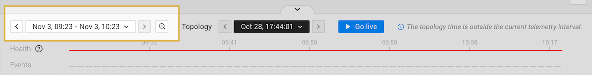
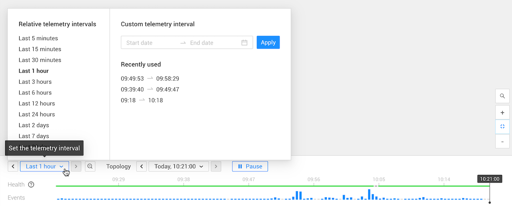
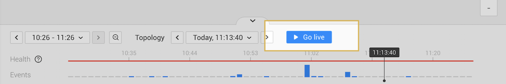
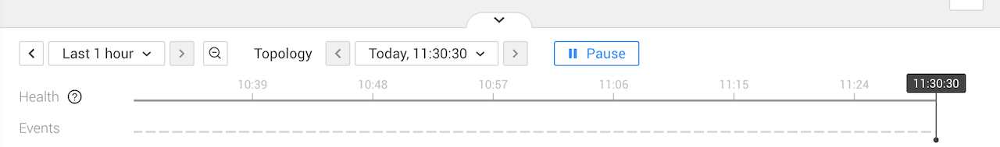

# Timeline and time-travel

## Overview

The timeline at the bottom of the Rancher Observability UI allows you to travel back in time to the state of the topology at a specific point in the past. You can then navigate through all telemetry available for the selected topology snapshot. Health and events charts in the timeline give an overview of the state of the topology during the selected telemetry interval.

## Timeline

### Telemetry interval

The telemetry interval specifies the time window for which events, metrics and traces are available in the Rancher Observability perspectives. It runs from left to right on the timeline.

The selected telemetry interval can be either relative \(live mode\), or set to a custom telemetry interval \(time travel mode\). By default, the telemetry interval is set to a relative telemetry interval - in live mode and shows telemetry from the last hour. You can zoom in/out or set a custom telemetry interval to view telemetry from a specific point in time.

#### Set the telemetry interval


* The telemetry interval can be a maximum of 6 months. 
* When a custom telemetry interval is set for the telemetry interval, Rancher Observability will pause the [topology time](#topology-time) and enter [time travel mode](#time-travel).


The telemetry interval can be set in the following ways:

* **Zoom in**

* **Zoom out**

* **Use the telemetry interval jumper arrows**

* **Set a relative or custom telemetry interval**

### Topology time

The topology in Rancher Observability is based on a snapshot of your environments as observed at that moment. The moment from which this snapshot is taken is specified by the topology time. By default, Rancher Observability is in live mode with the topology time set to the current time. You can [time travel](#time-travel) to a previous state of the topology by selecting a custom topology time. This helps you to investigate an issue at a certain moment in time. Even if a pod is long gone you can still see how it was connected, its logs, events, related resources, events and more.

On the timeline, the selected topology time is indicated by the play head - a black line with the current topology time at the top. It's also specified in the **Topology time** box at the top of the timeline.

#### Set the topology time

The topology time can be set in the following ways:

* **Click on the timeline**

* **Use the topology time jumper arrows**

* **Set a custom topology time**

* **Click a timestamp**

#### Topology time outside the telemetry interval

If the selected topology time is a time outside the currently selected [telemetry interval](#telemetry-interval), the message "The topology time is out of the current telemetry interval" will be displayed and the **Topology time** box at the top of the timeline will be highlighted black. As the timeline shows the telemetry interval from left to right, the play head indicating the current topology time won't be visible on the timeline.

You can still browse topology and telemetry as expected:

- In the [Topology Perspective](/use/views/k8s-topology-perspective.md) the state of the topology at the selected topology time is visualized.
- In all perspectives, telemetry is displayed that was generated in the selected telemetry interval and relates to the topology elements that existed at the selected topology time.

#### Live mode 

To stop time travelling and return the topology time to live mode, click **Go live** or **BACK TO LIVE** at the top of the screen.

### Health

The health state of a view during the selected telemetry interval is displayed as a colour in the timeline **Health** line.

For single resources, the health will be shown over time, in an overview a grey line is displayed.

### Events

The **Events** line in the timeline shows a bar chart with the number of events generated at each point in time. This helps you to see moments in the past with a lot of activity. Note that only events generated by topology elements that existed at the selected [topology time](#topology-time) are displayed.

To zoom in on an event bar of interest, click and drag to select a smaller telemetry interval around it on the timeline.


A single click on the timeline will move the play head to this point in time, and thus time travel to the state of the topology at the selected [topology time](#topology-time). Only events generated by topology elements that existed at the newly selected topology time will now be displayed.


## Time travel

In each of the Rancher Observability perspectives, you can either be in live mode or in the past. In live mode, Rancher Observability will constantly poll for new data. When you time-travel through topology or telemetry, you are effectively working with a snapshot of your infrastructure. The data available is based on two selections:

* [Topology time](#topology-time) - a specific moment in time for which you want to fetch a snapshot of your Kubernetes resources.
* [Telemetry interval](#telemetry-interval) - the time range for which you want to see telemetry and traces.

To stop time travelling and return to live mode, click **Go live** or **BACK TO LIVE** at the top of the screen.

