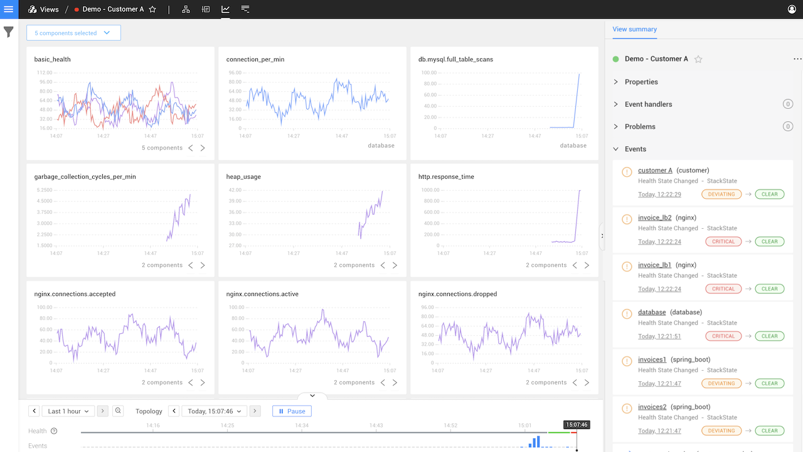
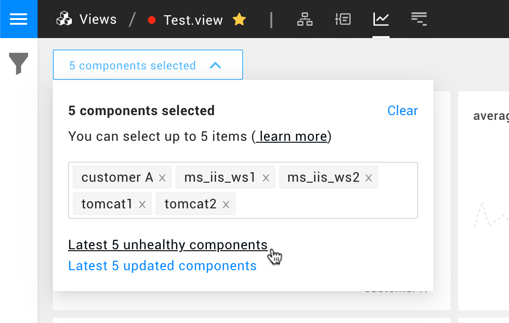

# Metrics Perspective

The Metrics Perspective shows metrics for the selected [view](../views/about_views.md). StackState will automatically deliver all the relevant information for any part of your landscape, so you don't need to pre-define the streams you want to see.

## Component selection

Metrics for up to **5** components can be displayed. When you open the Metrics Perspective, StackState will show the metrics for all components in your view. If there are more than 5 components in the view, StackState selects the top 5 components as follows:

* The 5 components that most recently changed their health state to either `CRITICAL` or `DEVIATING`.
* If there are no unhealthy components, the 5 components that most recently changed their health state.

You can manually change the components for which metrics are displayed using the **Component Selector**:

The component selection can be adjusted as follows:

* Clear the component selection using the **Clear** button.
* Add components by typing their name in the component bar; remove components by clicking **x** next to their name.
* Use the links at the bottom to set the component selection to the most recent 5 unhealthy or updated components.

## Filtering

The **View Filters** panel on the left of the StackState UI can be used to filter the sub-set of topology for which metrics are displayed. 

➡️ [Learn more about Topology Filters](../filters.md#filter-topology)

## Charts

Charts show metrics data for the selected components in near real-time - data is fetched every 30 seconds. If a process is stopped and no more data is received, the process will eventually leave the chart as the data shifts left at least every 30 seconds. If more data arrives during the 30-second interval, it will be pushed to a chart. A single chart can display multiple lines for the same metric when multiple components are selected - this grouping is based on the name of the stream. It's possible to cycle through data for each of these components to depict them as a single line in a single chart using the arrow controls on the chart.

## Time travel

Time travel is possible in the Metrics Perspective. When time traveling, the currently selected Topology is time traveled, and the metrics of those components are depicted in the charts. It's possible that a selected component may no longer exist in the time traveled state. In this case, no data will be shown for this component.

## Ordering

Metric charts are ordered based on the priority of the associated telemetry stream. The priority of a stream can be configured in the [Telemetry Inspector](/use/metrics/browse-telemetry.md).

