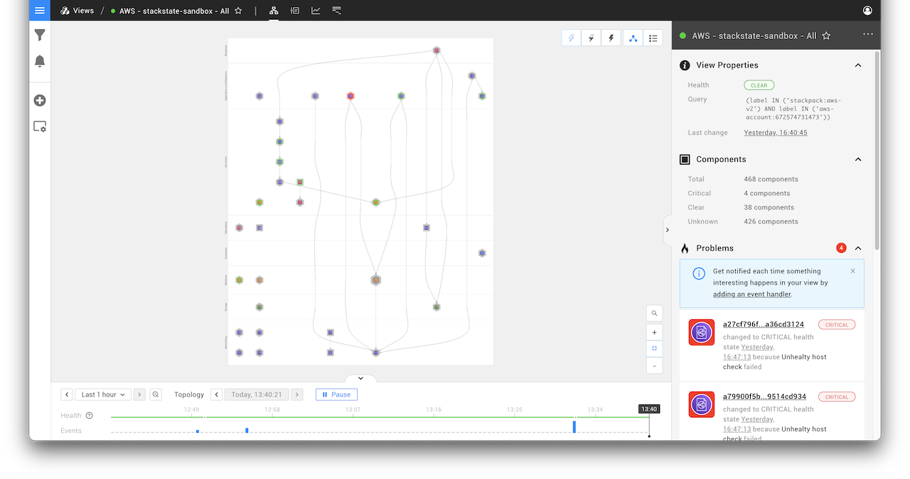
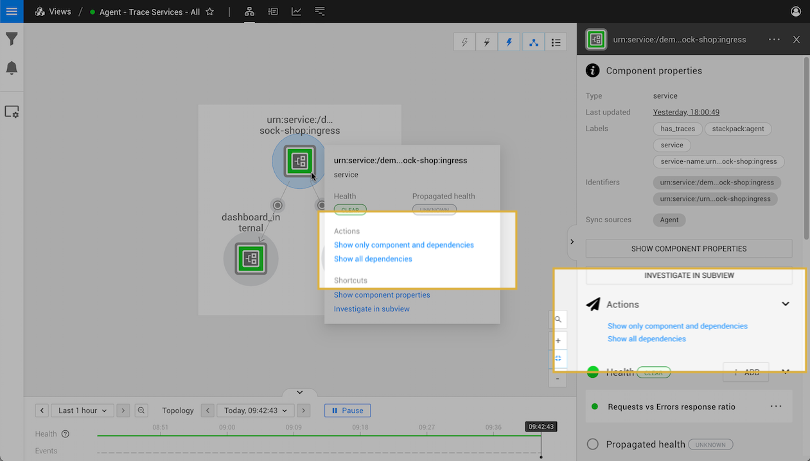
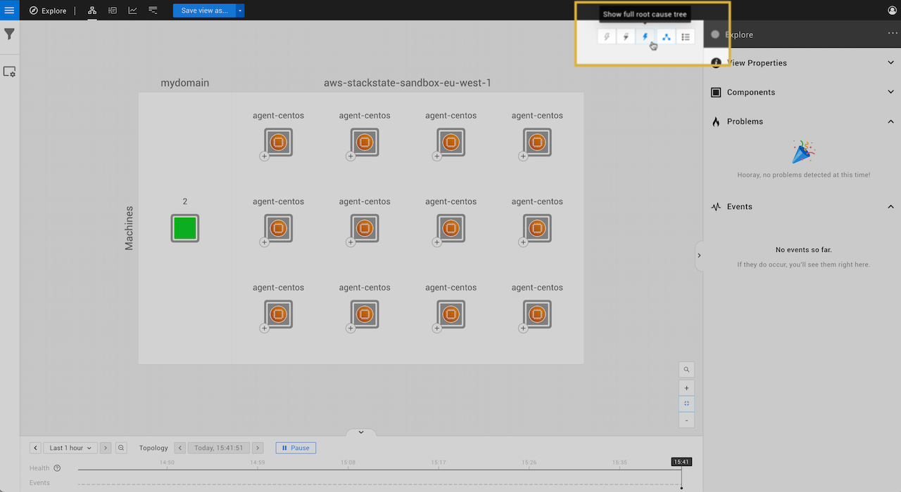
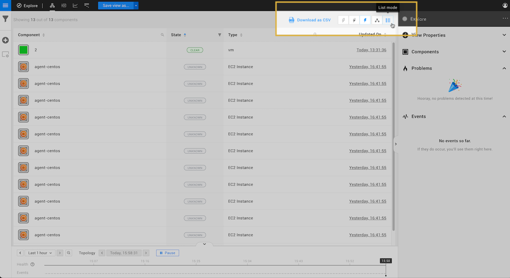

# Topology Perspective

## Overview

The Topology Perspective displays the components in your IT landscape and their relationships.

## Components

The Topology Perspective shows the filtered components and relations in a selected [view](../views/about_views.md) or the entire, unfiltered topology in [explore mode](../explore_mode.md). Components that have one or more health checks configured will report a calculated [health state](../../health-state/health-state-in-stackstate.md).

* Click on a component to open the [component details](#component-details-pane) in the right-hand pane.
* Hover over a component to open the [component context menu](#component-context-menu).

➡️ [Learn more about components](/use/concepts/components_relations.md#components).

### Component context menu

When you hover over a component, the component context menu is displayed. This gives you information about the component, including its name, type, health state and propagated health state. You can also run [shortcuts](#shortcuts) and the [actions](#actions) specific to the component from here.

### Actions

Actions can be used to expand the topology selection to show all dependencies for the selected component. Other actions may be available for specific components, such as component actions that are installed as part of a StackPack.



You can configure [component actions](../../../configure/topology/component_actions.md) in the **Settings** page or create [custom component actions](../../../develop/developer-guides/custom-functions/component-actions.md).


A list of the available actions is included in the Component Details pane when you select a component and also in the component context menu, which is displayed when you hover over a component.

### Shortcuts

Shortcuts give you direct access to detailed information about the specific component:

* **Show component properties** - Opens the component properties popup. This is the same as clicking SHOW COMPONENT PROPERTIES in the Component Details pane.
* **Investigate in subview** - Opens a subview containing only this component. The subview allows you to investigate a single component in all perspectives without needing to adjust the view filters. This is the same as clicking INVESTIGATE IN SUBVIEW in the Component Details pane.

## Relations

Relations show how components in the topology are connected together. They are represented by a dashed or solid line and have an arrowhead showing the direction of dependency between the components they link. [Health state will propagate](../../health-state/health-state-in-stackstate.md#propagated-health-state) from one component to the next, from dependencies to dependent components. Relations that have one or more health checks configured will report a calculated health state.

Click on a relation to open the relation details in the right-hand pane.

➡️ [Learn more about relations](/use/concepts/components_relations.md#relations).

## Filters

The components and events displayed in the topology visualization can be customized by adding filters.

Click the **View Filters** icon in the left-hand side menu to open the view filters. Here you can edit:

* Topology filters: The components displayed in the topology visualization.
* Events filters: The events shown in the **Events** list in the View Details pane on the right-hand side of the screen.

From the **Component Details** pane, click on a label to add this to the topology filter. The displayed topology will be expanded to include all components and relations with the selected label. To undo a label selection, click the back button in the browser or edit the topology filter in the view filters.

The View Filters are saved together with the View. For details, see the page [filters](../filters.md).

## Visualization settings

The visualization of components and relations in the topology perspective can be customized in the visualization settings. Click the **Visualization Settings** icon in the left-hand side menu to open the visualization settings menu. Here you can edit:

* Root cause display - to what extent the view should be expanded when an element in the view reports a DEVIATING or CRITICAL health state or propagated health state.
* Grouping - should all components be displayed individually or should like components be grouped. For details, see [component grouping](topology-perspective.md#grouping).
* Grid - should components be organized by [layer and domain](../../concepts/layers_domains_environments.md).
* Indirect relations - should relations between components be shown if these connect through other components that are not displayed in the view. For details, see [relations](topology-perspective.md#relations).

The Visualization Settings are saved together with the View. For details, see the page [Visualization settings](../views/visualization_settings.md).

## Details panel

The details panel on the right-hand side of the screen shows information about the view, or the currently selected component, relation or problem.

### Component Details pane

When a component is selected by clicking on it, the **Component Details** pane is shown on the right-hand side of the screen. This panel displays detailed information about the component:

* Metadata, such as the component name, type and any labels.
* [Health checks](../../health-state/add-a-health-check.md)
* [Telemetry streams](../../metrics-and-events/telemetry_streams.md)

### Problems

If one or more components in a view have a critical state, StackState will show the related components and their states as a **Problem** in the [View Details pane](../views/about_views.md#the-view-details-pane).

## Navigation

### Zoom in and out

There are zoom buttons located in the bottom right corner of the topology visualizer. The **plus** button zooms in on the topology, the **minus** button zooms out. In between both buttons is the **fit to screen** button which zooms out so the complete topology becomes visible.

### Find component

You can locate a specific component in the topology by clicking `CTRL` + `SHIFT` + `F` and typing the first few letters of the component name. Alternatively, you can select the **Find component** magnifying glass icon in the bottom right corner of the topology visualizer.

See the full list of [StackState keyboard shortcuts](../keyboard-shortcuts.md).

### Show root cause

If there are components with [telemetry streams](../../metrics-and-events/telemetry_streams.md) and [health checks](../../health-state/health-state-in-stackstate.md) in your view, the Topology Perspective will calculate a health state and propagate this state throughout the graph. The propagated health state will help you to see the risk of affecting other components.



You can configure or develop your own [propagation functions](../../../develop/developer-guides/custom-functions/propagation-functions.md).


It is possible that your view can contain components that have a deviating propagated health state caused by a component that is outside your view. The Topology Perspective allows you to configure whether the view should be expanded to show root cause components that are outside of the currently displayed view:

* **Don't show root cause** - Do not show the root causes of components shown by the current topology filters.
* **Show root cause only** - Only show the root causes of components shown by the current topology filters that have a `CRITICAL` or `DEVIATING` propagated health. Indirect relations are visualized if a component directly depends on at least one invisible component that leads to the root cause.
* **Show full root cause tree** - Show all paths from components shown by the current topology filters that have a `CRITICAL` or `DEVIATING` propagated health to their root causes.

## List mode

The components in the topology visualization can also be shown in a list instead of a graph:

### Export as CSV

From list mode, the component list can be exported as a CSV file. The CSV file includes `name`, `state`, `type` and `updated` details for each component in the view.

1. From the topology perspective, click the **List mode** icon on the top right of the screen to open the topology in list mode.
2. Click **Download as CSV** from the top of the page.
   * The component list will be downloaded as a CSV file named `<view_name>.csv`.
