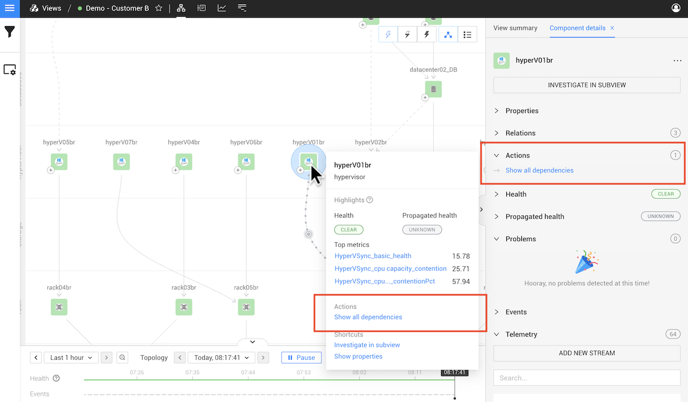
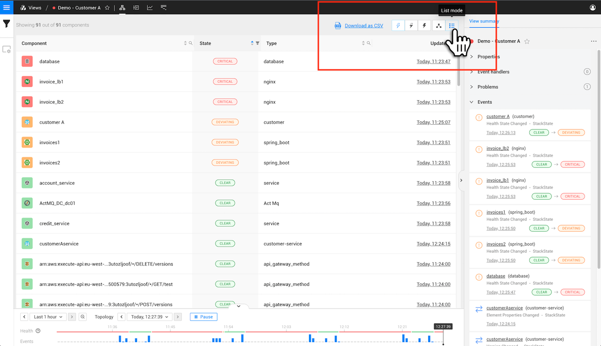

# Topology Perspective

## Overview

The Topology Perspective displays the components in your IT landscape and their relationships.

## Legend

Click on the Legend button (?) in the bottom right of the screen to display an explanation of the icons and colors used in the topology visualization.

## Components

The Topology Perspective shows the filtered components and relations in a selected [view](../views/about_views.md) or the entire, unfiltered topology in [explore mode](../explore_mode.md). Components that have one or more health checks configured will report a calculated [health state](../../concepts/health-state.md).

* Select a component to display [detailed component information](/use/concepts/components.md#component-details) in the right panel details tab - **Component details**.
* Hover over a component to open the [component context menu](#component-context-menu).

➡️ [Learn more about components](/use/concepts/components.md#components)

### Component context menu

When you hover the mouse pointer over a component, the component context menu is displayed. This gives you information about the component, this includes:

* The component name and type
* [Health state](/use/concepts/health-state.md) and [propagated health state](/use/concepts/health-state.md#element-propagated-health-state) of the component.
* [Top metrics](/use/metrics/top-metrics.md) for the component.
* [Shortcuts](#shortcuts) specific to the component.
* [Actions](#actions) specific to the component.

### Actions

Actions can be used to expand the topology selection to show all dependencies for the selected component. Other actions may be available for specific components, such as component actions that are installed as part of a StackPack.



**StackState Self-Hosted**

Extra information for the [StackState Self-Hosted product](https://docs.stackstate.com/):

    
You can configure component actions in the **Settings** page or create custom component actions.


A list of the available **Actions** is included in the right panel details tab when you select a component - **Component details**. Actions are also listed in the component context menu, which is displayed when you hover the mouse pointer over a component.

### Shortcuts

Shortcuts give you direct access to detailed information about the specific component:

* **Show properties** - Opens the properties popup for the component. This is the same as clicking **SHOW ALL PROPERTIES** in the right panel details tab when detailed information about a component is displayed - **Component details**.
* **Investigate in subview** - Opens a subview containing only this component. The subview allows you to investigate a single component in all perspectives without needing to adjust the view filters. This is the same as clicking INVESTIGATE IN SUBVIEW in the right panel details tab when detailed information about a component is displayed - **Component details**.

## Relations

Relations show how components in the topology are connected together. They're represented by a dashed or solid line and have an arrowhead showing the direction of dependency between the components they link. [Health state will propagate](../../concepts/health-state.md#element-propagated-health-state) from one component to the next, from dependencies to dependent components. Relations that have one or more health checks configured will report a calculated health state.

Select a relation to open detailed information about it in the right panel details tab - **Direct relation details**, **Indirect relation details** or **Grouped relation details** depending on the relation type that has been selected.

➡️ [Learn more about relations](/use/concepts/relations.md)

## Filters

The components and events displayed in the topology visualization can be customized by adding filters.

Click the **View Filters** icon in the left menu to open the view filters. Here you can edit the filters applied to the displayed topology and events:

* **Topology filters** - filter the components displayed in the topology visualization.
* **Events filters** - filter the events shown in the **Events** list in the right panel **View summary** and details tabs - **Component details** and **Direct relation details**.

Select an element to show detailed information about it in the right panel details tab. Click a label under **Properties** in the details tab to add this to the topology filter. The displayed topology will be expanded to include all components and relations with the selected label. To undo a label selection, click the back button in the browser or edit the topology filter in the view filters.

The view filters are saved together with the View. For details, see the page [filters](../filters.md).

## Visualization settings

The visualization of components and relations in the topology perspective can be customized in the visualization settings. Click the **Visualization Settings** icon in the left menu to open the visualization settings menu. Here you can edit:

* Root cause display - to what extent the view should be expanded when an element in the view reports a `DEVIATING` or `CRITICAL` health state or propagated health state.
* Grouping - should all components be displayed individually or should like components be grouped. For details, see [component grouping](topology-perspective.md#grouping).
* Grid - should components be organized by [layer and domain](../../concepts/layers_domains_environments.md).
* Indirect relations - should relations between components be shown if these connect through other components that aren't displayed in the view. For details, see [relations](/use/concepts/relations.md).

The Visualization Settings are saved together with the View. For details, see the page [Visualization settings](../views/visualization_settings.md).

## Problems

If one or more components in a view have a CRITICAL state, StackState will show the related components and their states as a **Problem** in the [View summary](../views/about_views.md#view-summary).

## Navigation

### Zoom in and out

There are zoom buttons located in the bottom right corner of the topology visualizer. The **plus** button zooms in on the topology, the **minus** button zooms out. In between both buttons is the **fit to screen** button which zooms out so the complete topology becomes visible.

### Find component

You can locate a specific component in the topology by clicking `CTRL` + `SHIFT` + `F` and typing the first few letters of the component name. Alternatively, you can select the **Find component** magnifying glass icon in the bottom right corner of the topology visualizer.

See the full list of [StackState keyboard shortcuts](../keyboard-shortcuts.md).

### Show root cause

If there are components with [telemetry streams](../../metrics/telemetry_streams.md) and [health checks](../../concepts/health-state.md) in your view, the Topology Perspective will calculate a health state and propagate this state throughout the graph. The propagated health state will help you to see the risk of affecting other components. When an element has an unhealthy [propagated health state](/use/concepts/health-state.md#element-propagated-health-state), this will be shown as an outer color in the topology visualization.



**StackState Self-Hosted**

Extra information for the [StackState Self-Hosted product](https://docs.stackstate.com/):

    
You can configure or develop your own propagation functions.


It's possible that a view can contain components that have a `DEVIATING` propagated health state caused by a component that's not included in the view itself. The Topology Perspective allows you to configure whether the view should be expanded to automatically show root cause components that are outside the currently displayed view:

* **Don't show root cause** - Don't show the root causes of components shown by the current topology filters.
* **Show root cause only** - Only show the root causes of components shown by the current topology filters that have a `CRITICAL` or `DEVIATING` propagated health. Indirect relations are visualized if a component directly depends on at least one invisible component that leads to the root cause.
* **Show full root cause tree** - Show all paths from components shown by the current topology filters that have a `CRITICAL` or `DEVIATING` propagated health to their root causes.

## List mode

The components in the topology visualization can also be shown in a list instead of a graph:

### Export as CSV

From list mode, the component list can be exported as a CSV file. The CSV file includes `name`, `state`, `type` and `updated` details for each component in the view.

1. From the topology perspective, click the **List mode** icon on the top right to open the topology in list mode.
2. Click **Download as CSV** from the top of the page.
   * The component list will be downloaded as a CSV file named `<view_name>.csv`.
