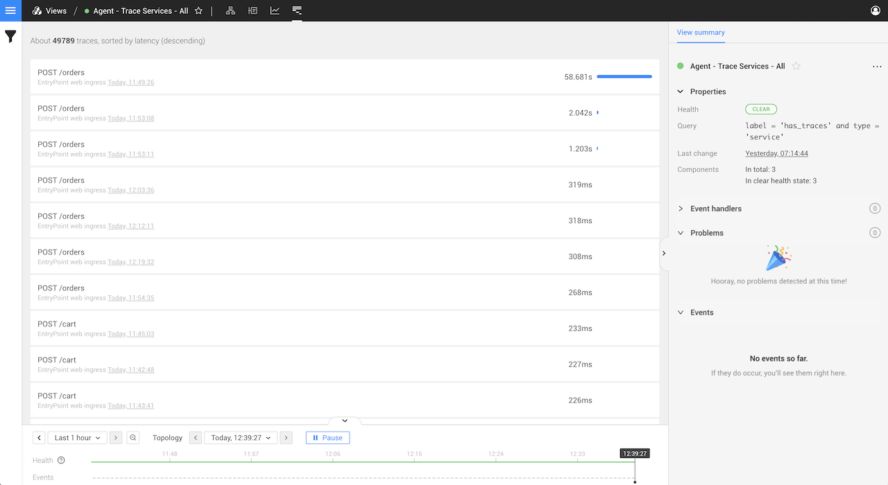
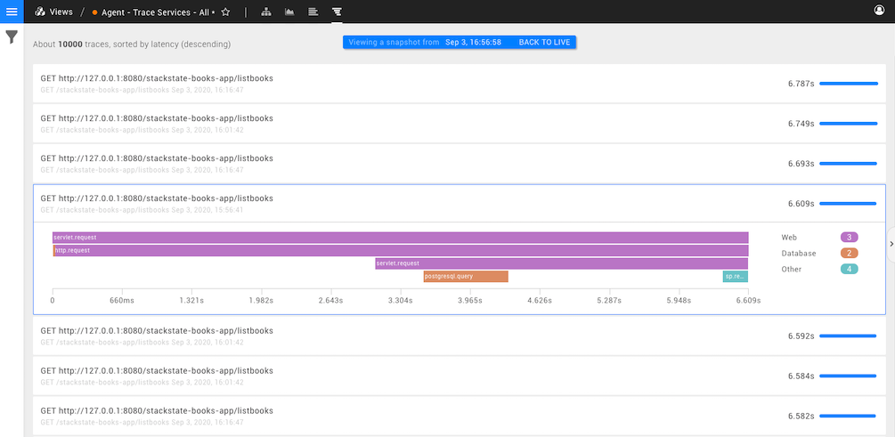
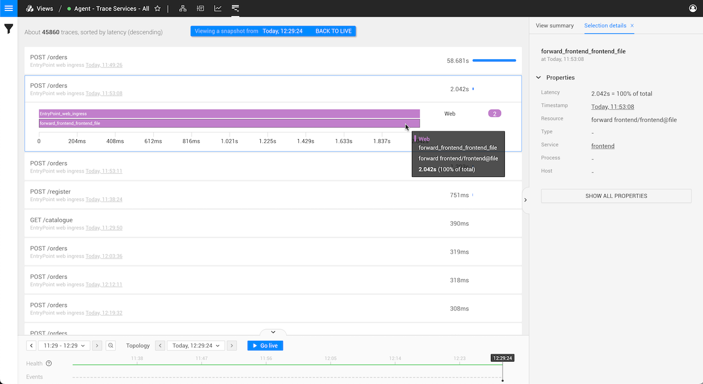
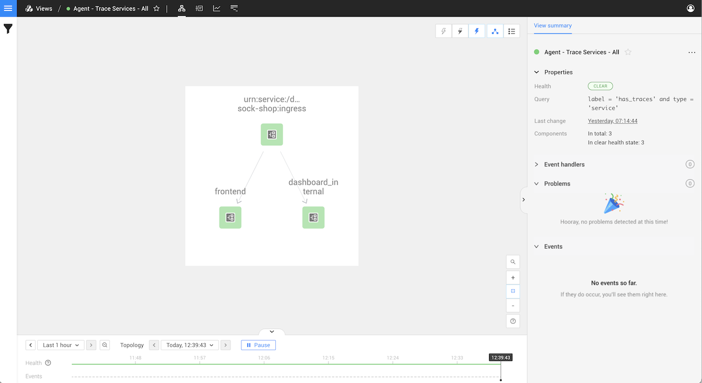

# Traces Perspective

## Overview

The Traces Perspective shows a list of traces and their spans for the components in your view. This allows you to monitor the performance of the applications in your IT infrastructure directly in StackState.

To find out more about how you can add traces to StackState, read the [guide to setting up traces](../../../configure/traces/set-up-traces.md).

## Inspecting Traces

### Trace Inspection

The Traces Perspective shows a list of the slowest traces for the components in your selected view. Click on any trace in the list to see the spans that belong to it

Span types are colored differently according to the information on the right. For example, the orange spans in this trace correspond to PostgreSQL calls that are made when completing the request.

### Span Details

When inspecting a trace and seeing the list of its spans, you can click on any span to see further details. The image below illustrates this action.

## Filter displayed traces

Traces and components are tightly related. The traces visible in the Traces Perspective can be filtered in the **View filters** on the left of the StackState UI.

### Filter by source component

The [topology filters](../filters.md#filter-topology) in the **View Filters** panel on the left of the StackState UI define the elements \(components and relations\) for which traces will be displayed. Only traces relating to elements that match the applied topology filters, or the view itself, will be visible. You can adjust the components for which traces are displayed by updating the topology filters.

### Filter by properties

The [trace filters](../filters.md#filter-traces) in the **View Filters** panel on the left of the StackState UI allow you to refine the traces displayed based on span type and tags.

### Filter by timestamp

The Traces Perspective shows traces matching the **Time Window** selected in the timeline control at the bottom of the StackState UI. Adjust the time window to show only traces from that time.

## Traces and Topology

In StackState, a [view](../views/about_views.md) shows you a sub-selection of your IT infrastructure in terms of components and relations. A number of our supported integrations send traces to StackState via [our Agent](../../../configure/traces/set-up-traces.md). These traces are used in the Traces Perspective and also in the [Topology Perspective](topology-perspective.md) to create the topology of your view.

For example, let's imagine that among your IT infrastructure the following components exist:

1. An HTTP service
2. A Java Application
3. A SQL Database

By installing our Agent and its integrations to gather traces from these technologies, StackState will receive traces that traverse these components. At ingestion time, StackState stores both the spans for each component in the list above and the topology that can be extracted from these traces \(components and relations\).

* Each component relates to a span
* Each trace relates to a list of spans \(or components\) that are traversed to complete the requests executed in your IT infrastructure.

The two images above illustrate these concepts by showing a library application whose main responsibility is to fetch a list of books. You can see an example of a trace and its spans for a request to fetch the list of books and the resulting topology created out of it.

When ingesting traces, StackState attaches service identifiers to the components that are created. These identifiers are also included as part of the **service** property of the spans in a trace. All topology created out of a trace will have a tag **has\_traces**, this allows you to easily identify components for which you have traces.

## Sorting and limits

Traces are sorted by latency \(descending\). This is the only sorting criteria available in this version. The trace list isn't limited by size, you can scroll infinitely to see all traces that are available for your component, filter and time selections. Finally, on top of the list of traces, StackState displays an approximation of the total amount of traces that are returned from the filters you have selected.

## Time Travel

When using the Traces Perspective, just like in other perspectives, you can either be in live mode or [time travel to the past](../timeline-time-travel.md#time-travel).

### Inspection, scrolling and its impact on time selection.

When using the Traces Perspective in live mode, you are constantly polling for the slowest traces in your time range selection. However, in a large IT infrastructure with constant requests being traced, your slowest traces right now might not be your slowest traces in a matter of seconds, changing their position the list. These constant updates to the order of the list could become frustrating, for example, if you are inspecting a trace/span, or scrolling through the list to look for a specific trace or pattern.

To avoid this, time will effectively be paused when you inspect a trace/span or scroll through the list of traces in live mode. This allows you to browse through a stable snapshot of your data. Note that pausing time means that you are now in the past, click **Go live** or **BACK TO LIVE** to stop time travelling and return to live mode.:

➡️ [Learn more about time travel](../timeline-time-travel.md#time-travel)

