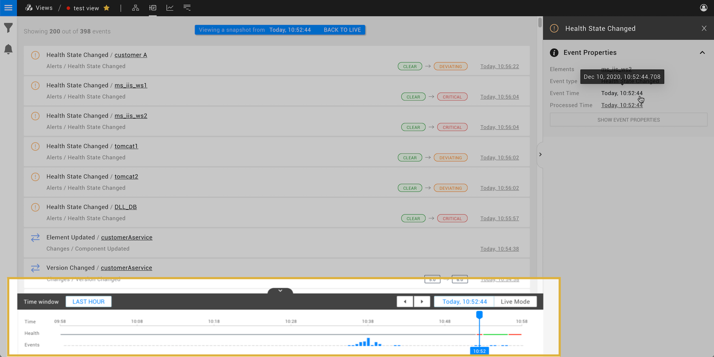

# Timeline and time travel

## Overview

The timeline at the bottom of the StackState UI allows you to travel back in time to the state of the topology at a specific point in the past. You can then navigate through all telemetry available for the selected topology snapshot. Health and events charts in the timeline give an overview of the state of the topology in the selected telemetry interval.

## Timeline

### Health

The health state of a view during the selected telemetry interval is displayed as a colour in the timeline **Health** line. 

Health state information is available when [health state is enabled](/use/health-state/configure-view-health.md) for the current view as long as the topology displayed results from the original topology filter saved in the view. If the topology filters have been edited and not saved, no health state information will be available.

When health state information is not available, a gray line is displayed.

### Events

The **Events** line in the timeline shows a bar chart with the number of events generated at each point in time. This helps you to see moments in the past with a lot of activity. Note that only events generated by topology elements that existed at the selected topology time are displayed.

To zoom in on an event bar of interest, click and drag to select a smaller telemetry interval around it on the timeline.


A single click on the timeline will move the playhead to this point in time, and thus time travel to the state of the topology at the selected time. Only events generated by topology elements that existed at the newly selected topology time will now be displayed. The telemetry interval will remain unchanged.


## Time travel

In each of the StackState perspectives, you can either be in live mode or in the past. In live mode, StackState will constantly poll for new data. When you time travel through topology or telemetry, you are effectively working with a snapshot of your infrastructure. The data available is based on two selections:

* [Topology time](#topology-time) - a specific moment in time for which you want to fetch a snapshot of your IT infrastructure.
* [Telemetry interval](#telemetry-interval) - the time range for which you want to see telemetry and traces.

Let's imagine a concrete scenario:

* You received an event notification saying that your payment processing application is not able to process any payments right now, and your customers aren't being served.
* In StackState, you can go to the moment in time when the components that make up the critical path of payment processing turned to a CRITICAL state. That moment corresponds to the point in time for which you will fetch the snapshot of your IT infrastructure - the topology time.
* You can then select to see the hours that preceded that moment in order to fetch the telemetry that will hopefully point you to the root cause of your problem - the telemetry interval.

### Telemetry interval

The telemetry interval specifies the time window for which events, metrics and traces are displayed in the StackState perspectives. This is indicated on the timeline from left to right.

You can set the telemetry interval in the following ways:

* Select a relative time window or set a custom time interval from the **Set the telemetry interval** popup on the left of the timeline.
* Use the time range arrow buttons to the left and right of the **Set the telemetry interval** popup to move the selected telemetry interval backwards or forwards through time.
* Click and drag on the timeline to zoom in on a selection.

The telemetry interval can be a maximum 6 months. It does not need to include the currently selected topology time, however, the message `The topology time is out of the current time interval` will be displayed in the timeline if the telemetry interval does not include the topology time.

If the end time of the selected telemetry interval is in the past, StackState will be in time travel mode. Click **Go live** or **BACK TO LIVE** to stop time travelling and return to live mode.

### Topology time

The topology time specifies the moment from which the IT infrastructure topology snapshot is taken. All telemetry displayed in StackState is based on a topology snapshot from the selected topology time. On the timeline, this is indicated as the playhead - a black line indicating the selectedtopology time.

By default, StackState is in live mode with the topology time set to the current time with the playhead on the right end of the timeline.

You can set the topology time in the following ways:

* Use the time range arrow buttons to the left and right ofse the **Set the topology time** box to move the playhead to the next set of events.
* Click on the timeline to move the playhead to the selected time.

If the selected [telemetry interval](#telemetry-interval) does not include the selected topology time, the message `The topology time is out of the current time interval` will be displayed in the timeline.

When the topology time is set to a point in the past, StackState will be in time travel mode. Click **Go live** or **BACK TO LIVE** to stop time travelling and return to live mode.

### Pause and go live

* TODO: STAC-12346 - redesign of timeline