# Timeline and time travel

## Overview

The timeline at the bottom of the StackState UI allows you to travel back in time to the state of the topology at a specific point in the past. You can then navigate through all telemetry available for the selected topology snapshot. Health and events charts in the timeline give an overview of the state of the topology during the selected telemetry interval.

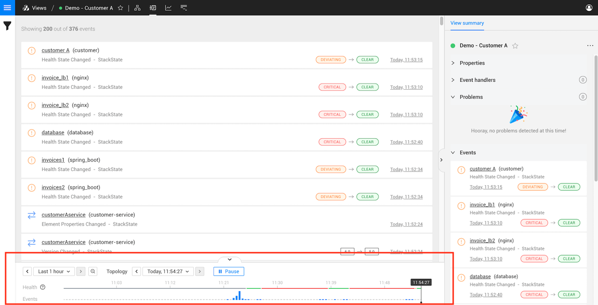

## Timeline

### Telemetry interval

The telemetry interval specifies the time window for which events, metrics and traces are available in the StackState perspectives. It runs from left to right on the timeline.

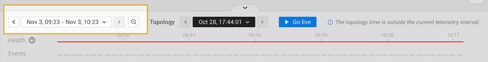

The selected telemetry interval can be either relative \(live mode\), or set to a custom telemetry interval \(time travel mode\). By default, the telemetry interval is set to a relative telemetry interval - in live mode and showing telemetry from the last hour. You can zoom in/out or set a custom telemetry interval to view telemetry from a specific point in time.

#### Set the telemetry interval


* The telemetry interval can be a maximum of 6 months. 
* When a custom telemetry interval is set for the telemetry interval, StackState will pause the [topology time](timeline-time-travel.md#topology-time) and enter [time travel mode](timeline-time-travel.md#time-travel).


The telemetry interval can be set in the following ways:

* **Zoom in**

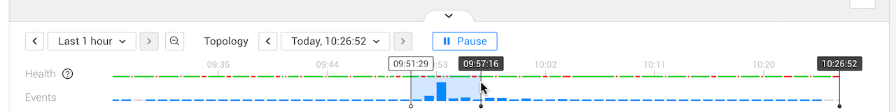

* **Zoom out**

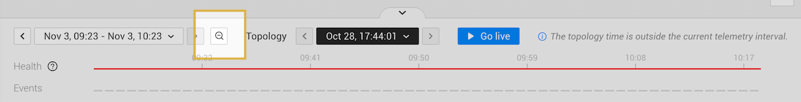

* **Use the telemetry interval jumper arrows**

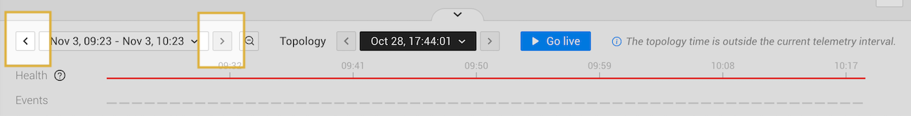

* **Set a relative or custom telemetry interval**

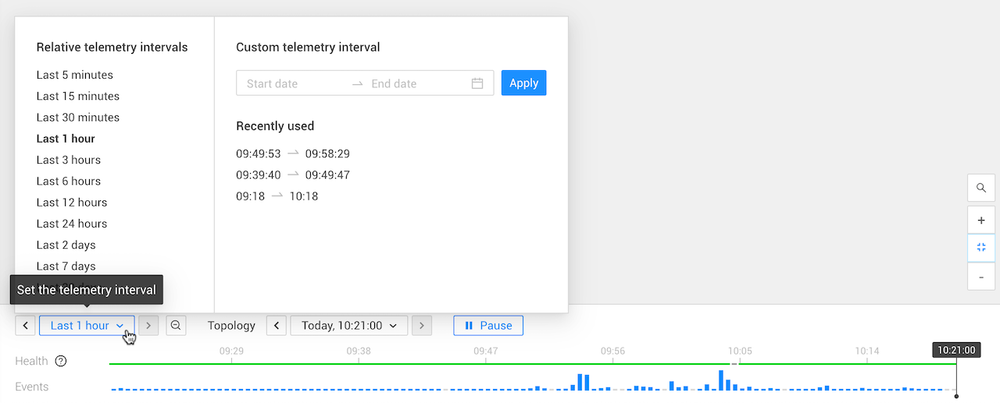



**StackState Self-Hosted**

Extra information for the [StackState Self-Hosted product](https://docs.stackstate.com/):

    
You can configure the default telemetry interval.



### Topology time

The topology and all telemetry displayed in StackState are based on a snapshot of the IT infrastructure. The moment from which this snapshot is taken is specified by the topology time. By default, StackState is in live mode with the topology time set to the current time. You can [time travel](timeline-time-travel.md#time-travel) to a previous state of the topology by selecting a custom topology time.

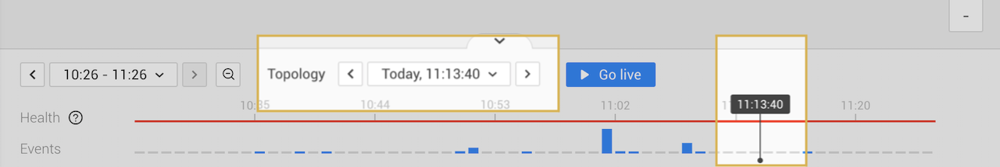

On the timeline, the selected topology time is indicated by the playhead - a black line with the current topology time at the top. It's also specified in the **Topology time** box at the top of the timeline.

#### Set the topology time

The topology time can be set in the following ways:

* **Click on the timeline**

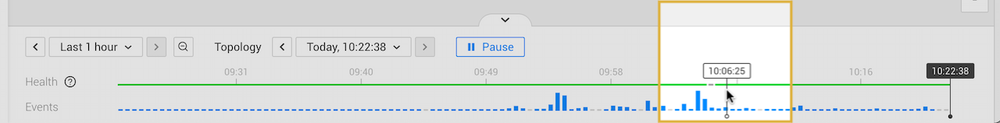

* **Use the topology time jumper arrows**

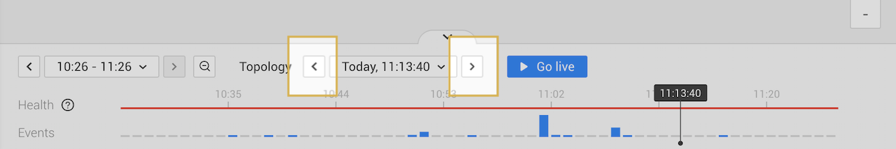

* **Set a custom topology time**

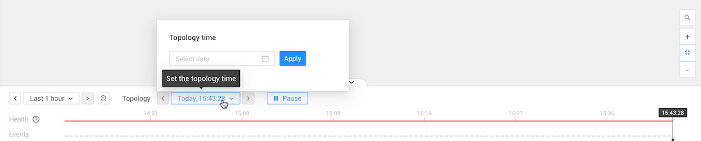

* **Click a timestamp**

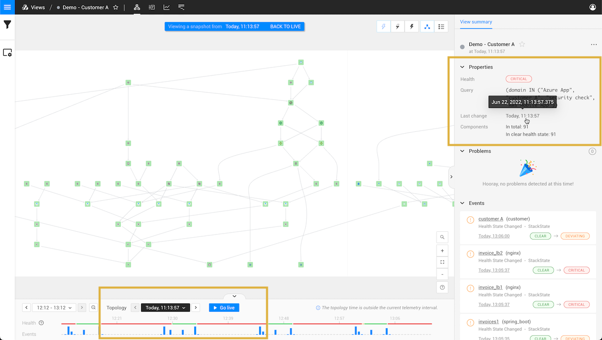

#### Topology time outside the telemetry interval

If the selected topology time is a time outside the currently selected [telemetry interval](timeline-time-travel.md#telemetry-interval), the message "The topology time is out of the current telemetry interval" will be displayed and the **Topology time** box at the top of the timeline will be highlighted black. As the timeline shows the telemetry interval from left to right, the playhead indicating the current topology time won't be visible on the timeline.

You can still browse topology and telemetry as expected:

- In the [Topology Perspective](/use/stackstate-ui/perspectives/topology-perspective.md) the state of the topology at the selected topology time is visualized.
- In all perspectives, telemetry is displayed that was generated in the selected telemetry interval and relates to the topology elements that existed at the selected topology time.

#### Live mode 

To stop time travelling and return the topology time to live mode, click **Go live** or **BACK TO LIVE** at the top of the screen.

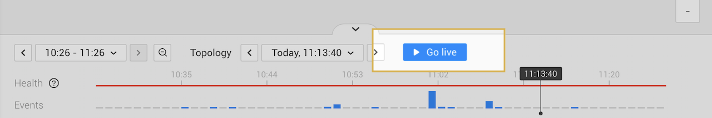

### Health

The health state of a view during the selected telemetry interval is displayed as a color in the timeline **Health** line.

Health state information is available when [health state is enabled](views/configure-view-health.md) for the current view as long as the topology displayed results from the original topology filter saved in the view.


If the topology filters have been edited and not saved, no health state information will be available.


When health state information isn't available, a gray line is displayed.

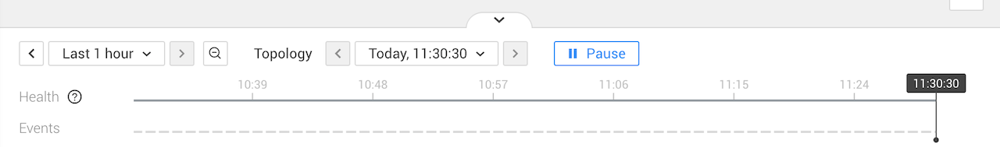

### Events

The **Events** line in the timeline shows a bar chart for the events at those time intervals. This helps you understand what happened to the components in the view in the past. Note that only events generated by the components that existed at the selected [topology time](timeline-time-travel.md#topology-time) and filtered by the [event filters](filters.md#filter-events) are displayed in the bar chart.

To inspect the events, hover over the blue bars. A context menu will appear that describes:

* The types of events that happened at that interval of time. Click on an event type to open a list of the associated events in the right panel **Events details** tab.
* The total number of events that happened at that interval of time. Click **All events** to open a list of all associated events in the right panel **Events details** tab.

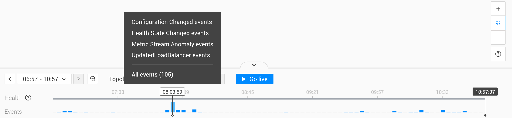

## Time travel

In each of the StackState perspectives, you can either be in live mode or in the past. In live mode, StackState will constantly poll for new data. When you time travel through topology or telemetry, you are effectively working with a snapshot of your infrastructure. The data available is based on two selections:

* [Topology time](timeline-time-travel.md#topology-time) - a specific moment in time for which you want to fetch a snapshot of your IT infrastructure.
* [Telemetry interval](timeline-time-travel.md#telemetry-interval) - the time range for which you want to see telemetry and traces.

Let's imagine a concrete scenario:

* You received an event notification saying that your payment processing application isn't able to process any payments right now, and your customers aren't being served.
* In StackState, you can go to the moment in time when the components that make up the CRITICAL path of payment processing turned to a CRITICAL state. That moment corresponds to the point in time for which you will fetch the snapshot of your IT infrastructure - the topology time.
* You can then select to see the hours that preceded that moment to fetch the telemetry that will hopefully point you to the root cause of your problem - the telemetry interval.

StackState will enter time travel mode whenever a custom topology time is selected, the **Pause** button is clicked, or a custom telemetry interval is set for the telemetry interval. When StackState is in time travel mode:

* You are effectively working with a snapshot of your infrastructure.
* Telemetry is available for components that were part of the topology at the selected topology time only.
* If a relative telemetry interval was selected in live mode, this is frozen as a custom telemetry interval relative to the moment at which time travelling began.

To stop time travelling and return to live mode, click **Go live** or **BACK TO LIVE** at the top of the screen.

