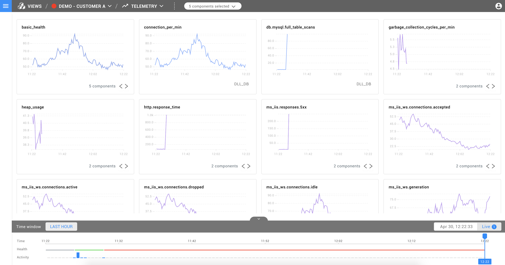

# Using the Telemetry Perspective


This page describes StackState version 4.0. Go to the [documentation for the latest StackState release](https://docs.stackstate.com/).


StackState can ingest telemetry data \(metrics, events, and logs\) from external IT systems such as monitoring, provisioning, deployment, and configuration management tools, or StackState’s Agent. The telemetry shown is based on current [Topology selection](topology_selection_advanced.md), showing a comprehensive picture of the IT environment and how it is functioning in near real-time. Telemetry perspective provides a dashboard of charts representing the metrics of the selected components. This document explains how the Telemetry Perspective works.

## Telemetry and Components

The Telemetry perspective can be adjusted in two different ways: by selecting a narrow and specific Topology and changing the view to Telemetry Perspective, or by opening a new Telemetry Perspective and using the [Component Selector](how_to_narrow_the_telemetry_perspective.md). The first option, unless the current Topology selection has been restricted to 5 components, results in Telemetry Perspective for the five newest unhealthy components \(critical, deviating. If there are no unhealthy components, then Telemetry Perspective shows the last five components that changed their state. You can narrow your Telemetry perspective using the [Component Selector](how_to_narrow_the_telemetry_perspective.md). The second option allows you to select up to 5 components from the currently selected Topology and show their telemetry side by side.

## Charts

Charts are showing Telemetry Data of selected components in near real-time - they are fetching data every 30 seconds. If a process is stopped and no more data is received, then eventually, the process will leave the chart as the data shifts left at least every 30 seconds. If there is more data that comes in during the 30 second interval it will be pushed to a chart. A single chart can display multiple lines for the same metric when multiple components are selected - this grouping is based on the name of the stream. It is possible to cycle through each of these streams and depict them as a single line in a single chart using the arrow controls on the chart.

## Time travel

Time traveling with the Telemetry Perspective is also possible. When time traveling, the currently selected Topology is time traveled, and the telemetry of those components are depicted in the charts. It is possible that the selected component may no longer exist in the time traveled state, no data for this component will be shown.

