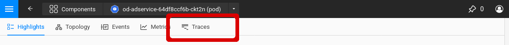

# Explore traces

## Navigate to Traces

You can explore the traces of any Kubernetes environment that is configured with opentelemetry through the StackState UI.
This can be done by drilling down to on of the Services, Deployments, Stateful Sets, Daemon Sets or Pods from the Kubernetes menu on the left

## Viewing Traces

To view the traces associated with the pod, service, deployment, statefulset or daemonset, click on the "Traces" menu item.
This will take you to the [Traces Perspective](../../use/views/k8s-traces-perspective.md)
