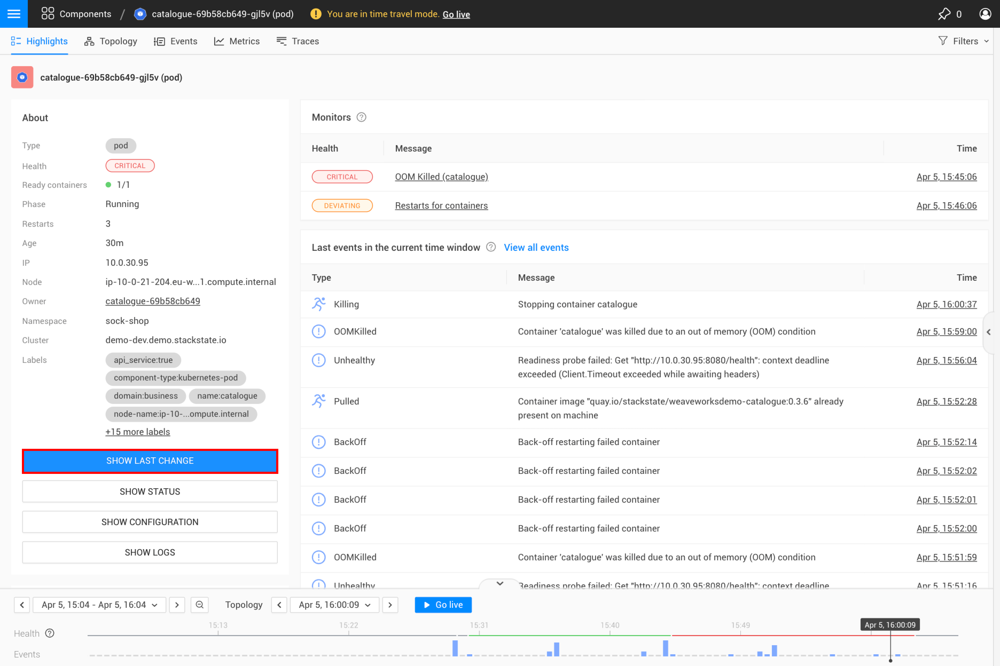

# Changes

## See diff from the last deployment

When issues arise after applying changes to your Kubernetes configurations, take a look at the last deployment change. 

Comparing the current configuration with the previous one can help you identify the specific changes that might have caused the problem.

