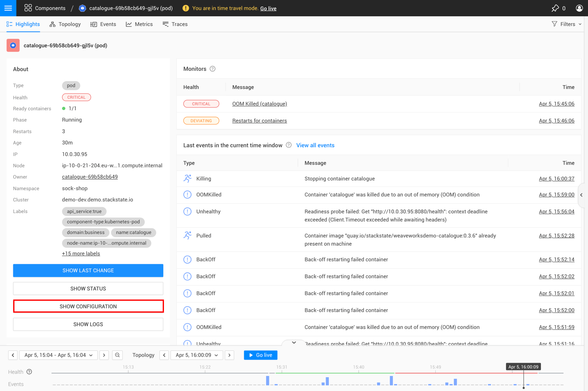
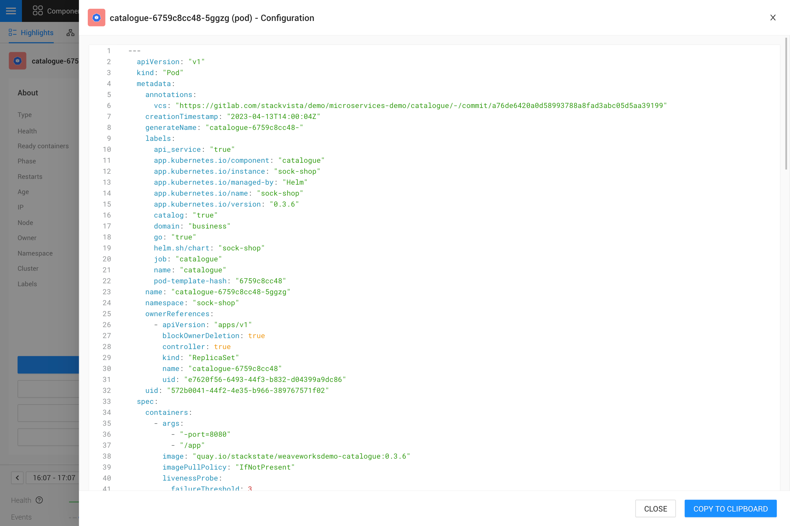

# YAML configuration

If a pod is experiencing issues such as crashes, failures to start or misconfigurations, inspecting the YAML configuration can help you identify the root cause. You can see YAML configuration by clicking on **Show configuration** button.



This gives the same output as ```kubectl describe``` command applied for service, pod or other resource. 


