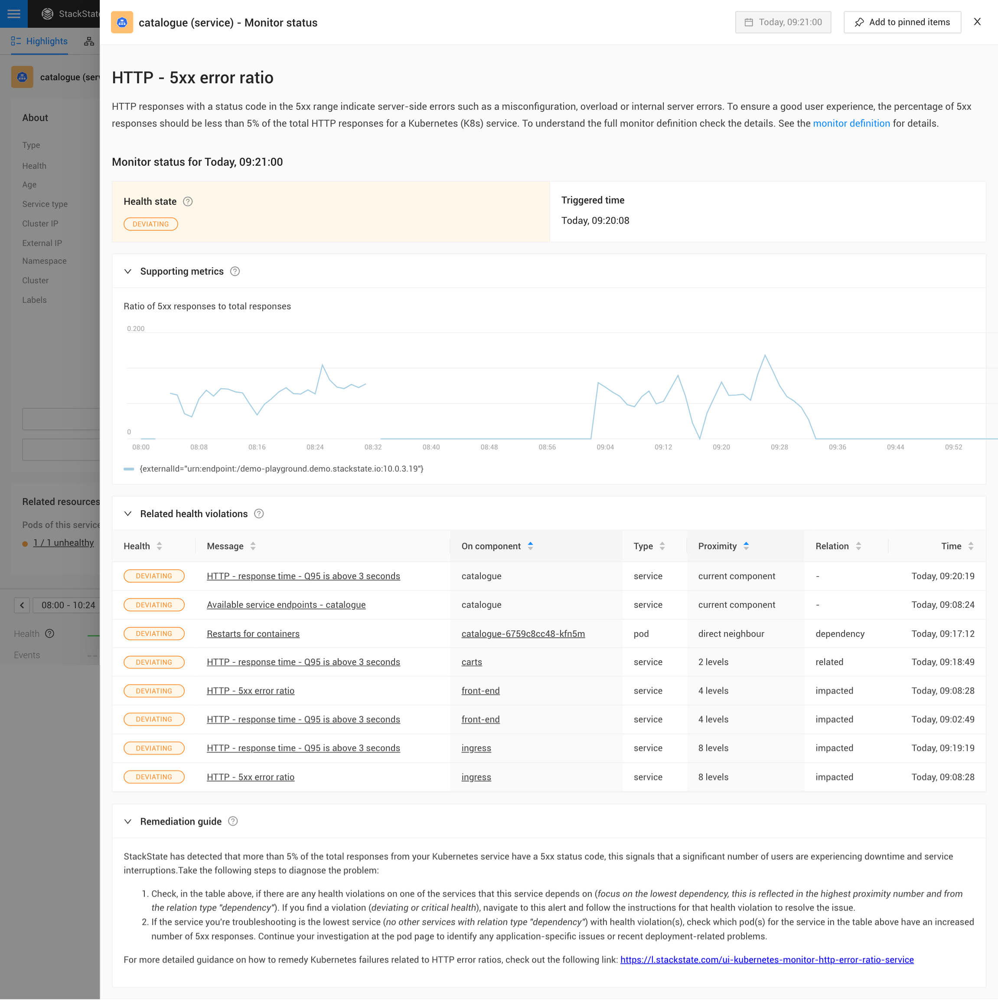

# What is guided troubleshooting?

## Overview

Out of the box, StackState collects and correlates all four essential data types: metrics, logs, events and traces. Data is key, but you can easily drown in too much of it. The main question is how to use all the data for your own benefit. StackState shows the impact of issues on the business, identifies the cause of issues accurately and automatically applies expert practices to help teams detect and remediate issues. 

Pre-configured monitors that look at the right things and issue alerts at the right time are enriched with clear hints to enable engineers to remediate the issues. This guidance helps every engineer immediately understand what needs to happen in order to remediate. In addition, after the issue is solved, this information will support the process of a blameless post mortem to determine what needs to be improved.

## Remediating issues with guided troubleshooting

For each monitor, StackState shows the supporting metric to indicate how the issue evolved over time.

Often, issues don’t happen in isolation. Sometimes they cause other issues, or the real problem is caused by a different component. StackState keeps track of how all components are related and warns you about related issues.

Each monitor type has a unique, step-by-step guide to help you resolve the problem at hand.

