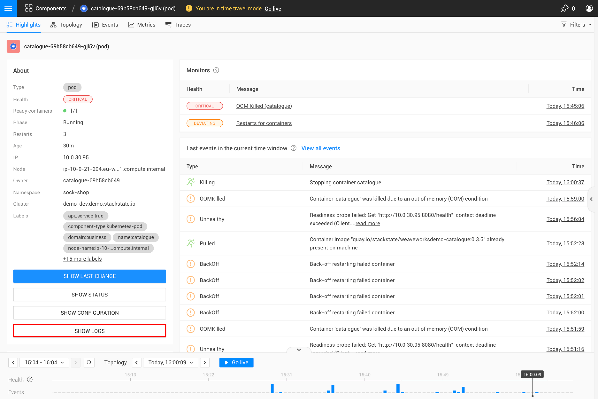
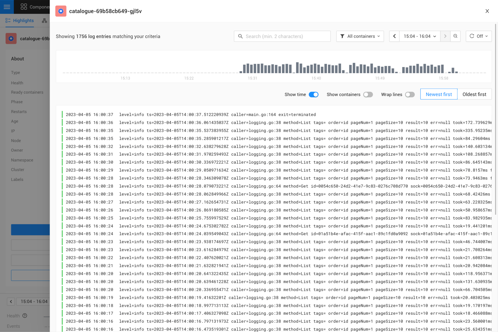

# Logs

## Overview

Kubernetes keeps comprehensive logs of cluster activity and application output. Logging provides valuable insight into how containers, nodes and Kubernetes itself is performing. Meticulously logging everything from Pods to ReplicaSets, it allows you to trace problems back to their source.

## Accessing pod logs

Errors and warnings in the logs are indicators of potential problems in your application, containers or the pod itself. To explore logs when on the pod screen click **Show logs** button.

## Using pod logs

You can use search to look for specific errors or warnings in the logs. Logs can be filtered by a container. You can select a desired time interval logs will be shown for and a refresh interval for how often you would like logs to be updated.

Logs histogram visualizes the number of log lines within a selected time interval and allows you to zoom to a particular interval by clicking and dragging.

Use these options to show or hide additional information for each log line:
- **Show time** to show timestamps
- **Show containers** to show the container name the log line belongs to
- **Wrap lines** to enable wrapping for the long lines
- **Newest first/Oldest first** to switch the log sorting order

