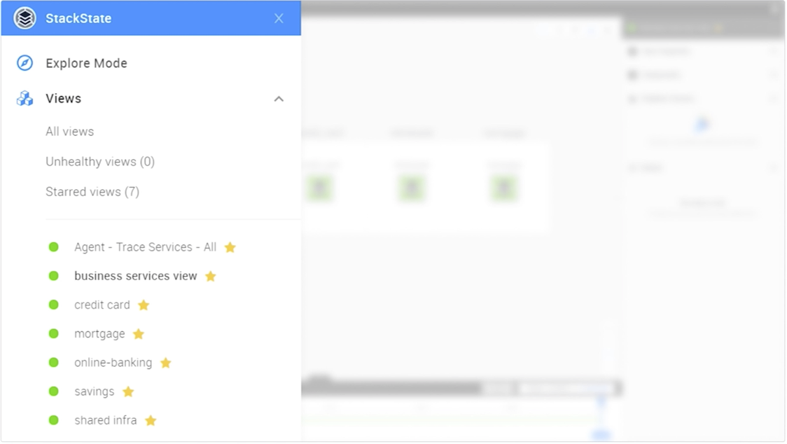

# Views


**This page describes StackState version 4.3.**

The StackState 4.3 version range is End of Life (EOL) and no longer supported. We encourage customers still running the 4.3 version range to upgrade to a more recent release.

Go to the [documentation for the latest StackState release](https://docs.stackstate.com/).


The full topology available in StackState is likely much larger than you need to be concerned with at any given point in time. StackState allows you to create a filter to select a specific set of components from your topology and save it as a view. Each stored view includes:

* The [View filters](view_filters.md):
  * Topology filters are used to add elements \(components and relations\) to the view.
  * Events and Traces filters refine the traces and events displayed.
* Topology visualization settings.
* Configuration to calculate the [view health state](views.md#view-health-state).

Generally speaking, views serve two major purposes:

1. Views are a type of bookmark. They help you to find your way back to a part of your topology that is of particular interest to you or your team. They may also serve as a starting point for defining new views.
2. Views can be used for [event notifications and automation](health-state-and-event-notifications/send-event-notifications.md). Whenever a change within the view requires your attention, an event handler can send out a notification, create an incident in an ITSM system or trigger automation.

## Access a view


Not all views are manually created. Many [StackPacks](../stackpacks/about-stackpacks.md) generate views after installation. It is recommended to use these views only as starting points for creating your own views.


Views marked with a star will be included directly in the main menu for easy access. Starred views are a personal preference that is stored in your account.

To access a list of all views, click **Views** from the main menu.

## The View Details pane

When you first open a view, the View Details pane will be visible on the right side of the StackState UI. This shows the following information:

* **View properties** - the view health state, query and last updated timestamp.
* **Components** - a summary of the number of components in the view.
* **Problems** -- any [problems](problems/problems.md) in the view.
* **Events** -- the most recent events that occurred for components in the view. Click **View all** to open the [Events Perspective](perspectives/events_perspective.md).

## View health state

A view is also a tool to define a clear selection of components for which you want to receive a event notifications. Typically, these are services that provide business value to a team's \(internal\) customers. StackState can define a single health state for any given set of components stored as a view. The calculation for a view's health state might be a simple count, but it could also be something more complex, for example:

* If service A and service B are working fine, then the view health state should be `CLEAR`.
* If service A has a problem, the view health state should be `DEVIATING`.
* If service B is is not in a `CLEAR` state, set the view health state to `CRITICAL`.

### Check the view health state

The view health state is reported as a colored dot next to the view name. The health states and colors used are the same as those used to report component and relation health state - if a view is healthy the circle will be green, if there are problems it will be orange or red. When the view health state is not enabled, the circle will be gray. A view can have any of the health states listed below:

* Green - `CLEAR` - There is nothing to worry about.
* Orange - `DEVIATING` - Something may require your attention.
* Red - `CRITICAL` - Attention is needed right now, because something is broken.
* Gray - `UNKNOWN` - The view does not have a view health state.

You can check the view health state in the following places in the StackState UI:

* **Health state of all views**: The view overview screen lists all views together with their health state.
* **Health state of starred views**: The main menu lists all starred views together with their health state.
* **Health state of the current view**: The health state of the current view is visible in the top bar and also next to the view name in the View Details pane on the right of the screen. Historical health state information for the current view can be seen in the timeline **Health** line at the bottom of the screen.

### Time travel with the view health state

The health state of the current view over time is indicated by the colour of the **Health** line in the timeline at the bottom of the screen. When the playhead on the timeline is moved to time travel to a moment in the past, the health state shown for the current view will change to match the state that it was at the selected point in time. The health state reported in the StackState main menu, however, will always report the current health state of all views.

### Enable or disable view health state

To enable view health state, set `View Health State Enabled` to **on** when you create or edit a view. To disable a view health state, [edit the view](views.md#delete-or-edit-a-view) and set `View Health State Enabled` to **off**.

Read more about how to [configure the view health state](health-state-and-event-notifications/configure-view-health.md).

## Create a view


By default all views are visible to everybody. You can star a view to add it to your personal main menu for easy access. For securing/hiding views please refer to the [RBAC documentation](../configure/security/rbac/role_based_access_control.md).


To create a new view, navigate to **Explore Mode** via the hamburger menu or use another view as a starting point. Whenever you change any of the [View filters](view_filters.md), a **Save View** button will appear at the top of the screen. Click this button to save your current selection to a view. To create a new view from the current view use the dropdown menu next to the button and select **Save View As**.

In the dialog the following options appear:

| Field Name | Description |
| :--- | :--- |
| View name | The name of the view. |
| View health state enabled | Whether the view has a health state. If this is disabled, thes health state, depicted by the colored circle next to the view name, will always be gray. When disabled, the StackState backend will not need to spend resources calculating a view health state each time the view changes. |
| Configuration function | When view health state is enabled, you can choose a [view state configuration function](../develop/developer-guides/custom-functions/view-health-state-configuration-functions.md#view-health-state-configuration-function-minimum-health-states) that is used to calculate the view health state whenever there are changes in the view. The default choice is **minimum health states**. |
| Arguments | The required arguments will vary depending on the chosen configuration function. |
| Identifier | \(Optional\) this field can be used to give the view a unique [identifier](../configure/identifiers.md). This makes the view uniquely referencable from exported configuration, like the exported configuration in a StackPack. |

## Event notifications for view health state changes

A `ViewStateChangedEvent` event is triggered whenever a view changes its health state. This event can be used in event handlers to, for example, to send an e-mail or Slack message or to trigger automation. Please refer to [event notifications](health-state-and-event-notifications/send-event-notifications.md) to understand how to set that up.

## Delete or edit a view


It is not recommended to delete or edit views created by StackPacks. When doing so, you will get a warning that the view is locked. If you proceed anyway the issue needs to be resolved when upgrading the StackPack that created the view.


To delete or edit a view:

1. Go to the list of views by clicking **Views** in the .
2. In the View Details pane on the right side of the screen, select the context menu next \(accessed through the triple dots\) to the right of the view name.
3. Select the **Delete** or **Edit** menu item.

## Secure views with RBAC

Through a combination of configuration of [permissions](../configure/security/rbac/rbac_permissions.md) and [scope](../configure/security/rbac/rbac_scopes.md), it is possible to give specific users:

* access to a specific subset of the topology \(a so-called scope\) and allow them to create their own views
* access to specific views and disallow them to create, modify or delete views

For further details, see the [RBAC documentation](../configure/security/rbac/role_based_access_control.md).

