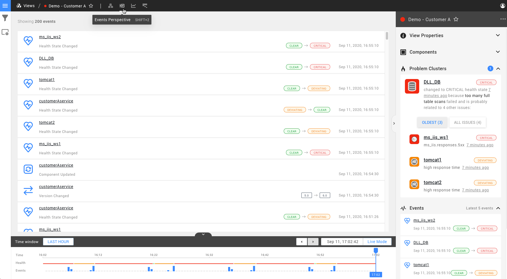

# Events Perspective


This page describes StackState version 4.1.  
Go to the [documentation for the latest StackState release](https://docs.stackstate.com/).


The Events Perspective shows events and changes for the components in your [view](./).

## Events

StackState records changes in your landscape as **events**. Events help you make sense of the changes that impact your IT landscape and are a great asset when troubleshooting problems.

The following events are currently recorded:

* Anomaly
* Component / relation created
* Component / relation deleted
* Component / relation updated
* Health state changed
* Version changed

## Filtering

### Topology Filters

The View Filters pane on the left side of the screen in any View allows you to filter the sub-set of topology for which events are displayed. Read more about [Topology Filters](filters.md#topology-filters)

### Filter Events

The Events Perspective supports filtering of events by **Event Types**.

## Time travel

When opening the Events Perspective, the events shown are based on the currently selected time window in the timeline control. Shrink the time window to display less events. Place the playhead on the timeline to restrict the events to the time indicated by the playhead.

## Event handlers

The Events Perspective allows the creation of [event handlers](../alerting.md) to act on events in the view.

