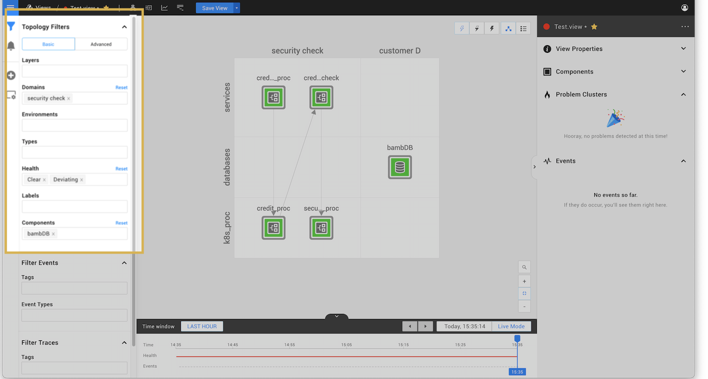
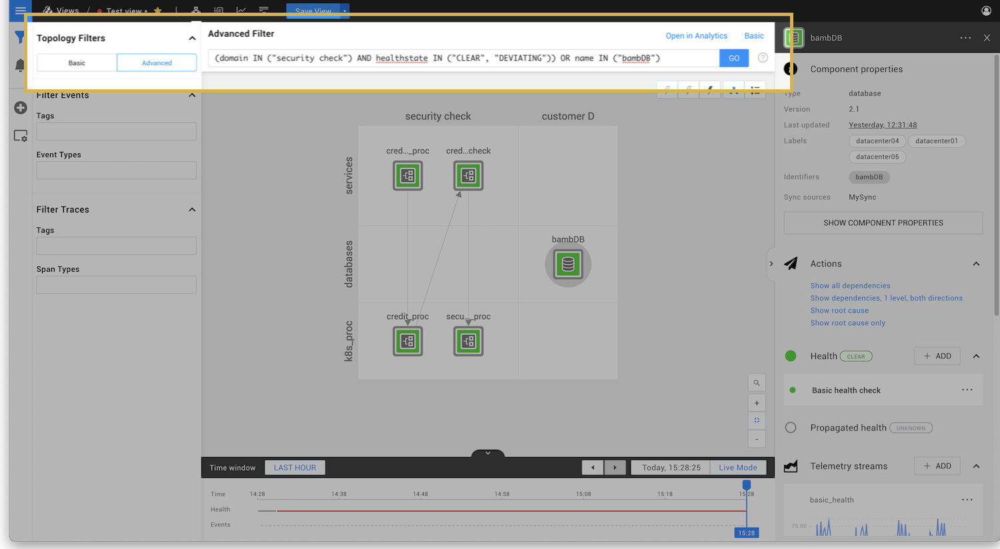

# Filter components in a view


**This page describes StackState version 4.2.**

The StackState 4.2 version range is End of Life (EOL) and no longer supported. We encourage customers still running the 4.2 version range to upgrade to a more recent release.

Go to the [documentation for the latest StackState release](https://docs.stackstate.com/).


The View Filters pane on the left side of the StackState UI allows you to filter the components and other information displayed in each perspective.

## Topology Filters

Topology Filters can be used to select a sub-set of topology components to be shown in any one of the available perspectives. You can browse your topology using basic filters or use the StackState in-built query language \(STQL\) to build an advanced topology filter that zooms in on a specific area of your topology. Read more about:

* [Basic filters](filters.md#basic-topology-filters)
* [Advanced filters](filters.md#advanced-topology-filters)
* [Topology filtering limits](filters.md#topology-filtering-limits)

### Basic topology filters

The main way of filtering the topology is by using the basic filters. When you set a filter, the open perspective will update to show only the visualization or data for the subset of your topology that matches the filter. Setting multiple filters will narrow down your search further. You can set more than one value for each filter to expand your search

| Filter | Description |
| :--- | :--- |
| Layers, Domains, Environments and Types | Filter by the component details included when components are imported or created. |
| Health | Only include components with the named health state as reported by the associated [health check](../health-state-and-event-notifications/add-a-health-check.md). |
| Labels | Only include components with a [custom label](../../configure/topology/tagging.md) or a default integration label, for example the [Dynatrace integration](../../stackpacks/integrations/dynatrace.md#dynatrace-filters-for-stackstate-views). |
| Components | The Components filter behaves differently to other filters. Components named here will be included in the topology **in addition to** the components returned from other filters. |

The example below uses basic filters to return components that match the following conditions:

* In the **Domain** `security check`
* AND has a **Health** state of `Clear` OR `Deviating`
* OR is the **Component** with the name `bambDB`



This could also be written as an advanced filter, see [advanced topology filters](filters.md#advanced-topology-filters).

### Advanced topology filters

You can use the in-built [StackState Query Language \(STQL\)](../../develop/reference/stql_reference.md) to build an advanced topology filter that zooms in on a specific area of your topology.

The example below uses an advanced filter to return components that match the following conditions:

* In the domain `security check`
* AND has a healthstate of `CLEAR` OR `DEVIATING`
* OR has the name `bambDB`



This could also be done using basic filters, see [basic topology filters](filters.md#basic-topology-filters).

### Topology filtering limits

To optimize performance, a configurable limit is placed on the amount of elements that can be loaded to produce a topology visualization. The filtering limit has a default value of 10000 elements, this can be manually configured in `etc/application_stackstate.conf` using the parameter `stackstate.topologyQueryService.maxStackElementsPerQuery`.

If a [basic filter](filters.md#basic-topology-filters) or [advanced filter query](filters.md#advanced-topology-filters) exceeds the configured filtering limit, you will be presented with an error on screen and no topology visualization will be displayed.

Note that the filtering limit is applied to the total amount of elements that need to be loaded and not the amount of elements that will be displayed.

In the example below, we first LOAD all neighbors of every component in our topology and then SHOW only the ones that belong to the `applications` layer. This would likely fail with a filtering limit error, as it requires all components to be loaded.

```text
withNeighborsOf(direction = "both", components = (name = "*"), levels = "15")
   AND layer = "applications"
```

To successfully produce this topology visualization, we would need to either re-write the query to keep the number of components loaded below the configured filtering limit, or increase the filtering limit.

## Filter Events

You can use the View Filters pane to filter the type of events shown in the [Events Perspective](events_perspective.md#filter-events).

## Filter Traces

The traces shown in the Traces Perspective can be filtered by **Tags** or **Span Types**. Read more about [FIlter Traces](traces-perspective.md#trace-filters)

