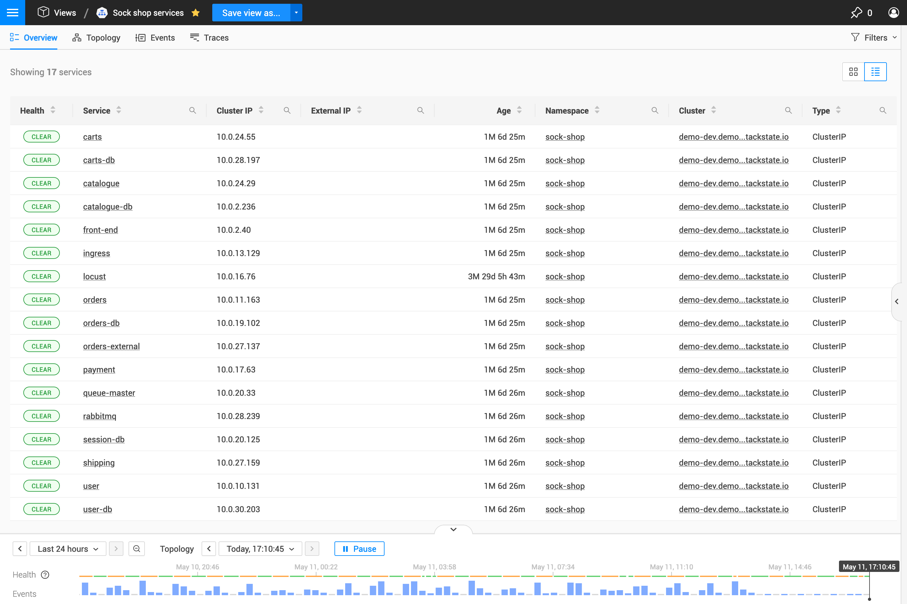
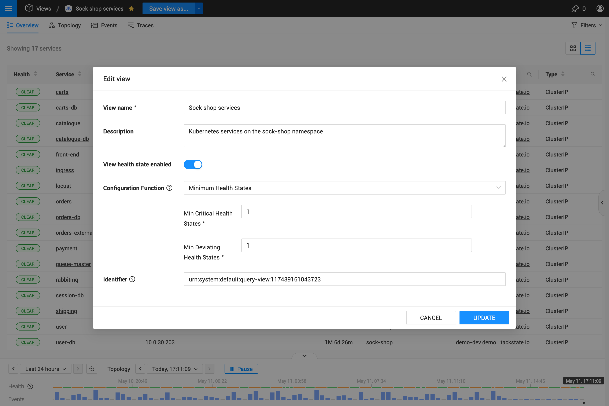

# Custom views

## Overview

Whilst a [kubernetes view](k8s-views.md) acts as a starting point to explore a specific part of your IT landscape, and an [explore view](k8s-explore-views.md) allows you to investigate a subset of a particular view, a **custom view** provides a way for you to get back to any of these views. 

In other words, you can create a custom view by saving a [kubernetes view](k8s-views.md) or an [explore view](k8s-explore-views.md) with your own settings (filters, visualization options, view settings, timeline configuration) to bookmark a part of your topology that's of particular interest to you or your team.


By default, custom views will be visible to all users, these can be secured by a **Rancher Observability administrator** if required.


## Handling

All the custom views can be found unde the **Views** entry in the main menu.

If you frequently use a certain custom view, you can add it to the **starred views**. All the starred views are listed directly in the **Views** section of the main menu for quick access - you can recognize the starred views by the yellow star icon next to their name. Add or remove a custom view from the starred views by simply clicking the star icon next to its name.

### Create a view

To create a new custom view, click the **Save view as...** blue button on the top navigation bar when you're on a [kubernetes view](k8s-views.md) or an [explore view](k8s-explore-views.md). To create a new view from a modified custom view, use the dropdown menu next to the button and select **Save view as...**.

In the **Save view as** dialog, the following options can be set:

| Field Name | Description |
| :--- | :--- |
| View name | The name of the view. |
| Description | A short description for the view. It helps remembering the scope of the view. |
| View health state enabled | Whether the view has a health state or not. If this is enable, the view health state is calculated based on the configuration function below. |
| Configuration function | When view health state is enabled, you can choose a function that's used to calculate the view health state whenever there are changes in the view. The default choice is **minimum health states** - this function calculates the health state of the view based on the amount of components in **CRITICAL** or **DEVIATING** state in the view. |
| Arguments | The required arguments will vary depending on the chosen configuration function, if any. |
| Identifier | A unique reference for the view, helpful when you want to reference the view from an exported configuration, such as the exported configuration in a StackPack. |

### Reset a view

When a custom view is created, all the filters, visualization options, view settings and the timeline configuration are saved on the view. If you want to reset the custom view to its original state after you have made some changes to it, use the dropdown menu next to the **Save...** button on the top navigation bar and select **Reset view**.

### Delete or edit a view


Note that changes made to a custom view will be applied for all users.


A custom view can be edited or deleted from either the **all views** screen, or the **custom view** screen.

1. **All views** screen:
   * Click **Views** in the main menu to open the **all views** screen.
   * Hover over the view you would like to edit or delete.
   * Click the **Edit view settings** or **Delete view** button on the right.
2. **Custom view** screen:
   * Open the view.
   * Open the dropdown menu next to the **Save...** button on the top navigation bar.
   * Click **Edit view settings** or **Delete view**.

## Structure

A custom view has an identical structure to the [kubernetes view](k8s-views.md) or the [explore view](k8s-explore-views.md) it was created from: it has the same [filters](k8s-view-structure.md#filters) and the same [perspectives](k8s-view-structure.md#perspectives).
