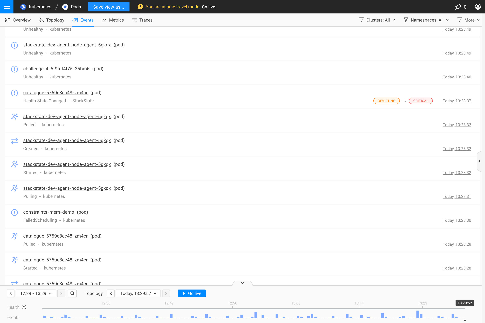
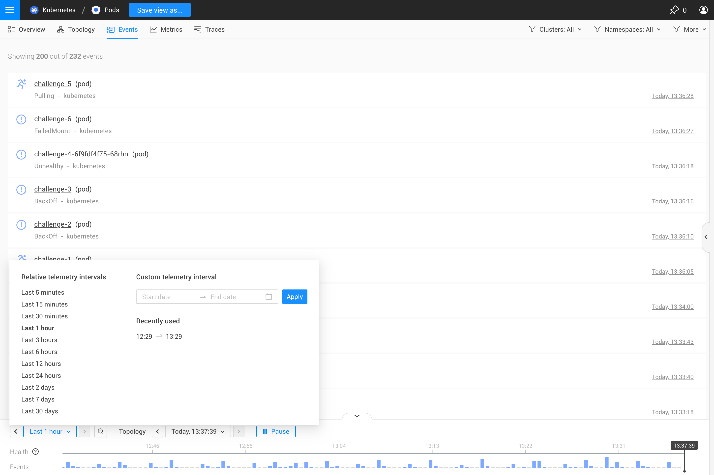

# Events Perspective

## Overview

The Events Perspective shows events and changes for the elements in the current [view](k8s-view-structure.md) or filtered topology.

## Filter displayed events

The events displayed can be filtered in the **filters** menu in the top right corner of the view UI. Event filters will be applied to all the events shown in the view: the events perspective, highlights perspectives and the timeline.

### Filter by properties

The [event filters](k8s-filters.md#filter-events) set in the **filters** menu can be used to refine the events displayed based on event category, type, source system and tags.

### Filter by source component

The [topology filters](k8s-filters.md#filter-topology) set in the **filters** menu define the elements \(components and relations\) for which events will be displayed. Only events relating to elements that match the applied topology filters or the view itself will be visible. You can adjust the components for which events are displayed by updating the topology filters.

### Filter by timestamp

The Events Perspective and events lists show events that match the [Telemetry interval](../stackstate-ui/k8sTs-timeline-time-travel.md#telemetry-interval) selected in the timeline at the bottom of the view UI. Adjust the telemetry interval to show only events that were generated at that time.

## Time travel

The Events Perspective lists events that were generated:

* by the topology elements that existed at the point in time specified by the [topology time](../stackstate-ui/k8sTs-timeline-time-travel.md#topology-time).
* within the selected [telemetry interval](../stackstate-ui/k8sTs-timeline-time-travel.md#telemetry-interval)

This allows you to time travel to both events generated by topology elements available at a specific point in history and events generated within a specific time window. Selecting a new topology time will time travel to the topology that was available at that point in history. The events list will be updated to include events for the topology elements available at that time and within the selected telemetry interval.

For example:

* Adjust the **Telemetry interval** to increase or decrease the number of events displayed.
* Adjust the **Topology time** to time travel to the topology available at that point in history. Events generated within the selected telemetry interval by topology elements that existed at the topology time will be displayed.
* Click a timestamp from the **Properties** of an event to jump to this topology time. This will update the events list to display events that were generated:
  * by topology elements that existed at that moment in time.
  * within the specified telemetry interval \(this will be adjusted to fit the selected timestamp if required\).

## See also

* [Filtering data](k8s-filters.md)
* [Working with StackState views](k8s-view-structure.md)
