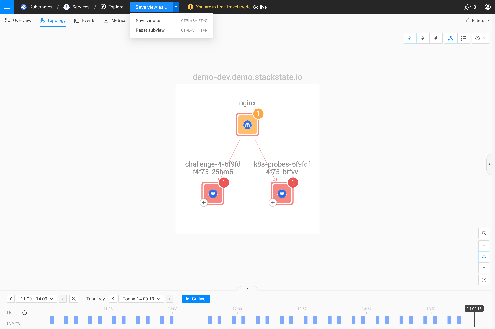
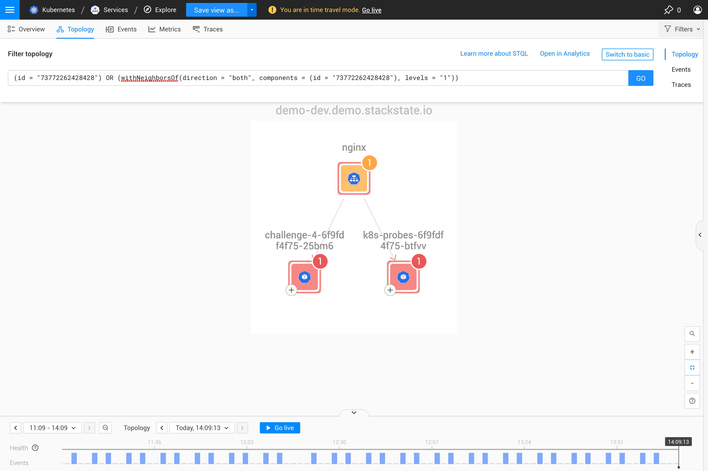

# Explore views

## Overview

In general, the concept of a [view](k8s-view-structure.md) in StackState allows you to monitor an area of your IT landscape that you had previously saved. But, often times when you need to investigate a subset of a particular view, you don't want to lose the scope of that view. This is where the **explore views** come into play.

To keep the scope of a particular view (e.g. `my view`) intact, all the investigative actions applied to a topology element or selection of elements (e.g. components, relations, groups) will automatically open in a temporary explore view, under the view you have started from (e.g. `my view / explore`).

Examples of **investigative actions** that will automatically be opened in an explore view:
- The **+ button** was clicked on a component in the [topology perspective](k8s-topology-perspective.md) to show the hidden neighbors of that component
- A **quick action** was executed on a component
- A topology element (component, relation, group) was **double-clicked** in the [topology perspective](k8s-topology-perspective.md) to investigate it
- The **'Explore...'** link or button was clicked on a topology element (component, relation, group) to investigate it


The investigative actions executed from an existing explore view will **not** open a new explore view - they will change the scope of the explore view you are in.


## Handling

When an explore view is automatically created, its original scope is also defined. This is helpful if you want to reset the explore view to its original scope after you have made some changes to it.

Although an explore view is meant to be temporary, it can be saved as a [custom view](k8s-custom-views.md) if you want to monitor it or review it later on.

If you don't want to save an explore view, simply move away from it or go back to the view you started from by using the breadcrumbs on the top navigation bar.

## Structure

The explore views have an identical structure to the [custom views](k8s-custom-views.md): they have the same [filters](k8s-view-structure.md#filters) and the same [perspectives](k8s-view-structure.md#perspectives).

