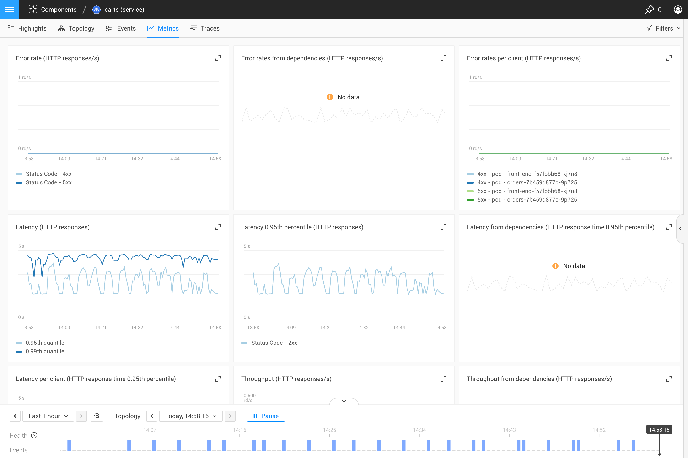

# Metrics Perspective

The Metrics Perspective shows metrics for the selected resource. 

## Charts

Charts show metrics data for the selected components in near real-time - data is fetched every 30 seconds. If a process is stopped and no more data is received, the process will eventually leave the chart as the data shifts left at least every 30 seconds. If more data arrives during the 30-second interval, it will be pushed to a chart. 

## Ordering

Metric charts are ordered based on the priority of the associated telemetry stream. The priority of a stream can be configured in the [Telemetry Inspector](/use/metrics/browse-telemetry.md).

