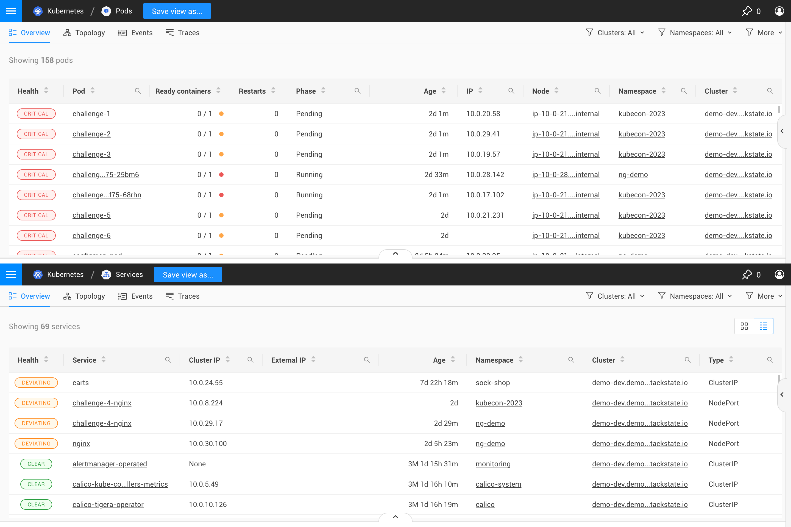
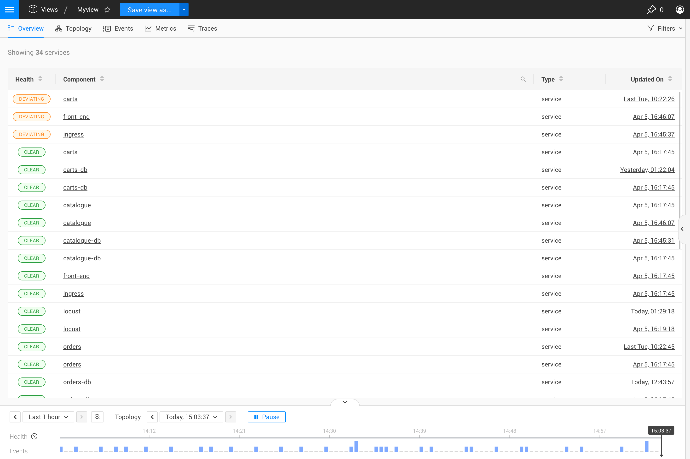
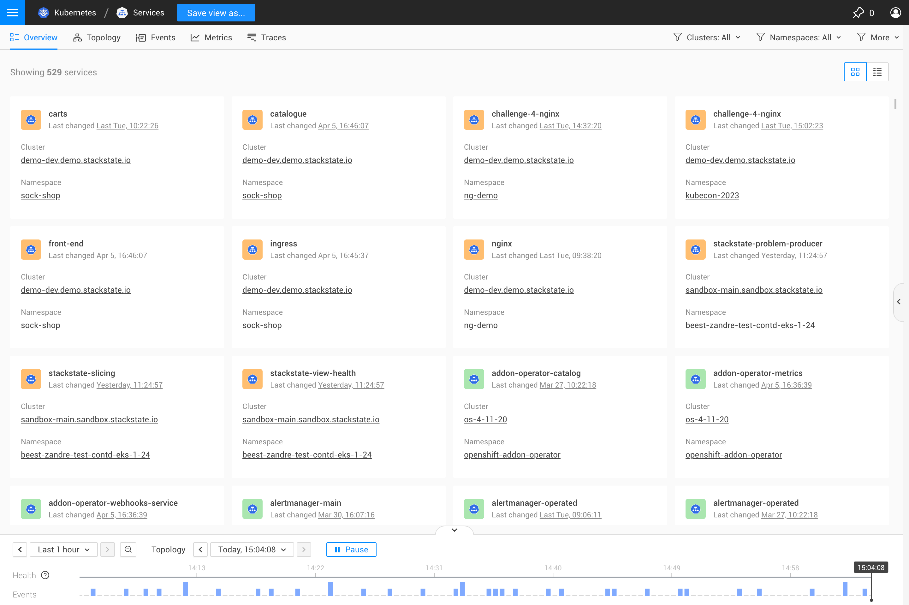

# Overview perspective

The Overview Perspective shows a list of all the components in your view. Depending on the type of view and the components in the view, the structure of the overview perspective will be different.

For example, the table structure used on the [kubernetes views](k8s-views.md) will reflect the most important properties of the component types included in each view: as seen below, the `services` view has a different table structure than the `pods` view.

 

For [custom views](k8s-custom-views.md) and [explore views](k8s-explore-views.md), the overview perspective table will have a generic one-size-fits-all structure, composed out of the most common properties, because of the diversity of component types that might be included in the view.

 

Although a table layout will be used in most of the view types for the overview perspective, in some cases a cards layout will also be provided, allowing you to change between different modes of displaying the contents of the overview perspective.
 

