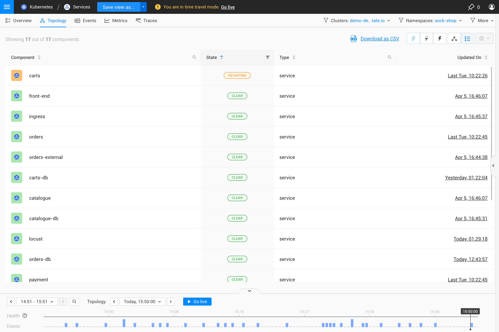

# Topology Perspective

## Overview

The Topology Perspective displays the components in your IT landscape and their relationships.

## Legend

Click on the Legend button (?) in the bottom right of the screen (just below the zoom controls) to display an explanation of the icons and colors used in the topology visualization.

## Components

The Topology Perspective shows the filtered components and relations in a selected [view](k8s-view-structure.md). Components that have one or more [monitors](../../use/alerting/k8s-monitors.md) configured will report a calculated health state.

* Select a component to display [detailed component information](/use/concepts/components.md#component-details) in the right panel details tab - **Component details**.
* Hover over a component to open the [component context menu](#component-context-menu).

➡️ [Learn more about components](/use/concepts/components.md#components)

### Component context menu

When you hover the mouse pointer over a component, the component context menu is displayed. This gives you information about the component, which includes:

* The component name and type
* [Health state](/use/concepts/health-state.md) and [propagated health state](/use/concepts/health-state.md#element-propagated-health-state) of the component.
* [Actions](#actions) specific to the component.
* [Shortcuts](#shortcuts) specific to the component.

### Actions

Actions can be used to expand the topology selection to show all dependencies for the selected component. Other actions may be available for specific components, such as component actions that are installed as part of a StackPack.

A list of the available **Actions** is included in the right panel details tab when you select a component - **Component details**. Actions are also listed in the component context menu, which is displayed when you hover the mouse pointer over a component.

### Shortcuts

Shortcuts give you direct access to detailed information about the specific component:

* **Open component view** - Opens the [component view](k8s-component-views.md) for this component. The component view provides you with a bird's eye view of everything that matters about this component and its direct neighbors, depending on the component type you are viewing.
* **Explore component** - Opens an [explore view](k8s-explore-views.md) containing only this component. The explore view allows you to investigate a single component from all perspectives without needing to adjust the view filters. Double-clicking a component achieves the same result.
* **Show properties** - Opens the properties popup for the component. This is the same as clicking **SHOW ALL PROPERTIES** in the right panel details tab when detailed information about a component is displayed - **Component details**.

## Relations

Relations show how components in the topology are connected together. They're represented by a dashed or solid line and have an arrowhead showing the direction of dependency between the components they link. 

Select a relation to open detailed information about it in the right panel details tab - **Direct relation details**, **Indirect relation details** or **Grouped relation details** depending on the relation type that has been selected.

➡️ [Learn more about relations](/use/concepts/relations.md)

## Visualization settings

The way components and relations are displayed in the topology perspective can be customized in the visualization settings menu in the top right corner of the visualizer:

* Grid - should components be organized by [layer and domain](../../concepts/layers_domains_environments.md).
* Grouping - should all components be displayed individually or should like components be grouped. For details, see [component grouping](topology-perspective.md#grouping).
* Indirect relations - should relations between components be shown if these connect through other components that aren't displayed in the view. For details, see [relations](/use/concepts/relations.md).

The Visualization Settings are saved together with the View. For details, see the page [Visualization settings](../views/visualization_settings.md).

## Navigation

### Zoom in and out

There are zoom buttons located in the bottom right corner of the topology visualizer. The **plus** button zooms in on the topology, the **minus** button zooms out. In between both buttons is the **fit to screen** button which zooms out so the complete topology becomes visible.

### Find component

You can locate a specific component in the topology by clicking `CTRL` + `SHIFT` + `F` and typing the first few letters of the component name. Alternatively, you can select the **Find component** magnifying glass icon in the bottom right corner of the topology visualizer.

See the full list of [Rancher Observability keyboard shortcuts](../keyboard-shortcuts.md).

### Show root cause

If there are components with monitors on them which are outside the view but might influence the component in the view, the Topology Perspective will show the health state of all components shown.

* **Don't show root cause** - Don't show the root causes of components shown by the current topology filters.
* **Show root cause only** - Only show the root causes of components shown by the current topology filters that have a `CRITICAL` or `DEVIATING` propagated health. Indirect relations are visualized if a component directly depends on at least one invisible component that leads to the root cause.
* **Show full root cause tree** - Show all paths from components shown by the current topology filters that have a `CRITICAL` or `DEVIATING` propagated health to their root causes.

## List mode

The components in the topology visualization can also be shown in a list instead of a graph:

### Export as CSV

From list mode, the component list can be exported as a CSV file. The CSV file includes `name`, `state`, `type` and `updated` details for each component in the view.

1. From the topology perspective, click the **List mode** icon on the top right to open the topology in list mode.
2. Click **Download as CSV** from the top of the page.
   * The component list will be downloaded as a CSV file named `<view_name>.csv`.
