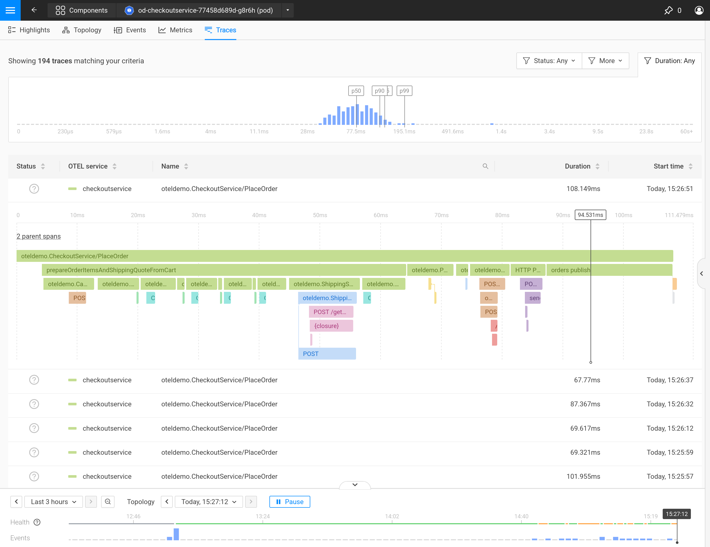
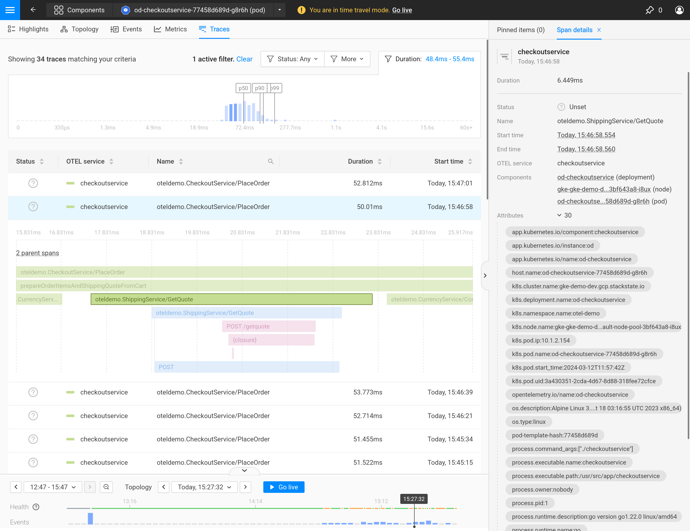

# Traces perspective

The Traces Perspective shows spans for a component and their duration distribution with status code.
This allows you to monitor the performance of the applications in your IT infrastructure directly in StackState.

Click on any span in the list to see the descendant spans that belong to it. 
When expanded, the timeline for a span shows when each descendant started and completed.
Parent spans in the same trace are collapsed by default, but can be expanced as needed.  
Spans are colored differently according to their OpenTelemetry ServiceName.
When inspecting a trace and seeing the list of its spans, you can click on any span to see further details.
The image below illustrates this action.

## Filter traces

The trace filters allow you to refine the traces displayed based on span status (Error, Ok or Unset), parent type (External, Internal or Root) and duration.

In addition to these filters, the traces match the **Time Window** selected in the timeline control at the bottom of the StackState UI.
Adjust the time window to show only traces from that time.

### Filtering the duration

As shown in the second screenshot, it is possible to select a duration interval for the span Duration by brushing the histogram.
Zooming out can be achieved by clearing all filters, or by brushing the entire range.

## Span details

In StackState, a [view](k8s-view-structure.md) shows you a sub-selection of your IT infrastructure for a particular Kubernetes resource.
The traces perspective shows the spans related to the resource, along with their descendants and (on request) parents.
As a descendant span can originate from an other resource, it is possible to navigate to it from the span details.

The two images above illustrate these concepts by showing a checkout service whose main responsibility is to create an order from a cart.
You can see an example of a trace and its spans for a request to place an order.
A descendant span has been highlighted and its details are shown, including links to components that are related to it.

Similarly brushing a trace will zoom in on a particular time section of the trace.
The selection can be reset by clicking later.

## Time Travel

When using the Traces Perspective, just like in other perspectives, you can either be in live mode or [time travel to the past](../stackstate-ui/k8sTs-timeline-time-travel.md#time-travel).
