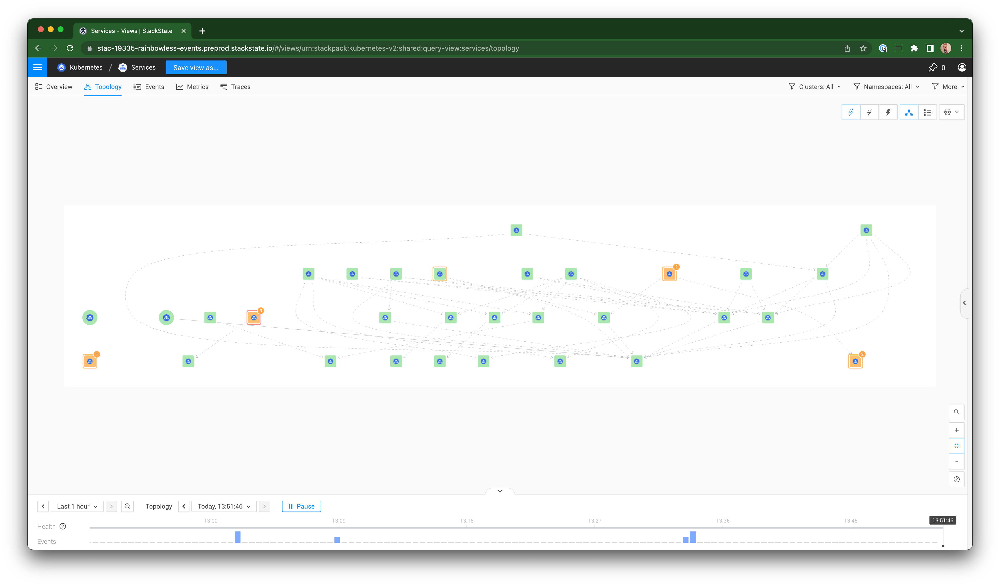

# Kubernetes views

## Overview

StackState for Kubernetes Troubleshooting has deep knowledge of Kubernetes and its components. After installation of the StackState agent in your cluste, it will then automatically detect and visualize the topology of your Kubernetes applications. This includes the Kubernetes resources that make up your application, such as deployments, pods, services, and ingress. It will also automatically detect and visualize the topology of your Kubernetes infrastructure that makes up your cluster, such as nodes, namespaces, and persistent volumes.

## Support for Kubernetes native resources

StackState for Kubernetes Troubleshooting has dedicated overviews and highlights pages for the following Kubernetes native resources:

All other Kubernetes resources are recognized and visualized in the topology views.
