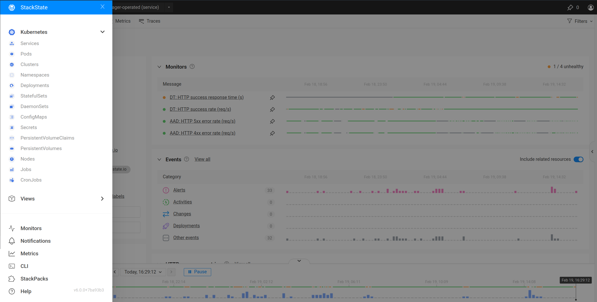
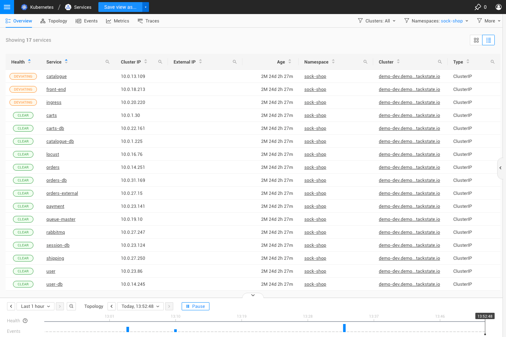
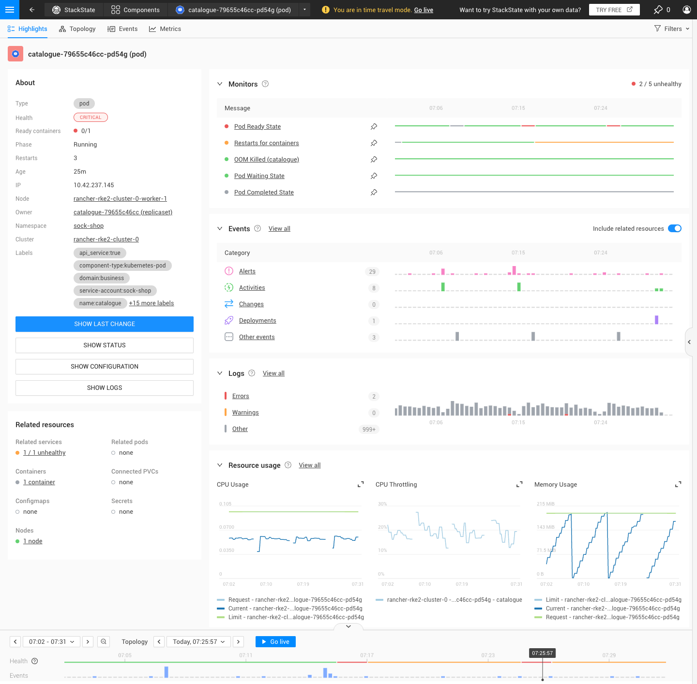

# Kubernetes views

## Overview

SUSE Observability has deep knowledge of Kubernetes and its components. After installation of the SUSE Observability agent in your cluster, it will then automatically detect and visualize the topology of your Kubernetes applications. This includes the Kubernetes resources that make up your application, such as deployments, pods, services, and ingress. It will also automatically detect and visualize the topology of your Kubernetes infrastructure that makes up your cluster, such as nodes, namespaces, and persistent volumes.

SUSE Observability has dedicated overviews and highlights pages for the following Kubernetes native resources:

All other Kubernetes resources are recognized and visualized in the topology views.

## Overview pages

The overview pages provide a high-level overview of specific Kubernetes resources in your environment. These overviews highlight the most important information about the resource, including its health, age, namespace, cluster and more.

From an overview page, you can click on one of the Kubernetes resources to navigate to the highlights page for that resource.

## Highlights pages

The highlights page shows an overview of the most important information about a specific Kubernetes resource. Here you can see the health of the resource, the monitors that are active on the resource, and the events that have occurred on the resource. Also we display the key metrics for the resource.

